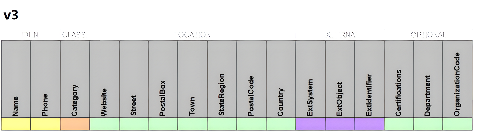

# Index

- [C.1 Introduzione e scopo](#c1-introduzione-e-scopo)
- [C.2 Struttura e Formato](#c2-struttura-e-formato)
  - [C.2.1 Terminologia](#c21-terminologia)
- [C.3 Fase di Riferimento](#c3-fase-di-riferimento)
- [C.4 Data Schema](#c4-data-schema)
  - [C.4.1 Data Tables](#c41-data-tables)
  - [C.4.2 Data Fields](#c42-data-fields)
- [C.5 Interoperabilità IFC](#c5-interoperabilità-ifc)

# C.1 Introduzione e scopo

Il National BIM Standard-United States® (NBIMS-US™) _Construction to Operations Building information exchange_ ([COBie](https://www.nibs.org/nbims/v3/cobie#COBie1)) è un formato di dati e uno standard di processo. Il suo scopo è quello di assistere i team di progetto nell'acquisizione e nella consegna dei dati relativi ai beni manutenibili di una struttura in un formato digitale, con l'obiettivo di ridurre o addirittura eliminare il ritardo tra la consegna (dopo la progettazione e la costruzione) e il momento in cui il sistema di gestione delle strutture può iniziare le operazioni e la manutenzione di tali beni **mantenibili**. Si tratta di un insieme combinato di tutti gli spazi, i prodotti e le apparecchiature presenti nei disegni di progetto associati, nonché di una raccolta di informazioni relative alla costruzione, alle operazioni e alla manutenzione (O&M) e alla messa in servizio acquisite durante la costruzione.

**N.B.** Gli **asset mantenibili** di una struttura per COBie sono gli elementi che il proprietario di una struttura gestirà in un sistema di gestione e manutenzione. Possono includere apparecchiature meccaniche, elettriche, impianti idraulici e altri elementi che richiedono manutenzione, cura e sostituzione.

Lo standard COBie ha successo quando tutte le parti interessate al progetto sono coinvolte, ovvero quando ogni stakeholder coinvolto ha un suo ruolo nel fornire, nel formato digitale standardizzato COBie, le informazioni relative agli asset mantenibili della struttura durante il progetto. Questi dati vengono consegnati in determinate fasi del progetto, per culminare in una consegna completa al momento della consegna del progetto.

COBie è stato tipicamente utilizzato per progetti di progettazione e costruzione di edifici, ma può essere utilizzato, soprattutto in seguito agli ultimi aggiornamenti alla versione 3, anche per progetti infrastrutturali o per trasferire la proprietà di una struttura da una parte all'altra.

# C.2 Struttura e Formato

Il formato COBie è un sottoinsieme dei contenuti di un modello informativo dell'edificio (BIM). Si tratta di dati non grafici definiti come [Model View Definition](https://technical.buildingsmart.org/standards/ifc/mvd/) (MVD) dello schema [Industry Foundation Class](https://technical.buildingsmart.org/standards/ifc/) (IFC). Può anche essere rappresentato in formato di foglio elettronico seguendo una struttura tabellare così composta.

Tabella c1. Struttura COBie

| **Tabelle Generali** | **Tabelle Spaziali** | **Tabelle Asset** | **Tabelle Processo** | **Tabelle Supporti** |
| :------------------: | :------------------: | :---------------: | :------------------: | :------------------: |
|       FACILITY       |        LEVEL         |       Type        |       PACKAGE        |       DOCUMENT       |
|       COMPANY        |         ZONE         |     COMPONENT     |         JOB          |       RESOURCE       |
|                      |      SPACEType       |      SYSTEM       |        EVENT         |       PICKLIST       |
|                      |        SPACE         |     ATTRIBUTE     |     INSTRUCTION      |                      |
|                      |      COORDINATE      |                   |         RISK         |                      |

Ogni tabella di dati comprende un insieme standardizzato di campi, i quali possono essere dichiarati come obbligatorio, obbligatorio solo se indicato nel contratto o come riferimento a un altro campo del database. Questo permette al committente di definire i campi specifici che si desiderano vengano compilati nella fornitura dei dati.

Tale specifica fornisce un metodo standardizzato ai team di progetto per fornire i dati necessari alla manutenzione di un impianto in formato digitale. In questo modo, il proprietario dell'impianto ha la possibilità di alimentare il proprio sistema di manutenzione in modo rapido e preciso con i dati necessari. COBie può essere utilizzato ogni volta che si verifica un passaggio di consegne, come ad esempio, al termine di una nuova costruzione, al termine di una ristrutturazione, o quando una struttura esistente cambia proprietà o gestione.

**N.B.** Per ogni struttura deve essere fornito un file COBie. Se ci sono più strutture, deve essere predisposto anche un file COBie aggiuntivo che identifichi gli asset del sito.

## C.2.1 Terminologia

Tabella c2. Terminologia

|         Termine         |                                                                                      Definizione                                                                                       |                                                                                                          Descrizione                                                                                                          |
| :---------------------: | :------------------------------------------------------------------------------------------------------------------------------------------------------------------------------------: | :---------------------------------------------------------------------------------------------------------------------------------------------------------------------------------------------------------------------------: |
|         _COBie_         |                                                                Construction to Operations Building Information Exchange                                                                |                                                                                      Lo standard digitale definito in questo documento.                                                                                       |
|         _NIBS_          |                                                                        National Institute of Building Sciences                                                                         |                                             Un'organizzazione non governativa e senza scopo di lucro impegnata a sostenere i progressi della scienza e della tecnologia edilizia.                                             |
|       _NBIMS-US™_       |                                                                          National BIM Standard-United States®                                                                          |                                               Il National BIM Standard-United States® è un documento sviluppato e mantenuto dal NIBS. Lo standard COBie fa parte del NBIMS-US™.                                               |
|          _IFC_          |                                                                              Industry Foundation Classes                                                                               |                                                                     Uno standard ISO (ISO 16739-1:2018) per la descrizione digitale dell'industria AECO.                                                                      |
|        _ifcXML_         |                                                                             XML Schema Definition for IFC                                                                              |                                                                      Uno schema XML per i file IFC Step basato sulle regole di trasformazione STEP XML.                                                                       |
|          _IDS_          |                                                                           Information Delivery Specification                                                                           | Un documento che definisce i requisiti di scambio dei modelli digitali, che comprende le modalità di scambio degli oggetti del modello, delle loro proprietà, delle loro classificazioni, dei loro valori e delle loro unità. |
|          _MVD_          |                                                                                 Model View Definition                                                                                  |                     Un sottoinsieme dello schema IFC complessivo utilizzato per descrivere uno scambio di dati per un uso o un flusso di lavoro specifico. Lo standard COBie è considerato un MVD di IFC.                     |
|          _FM_           |                                                                                 Facilities Management                                                                                  |                                                                    La manutenzione e la gestione degli edifici e delle attrezzature di un'organizzazione.                                                                     |
|          _O&M_          |                                                                                Operations & Maintenance                                                                                |                                                                  I compiti, le responsabilità e gli sforzi associati alla gestione continua delle strutture.                                                                  |
|         _JSON_          |                                                                               JavaScript Object Notation                                                                               |                                                   Formato standard aperto di file e scambio di dati basato su coppie attributo-valore e array in testo leggibile dall'uomo.                                                   |
|         _GUID_          |                                                                                Global Unique Identifier                                                                                |                                                 Una stringa di testo a 128 bit in formato esadecimale utilizzata per rappresentare l'identificazione di un elemento digitale.                                                 |
|         _Asset_         |               Gli asset mantenibili di una struttura per COBie sono gli elementi che il proprietario di una struttura gestirà in un sistema di gestione e manutenzione.                |                                I beni mantenibili possono includere attrezzature meccaniche, elettriche, impianti idraulici e altri elementi che richiedono manutenzione, cura e sostituzione.                                |
|       _Component_       |                                           Le singole istanze dei prodotti e delle apparecchiature definite nella tabella dei dati del tipo.                                            |                                                                          I componenti possono far parte di altri componenti, costituendo un insieme.                                                                          |
|        _Entity_         |                                         Classe di informazioni definita da attributi e vincoli comuni, come definito nella norma ISO-10303-11.                                         |                                          Come il termine “classe” nei comuni linguaggi di programmazione, ma che descrive solo strutture di dati (non comportamenti, come i metodi).                                          |
|        _Element_        | Un componente principale, un insieme o una parte di un'entità di costruzione che, di per sé o in combinazione con altri, svolge una funzione predominante di un'entità di costruzione. |                                                                                            Si veda l'uso del termine in IFC e MVD.                                                                                            |
|       _Attribute_       |                                                  Una singola unità di dati che in un determinato contesto è considerata indivisibile.                                                  |                                                                  Fonte: ISO/TS 21089:2018(en), 3.44, modificato dal termine “data attribute” a “attribute”.                                                                   |
|       _Instance_        |                                                                                  Evento di un'entità.                                                                                  |                                                                     Come il termine “istanza di una classe” nella programmazione orientata agli oggetti.                                                                      |
|     _Object Types_      |                                                           Caratteristiche comuni condivise da più occorrenze di un oggetto.                                                            |                                                                                  Come “classe”, “template” e “tipo” in altre pubblicazioni.                                                                                   |
|  _External Reference_   |                                     Collegamento a informazioni esterne all'insieme di dati, con rilevanza diretta per le informazioni specifiche.                                     |                                                                                  Il collegamento proviene dall'esterno dell'insieme di dati.                                                                                  |
|  _Data Table or Table_  |                                                                          Tabella delle informazioni digitali                                                                           |                                                   Le tabelle comprendono righe di dati (record) e colonne di intestazioni di dati. COBie è composto da 19 tabelle di dati.                                                    |
|  _Data Field or Field_  |                                                                     Un singolo campo di informazioni digitali                                                                       |                                                                                              COBie è composto da 144 campi dati.                                                                                              |
| _Data Record or Record_ |                                                                       Una riga di dati correlati in una tabella                                                                        |                                                          Ogni tabella di dati comprende righe di dati, dette record, che rappresentano gli asset definiti in COBie.                                                           |
|  _Data Value or Value_  |                                                                                I dati di un campo dati                                                                                 |                                               COBie richiede che tutti i campi dati abbiano un valore e non siano lasciati vuoti, anche se il valore è “n/a” (non applicabile).                                               |

# C.3 Fase di Riferimento

Nei progetti di progettazione e costruzione, lo scopo ultimo di COBie è quello di fornire informazioni sugli asset di una struttura al proprietario/gestore che subentrerà al termine di tali fasi del ciclo di vita del progetto. In genere, questo si verifica al termine della costruzione, ma può essere applicato anche ai passaggi intermedi, detti _data drop_, tra i vari consulenti coinvolti nel processo di progettazione e costruzione.

Tuttavia lo scopo di questo documento è quello di concentrarsi solamente sulle fasi di "**Handover Phase**", ovvero la fase di consegna delle informazioni al committente ed ai facility managers in modo tale che le informazioni raccolte possano essere utilizzate per alimentare i loro database aziendali anche se tali infrastrutture non sono ancora dotate di moduli BIM; e di "**Operations Phase**", ovvero la fase in cui i manutentori prendono decisioni circa manutenzioni ordinarie e/o straordinarie atte a migliorare il comfort degli utenti e le prestazioni del bene.

La fase di **Handover** viene definita come "_phase to evaluate the completed work through testing, inspection, and commissioning activities, including for any owner-furnished equipment, to ensure that design/performance criteria are met while conforming to applicable codes and standards, and transfer project knowledge from the design/construction team to the owner/facility management team via demonstrations, training, and documentation_".
Mentre la fase di "**Operations**" viene definita come "_phase in which owner or a designated agent occupies, uses, manages, and maintains a facility, which may also include partial or whole facility renovation, repair, reconditioning or remodeling activities as part of the project use lifecycle_".

**N.B.** E' necessario designare chi sarà incaricato di revisionare le singole informazioni prodotte (es. il facility manager potrà revisionare i dati relativi alle dotazioni impiantistiche, invece lo space manager potrà revisionare i dati relativi agli spazi ed alle zone, ...). Tali verifiche possono essere effettuate anche per mezzi di strumenti automatici, disponibili liberamente in rete, che permettono di validara la correttezza della struttura dei dati trasmessi.

# C.4 Data Schema

Lo schema dei dati COBie è strutturato come un **database relazionale** composto da 19 tabelle di dati. Come in tutti i database, ogni tabella di dati deve avere una _chiave primaria_ per ogni riga di dati della tabella (_record_). Per la maggior parte delle tabelle di dati, la chiave primaria è la prima colonna di dati, “Name”. Per alcune tabelle, non è previsto che il valore del campo dati “Name” sia unico, quindi il valore di tale campo dati non può essere utilizzato come chiave primaria. Per queste tabelle, la chiave è una combinazione dei valori di diversi campi dati del record (_chiave composta_). La chiave composta è una concatenazione di valori separati da un trattino basso e può essere una concatenazione di due o tre campi. Ciò significa che il formato della chiave univoca sarà sempre uno dei seguenti:

> Name
> Name_Field1
> Name_Field1_Field2

Di seguito sono riportati i valori chiave per ciascuna tabella di dati:

Tabella c3. Chiavi primarie

| Data Table |   Key Value Format    |
| :--------: | :-------------------: |
|  Company   |         Name          |
|  Facility  |         Name          |
|   Level    |         Name          |
| SpaceType  |         Name          |
|   Space    |         Name          |
|    Zone    |         Name          |
|    Type    |         Name          |
| Component  |         Name          |
|   System   |         Name          |
|  Resource  |         Name          |
|    Job     | Name_Table_Table.Name |
|   Event    |     Name_Job.Name     |
|  Package   |         Name          |
|    Risk    |         Name          |
|  Document  | Name_Table_Table.Name |
| Attribute  | Name_Table_Table.Name |
| Coordinate | Name_Table_Table.Name |

Il valore della chiave “Name” in un Deliverable COBie è equivalente alla nomenclatura relativa a quel tipo di asset così come riportate nelle sezione precedenti di tale documento. Tuttavia, qualora vengono a verificarsi valori duplicati a causa dell'aggregazione di più modelli informativo, questi valori dovranno essere modificati per essere conformi a COBie (concatenando altri dati ai valori dei nomi/chiavi, come il tipo di asset).

**Data Fields**
Ogni tabella di dati contiene diversi campi predefiniti come parte dello standard COBie. La sezione "Data Fields" fornisce i dettagli su ciascuno di essi.

**Reference Fields**
I Data Fields possono essere correlati ad altri Data Fields del database presenti nella stessa tabella o in altre tabelle.

Ad esempio, il valore del campo “Manufacturer” della tabella dati “Type” fa riferimento al campo “Name” della tabella “Company”. In questo modo, una modifica al campo "Nome" della tabella "Company" si propagherà a tutte le altre tabelle di dati che vi fanno riferimento.

**Status**
Ogni tabella e ogni data Fields include uno stato relativo al relativo requisito; ne sono disponibili otto. Quando COBie viene consegnato in un foglio di calcolo (es. LibreOffice Calc o Microsoft Excel), ogni requisito può essere codificato a colori per facilitarne il riconoscimento.

    **Required**
    	Tabelle di dati e campi di dati che devono sempre essere presenti in ogni Deliverable COBie.
    	Colore SpreadsheetML: #FFFF99

    **Required (Reference to Another Data Field)**
    	Campi dati che sono obbligatori e il cui valore fa riferimento a un altro campo dati, sia nella stessa tabella dati che in una tabella dati diversa (compresa la tabella dati PickList). Questo stato non viene utilizzato per le tabelle di dati, ma solo per i campi di dati.
    	Colore SpreadsheetML: #FFCC99

    **Only If Specified in the Contract**
    	Tabelle di dati e campi di dati facoltativi, richiesti solo se specificati nel contratto relativo ai Deliverable COBie.
    	Colore SpreadsheetML: #CCFFCC

    **Only If Specified in the Contract (Reference to Another Data Field)**
    	I campi di dati sono obbligatori solo se specificati nel contratto e il cui valore fa riferimento a un altro campo di dati, sia nella stessa tabella di dati che in una tabella di dati diversa (compresa la tabella di dati PickList che ha uno stato di “Solo se specificato nel contratto”). Questo stato non viene utilizzato per le tabelle di dati, ma solo per i campi di dati.
    	Colore SpreadsheetML: #CCFFFF

    **External Reference**
    	I campi di dati i cui valori contengono informazioni che consentono di risalire al software che ha generato le informazioni (sistema di origine). Questo stato non viene utilizzato per le tabelle di dati, ma solo per i campi di dati.
    	Colore SpreadsheetML: #CC99FF

    **Secondary Information When Preparing Product Data**
    	Tabelle di dati e campi di dati facoltativi, richiesti solo se specificati nel contratto relativo ai Deliverable COBie, che includono informazioni secondarie normalmente non contenute in un Deliverable COBie.
    	Colore SpreadsheetML: #C0C0C0

    **Regional, Owner, or Product-specific Data**
    	Tabelle di dati e campi di dati che sono richiesti a causa di requisiti regionali, del proprietario o specifici del prodotto.
    	Colore SpreadsheetML: #99CCFF

    **Not Used**
    	Tabelle di dati o campi di dati non utilizzati nel Deliverable COBie.
    	Colore SpreadsheetML: #000000

## C.4.1 Data Tables

Le tabelle di dati, definite nel capitolo [C.2 Struttura e Formato](#c2-struttura-e-formato), hanno ciascuna uno scopo e sono organizzate in una gerarchia relativa a un impianto, una struttura o un gruppo di strutture.

**Instruction** (==REQUIRED==). Fornisce istruzioni scritte relative al database COBie, ma contiene anche le informazioni generali di presentazione per un particolare consegna.
**Company** (==REQUIRED==). Rappresenta le informazioni relative a un'azienda a cui si fa riferimento altrove in un un'altra tabella. Questa tabella si chiamava “Contact” nelle versioni precedenti di COBie.
**Facility** (==REQUIRED==). Fornisce informazioni relative all'impianto, alla struttura o al gruppo di strutture (nel caso di progetti infrastrutturali) a cui la consegna fa riferimento. In questa tabella è ammesso un solo valore (_record_).
**Level** (==REQUIRED==). Contiene informazioni relative ai livelli verticali di un impianto o, nel caso di progetti infrastrutturali, alle aree geografiche come il sito circostante un impianto/struttura, un corridoio ferroviario o autostradale, ecc. Questa tabella era chiamata “Floor” nelle versioni precedenti di COBie.
**SpaceType** (==REQUIRED==). Fornisce informazioni relative ai diversi tipi di spazi che compongono un impianto, una struttura o un gruppo di strutture per questo deliverable COBie. Ad esempio: “Office”, ‘Mechanical’ o ‘Circulation’. Si tratta di una nuova tabella di dati per il COBie V3.
**Space** (==REQUIRED==). Gli spazi rappresentano la suddivisione dei _Levels_ in _Rooms/Areas_ che hanno uno scopo funzionale comune per un utente. Gli spazi devono essere occupabili (visitabili). In verticale, gli spazi vanno dall'alto del livello alla base della soletta sovrastante. Gli spazi occupati vanno fino alla base del soffitto, come espresso dal campo dati _COBie.Space.UsableHeight_. Gli spazi di grandi dimensioni che hanno più di un singolo scopo funzionale o utente possono essere separati in spazi individuali. Gli spazi possono essere utilizzati anche su livelli di tipo “_Roof_” (tetto) o “_Site_” (sito) per identificare regioni spaziali al di fuori del recinto di una struttura. Si prevede che l'elenco totale degli Spazi in un deliverable COBie rappresenti l'intera estensione dell'impianto, della struttura o del gruppo di strutture.
**Zone** (REQUIRED ONLY IF SPECIFIED IN THE CONTRACT). Le zone rappresentano un raggruppamento di spazi combinati per uno scopo comune. Si prevede che le Zone in un deliverable COBie includano tutti gli Spazi. Gli spazi possono appartenere a più di una zona.
**Coordinate** (REQUIRED ONLY IF SPECIFIED IN THE CONTRACT). Rappresenta l'orientamento geometrico semplice associato ai dati in un deliverable COBie. Questa informazione è utile se un singolo spazio contiene più componenti, per aiutare a identificarne uno in particolare. Ad esempio, un apparecchio di illuminazione in un grande spazio di magazzino.
**Type** (==REQUIRED==). Rappresenta le informazioni relative ai diversi tipi di prodotti e attrezzature del Facility. Lo scopo principale di COBie è quello di acquisire i dati sui beni “mantenibili” o “gestibili” (prodotti e attrezzature) di un impianto, di una struttura o di un gruppo di strutture. Non aggiungere campi di dati personalizzati a questa tabella di dati (o alla destra delle colonne se rappresentati in formato SpreadsheetML / Microsoft Excel). A tale scopo, utilizzare la tabella Attributi. ==REQUIRED==.
**Component** (==REQUIRED==). Le singole istanze dei prodotti e delle apparecchiature definite nella tabella Type. Tutti i record *COBie.Componen*t devono essere identificati all'interno di un _COBie.Space_ in cui si trova il bene o nel _COBie.Space_ da cui il bene viene gestito.
**System** (REQUIRED ONLY IF SPECIFIED IN THE CONTRACT). I sistemi rappresentano raggruppamenti di componenti che svolgono una funzione comune. I componenti possono appartenere a più di un sistema.
**Attribute** (REQUIRED ONLY IF SPECIFIED IN THE CONTRACT). Utilizzato per memorizzare i campi dati personalizzati per il deliverable COBie. Questa tabella deve essere utilizzata al posto dell'aggiunta di campi di dati personalizzati ad altre tabelle di dati in un deliverable COBie.
**Job** (REQUIRED ONLY IF SPECIFIED IN THE CONTRACT). Identifica la varietà di lavori richiesti per il funzionamento, la manutenzione, l'avvio, l'arresto o la risoluzione dei problemi di un determinato componente dell'impianto, della struttura o di un gruppo di strutture.
**Event** (REQUIRED ONLY IF SPECIFIED IN THE CONTRACT). Gli eventi rappresentano una singola occorrenza di un'attività come parte di un lavoro. Introdotto in COBie V3.
**Package** (REQUIRED ONLY IF SPECIFIED IN THE CONTRACT). Include informazioni sul contratto legale che ha richiesto il deliverable COBie. Introdotto in COBie V3.
**Risk** (REQUIRED ONLY IF SPECIFIED IN THE CONTRACT). Identifica lo scambio di informazioni sui processi aziendali e sulla segnalazione di eccezioni relative ad altre parti di un deliverable COBie. Anche se tutti i campi “Table” e “Table.Name” sono indicati come obbligatori, l'unico requisito è che almeno una coppia di questi campi sia popolata, ma è possibile popolarli fino a tutte e tre le coppie. In altre parole, se la coppia di campi “SpatialTable” e “SpatialTable.Name” è popolata, la coppia “PhysicalTable” e “PhysicalTable.Name” o la coppia “ProcessTable” e “ProcessTable.Name” non devono essere popolate (anche se è possibile scegliere qualsiasi combinazione di coppie).
**Resource** (REQUIRED ONLY IF SPECIFIED IN THE CONTRACT). I registri delle risorse identificano gli strumenti, i materiali e la formazione necessari per la manutenzione dell'impianto, della struttura o del gruppo di strutture.
**Document** (REQUIRED ONLY IF SPECIFIED IN THE CONTRACT). I record dei documenti identificano i file esterni che forniscono informazioni associate ai dati di un deliverable COBie. I file a cui si fa riferimento in questa tabella di dati devono essere forniti con il deliverable COBie in formato PDF (Portable Document Format) o in un tipo di file immagine comune, come il formato PNG (Portable Network Graphics) o JPEG (Joint Photographic Experts Group).
**PickList** (==REQUIRED==). Include elenchi di valori accettabili per alcuni campi di dati.

Ogni Data Table contiene diversi Data Field, che sono predefiniti come parte dello standard COBie.

_Naming_
I nomi dei campi dati utilizzano le seguenti convenzioni di denominazione:

- i nomi non contengono spazi;
- testo in formato CamelCase;
- quando un Data Field fa riferimento a un altro Data Field, della stessa tabella o di un'altra, il nome è una combinazione del nome della tabella e del campo di quella tabella, separati da un punto (ad esempio, il campo “Component.Name” della tabella dati “Systema”). Tutti i campi dati della tabella di dati “PickList” sono formattati in questo modo, identificando i campi dati specifici e la tabella di dati in cui risiedono.

_Organizzazione_
Per organizzare meglio i campi delle tabelle di dati, questi vengono raggruppati in base al loro scopo. Esistono sei raggruppamenti:

- _Identification_ - campi di dati utilizzati per identificare un bene.
- _Classification_ - campi di dati utilizzati per classificare meglio un asset.
- _Location_ - campi di dati relativi all'ubicazione di un asset.
- _External_ - campi di dati popolati automaticamente da software esterni.
- _Required_ - campi di dati aggiuntivi che sono sempre richiesti per ogni deliverable COBie.
- _Optional_ - campi di dati aggiuntivi che sono necessari solo se specificati nel contratto.

I campi di ogni tabella vengono quindi ordinati in base a questi raggruppamenti (nell'ordine indicato sopra). Se in una tabella dati esistono più campi dati con lo stesso raggruppamento, i campi dati vengono ordinati in ordine alfabetico. L'unica eccezione è il campo “Name”, che è sempre il primo campo della tabella.

_Nomenclatura_
In questo standard si fa riferimento a campi specifici in tabelle specifiche. Per facilitarne l'identificazione, si utilizza una nomenclatura puntata: _DataTable.DataField_. Spesso questa nomenclatura è preceduta dal testo “_COBie_”. Ad esempio, il campo dati “Name” della tabella “Type” sarà rappresentato come:

> COBie.Type.Name

_Valore predefinito_
I campi non devono essere lasciati vuoti ma si deve invece utilizzare il valore “n/a” (senza virgolette) per i campi di testo e “0” per i campi di numeri reali.

_Valori predeterminati_
Alcuni campi in COBie devono essere popolati con valori già determinati. In altre parole, l'utente deve scegliere un valore da un elenco e non può digitare il proprio valore (o anche un'abbreviazione di uno dei valori predeterminati). Questi elenchi di valori predeterminati sono noti come PickList e per memorizzarli esiste un'apposita tabella.
Alcuni di questi PickList sono costanti per tutti i deliverable COBie (come COBie.Level.Category e COBie.Type.AssetType), mentre altri variano in base alle preferenze regionali o del proprietario (come ad esempio l'uso di valori OmniClass Table 34 per il campo dati COBie.Company.Category negli Stati Uniti e di valori Uniclass Table Ro per lo stesso campo dati nel Regno Unito).

_Campi dati personalizzati_
Non è consentito creare campi personalizzati nelle tabelle. È invece possibile utilizzare la tabella _COBie.Attributes_ per aggiungere campi dati supplementari ai deliverable COBie.
Il motivo è che, in quanto schema standard, i sistemi di gestione degli asset possono disporre di mappature dei campi precostituite per consentire l'importazione di dati da un deliverable COBie standard senza alcuna personalizzazione. Se i campi dati vengono aggiunti alle tabelle, i sistemi di gestione degli asset non saranno in grado di riconoscere e importare tali campi senza prima personalizzare lo strumento di importazione.

_Valori separati da virgola_
Alcuni campi richiedono un elenco di valori separati da virgole. Questi includono:

- COBie.Zone.Space.Name
- COBie.Component.Space.SecondaryName
- COBie.System.Component.Name
- COBie.Job.Priors
- COBie.Job.Resource.Name

_Tipi di dati_
Ogni campo può essere di un certo dataType. Nei capitoli a seguire il dataType è espresso secondo la seguente codifica:

- **T**, testo come stringa di caratteri che può includere lettere, numeri e punteggiatura. Salvo indicazione contraria:
  - la lunghezza totale del campo deve essere limitata a 255 caratteri o meno;
  - utilizzare solo caratteri ASCII (0-9, A-Z, a-z, spazio " ", trattino "-" e sottolineatura "\_");
  - non devono essere inclusi caratteri non stampabili;
  - i campi del nome non devono contenere spazi a causa di incoerenze del software di analisi;
- **R**, numero reale;
- **D**, data (secondo la norma ISO 8601);
- **U**, URL (Uniform Resource Locator o indirizzo web)

## C.4.2 Data Fields

Tabella c4. Data Fields per tabella Instruction ([IfcProject](https://standards.buildingsmart.org/IFC/RELEASE/IFC4_3/HTML/lexical/IfcProject.htm), [IfcUnitAssignment](https://standards.buildingsmart.org/IFC/RELEASE/IFC4_3/HTML/lexical/IfcUnitAssignment.htm))

|           DATA FIELD           |                                                                                                                                                                                                Descrizione                                                                                                                                                                                                 | Type | Organizzazione |        Status        | IFC CLASSES                                                                                                         |
| :----------------------------: | :--------------------------------------------------------------------------------------------------------------------------------------------------------------------------------------------------------------------------------------------------------------------------------------------------------------------------------------------------------------------------------------------------------: | :--: | :------------: | :------------------: | ------------------------------------------------------------------------------------------------------------------- |
|             Title              |                                                                                                                                                                      Il titolo di questo standard di deliverable, che è sempre COBie                                                                                                                                                                       |  T   |      n/a       |       Required       |                                                                                                                     |
|            Version             |                                                                                                                                                                            La versione dello standard COBie che si sta inviando                                                                                                                                                                            |  T   |      n/a       |       Required       |                                                                                                                     |
|            Release             |                                                                                                                                                                                      La release della versione COBie                                                                                                                                                                                       |  T   |      n/a       |       Required       |                                                                                                                     |
|             Status             |                                                                                                                                                                         La versione IFC a cui questo deliverable COBie si allinea                                                                                                                                                                          |  T   |      n/a       |       Required       |                                                                                                                     |
|             Region             |                                                                                                                                                    La lingua in cui è scritto questo deliverable COBie. Il formato è il codice ISO 639-1 a due lettere                                                                                                                                                     |  T   |      n/a       |       Required       |                                                                                                                     |
|         ExportDateTime         |                                                                                                                                   La data o la data e l'ora di generazione di questo deliverable COBie. Il formato è ISO 8601 (AAAA-MM-GG), con l'ora esatta facoltativa                                                                                                                                   |  D   |      n/a       |       Required       |                                                                                                                     |
|           Milestone            |                                                                                                                                                         Descrizione della milestone del progetto per la quale questo deliverable COBie rappresenta                                                                                                                                                         |  T   |      n/a       |     If Specified     |                                                                                                                     |
|       OriginatingCompany       |                                                                                                                                               Il nome della società che ha generato questo deliverable COBie, con riferimento a un valore COBie.Company.Name                                                                                                                                               |  T   |      n/a       | Required (Reference) |                                                                                                                     |
|            AreaUnit            |                                                                                                                                               Le unità di misura dell'area in questo deliverable COBie, con riferimento al valore COBIe.PickList.Units.Area                                                                                                                                                |  T   |      n/a       | Required (Reference) |                                                                                                                     |
|          CurrencyUnit          |                                                                                                                                            Le unità di misura della valuta in questo deliverable COBie, con riferimento al valore COBIe.PickList.Units.Currency                                                                                                                                            |  T   |      n/a       | Required (Reference) |                                                                                                                     |
|          DurationUnit          |                                                                                                                                             Le unità per la durata in questo deliverable COBie, facendo riferimento a un valore COBIe.PickList.Units.Duration                                                                                                                                              |  T   |      n/a       | Required (Reference) |                                                                                                                     |
|           LinearUnit           |                                                                                                                                            Le unità per le misure lineari in questo deliverable COBie, con riferimento a un valore COBIe.PickList.Units.Linear                                                                                                                                             |  T   |      n/a       | Required (Reference) |                                                                                                                     |
|           VolumeUnit           |                                                                                                                                         Le unità per le misure di volume in questo deliverable COBie, facendo riferimento a un valore COBIe.PickList.Units.Volume                                                                                                                                          |  T   |      n/a       | Required (Reference) |                                                                                                                     |
|           WeightUnit           |                                                                                                                                              Le unità di misura dell'area in questo deliverable COBie, con riferimento al valore COBIe.PickList.Units.Weight                                                                                                                                               |  T   |      n/a       | Required (Reference) |                                                                                                                     |
|    AreaMeasurementStandard     |                                                                                                     Il metodo di misurazione associato utilizzato per calcolare le misure dell'area spaziale applicate a tutte le informazioni COBie diverse da quelle presenti nella tabella dei dati degli attributi                                                                                                     |  T   |      n/a       |       Required       |                                                                                                                     |
|  CoordinateSystemDescrizione   |                                      Una descrizione di come i modelli digitali utilizzati per generare un deliverable COBie sono situati nello spazio del mondo reale per favorire l'allineamento tra più modelli. Ciò può includere il riferimento a uno specifico sistema di coordinate del piano di stato o a un pin di rilevamento situato sul sito del progetto                                      |  T   |      n/a       |       Required       |                                                                                                                     |
|     CoordinateSystemOrigin     | In genere è definito dal team di progetto e spesso è impostato in una posizione specifica all'interno dell'edificio o del sito di progetto. L'origine viene solitamente scelta per allinearsi con un punto di riferimento chiave, come un angolo dell'edificio, un punto di controllo del rilievo o un altro elemento significativo. A volte può essere definita con i valori di Northing, Easting e quota |  T   |      n/a       |       Required       |                                                                                                                     |
|  ClassificationSystem.Company  |                                                                                                             Il sistema di classificazione utilizzato per il campo dati COBie.Company.Category. Questo campo dati si allinea ai valori contenuti nel campo dati COBie.PickList.Company.Category                                                                                                             |  T   |      n/a       |       Required       | [IfcClassification.Name](https://standards.buildingsmart.org/IFC/RELEASE/IFC4_3/HTML/lexical/IfcClassification.htm) |
| ClassificationSystem.Facility  |                                                                                                            Il sistema di classificazione utilizzato per il campo dati COBie.Facility.Category. Questo campo dati si allinea ai valori contenuti nel campo dati COBie.PickList.Facility.Category                                                                                                            |  T   |      n/a       |       Required       | [IfcClassification.Name](https://standards.buildingsmart.org/IFC/RELEASE/IFC4_3/HTML/lexical/IfcClassification.htm) |
| ClassificationSystem.SpaceType |                                                                                                           Il sistema di classificazione utilizzato per il campo dati COBie.SpaceType.Category. Questo campo dati si allinea ai valori contenuti nel campo dati COBie.PickList.SpaceType.Category                                                                                                           |  T   |      n/a       |       Required       | [IfcClassification.Name](https://standards.buildingsmart.org/IFC/RELEASE/IFC4_3/HTML/lexical/IfcClassification.htm) |
|   ClassificationSystem.Type    |                                                                                                                Il sistema di classificazione utilizzato per il campo dati COBie.Type.Category. Questo campo dati si allinea ai valori contenuti nel campo dati COBie.PickList.Type.Category                                                                                                                |  T   |      n/a       |       Required       | [IfcClassification.Name](https://standards.buildingsmart.org/IFC/RELEASE/IFC4_3/HTML/lexical/IfcClassification.htm) |
|  ClassificationSystem.System   |                                                                                                              Il sistema di classificazione utilizzato per il campo dati COBie.System.Category. Questo campo dati si allinea ai valori contenuti nel campo dati COBie.PickList.System.Category                                                                                                              |  T   |      n/a       |       Required       | [IfcClassification.Name](https://standards.buildingsmart.org/IFC/RELEASE/IFC4_3/HTML/lexical/IfcClassification.htm) |

Tabella c5. Data Fields per tabella Company ([IfcOrganizzazione](https://standards.buildingsmart.org/IFC/RELEASE/IFC4_3/HTML/lexical/IfcOrganizzazione.htm))

|     DATA FIELD     |                                                                                                                                                  Descrizione                                                                                                                                                   | Type | Organizzazione |          Status          |                                                              IFC CLASSES                                                               |
| :----------------: | :------------------------------------------------------------------------------------------------------------------------------------------------------------------------------------------------------------------------------------------------------------------------------------------------------------: | :--: | :------------: | :----------------------: | :------------------------------------------------------------------------------------------------------------------------------------: |
|        Name        |                                                                                              Il nome della società/organizzazione. È la chiave primaria di questa tabella di dati e ogni valore deve essere unico                                                                                              |  T   | Identification |         Required         |          [IfcOrganizzazione.Name](https://standards.buildingsmart.org/IFC/RELEASE/IFC4_3/HTML/lexical/IfcOrganizzazione.htm)           |
|       Phone        |                                                                                                                                       Il numero di telefono dell'azienda                                                                                                                                       |  T   | Identification |         Required         |          [PsetAddress.TelephoneNumbers](https://standards.buildingsmart.org/IFC/RELEASE/IFC4_3/HTML/lexical/Pset_Address.htm)          |
|      Category      |                                                                                    La classificazione dell'azienda. Il valore di questo campo dati deriva da uno dei valori del campo dati COBie.PickList.Company.Category                                                                                     |  T   | Classification | If Specified (Reference) |                                                      Valore derivante da PickList                                                      |
|      Website       |                                                                                                                                     L'indirizzo del sito web dell'azienda                                                                                                                                      |  T   |    Location    |       If Specified       |           [PsetAddress.WWWHomePageURL](https://standards.buildingsmart.org/IFC/RELEASE/IFC4_3/HTML/lexical/Pset_Address.htm)           |
|       Street       |                                                                                                                                       L'indirizzo stradale dell'azienda                                                                                                                                        |  T   |    Location    |       If Specified       |            [PsetAddress.AddressLine](https://standards.buildingsmart.org/IFC/RELEASE/IFC4_3/HTML/lexical/Pset_Address.htm)             |
|     PostalBox      |                                                                                                                                 L'indirizzo della casella postale dell'azienda                                                                                                                                 |  T   |    Location    |       If Specified       |             [PsetAddress.PostalBox](https://standards.buildingsmart.org/IFC/RELEASE/IFC4_3/HTML/lexical/Pset_Address.htm)              |
|        Town        |                                                                                                                                L'indirizzo della città o del paese dell'azienda                                                                                                                                |  T   |    Location    |       If Specified       |                [PsetAddress.Town](https://standards.buildingsmart.org/IFC/RELEASE/IFC4_3/HTML/lexical/Pset_Address.htm)                |
|    StateRegion     |                                                                                                                                 Lo stato o l'indirizzo regionale dell'azienda                                                                                                                                  |  T   |    Location    |       If Specified       |              [PsetAddress.Regional](https://standards.buildingsmart.org/IFC/RELEASE/IFC4_3/HTML/lexical/Pset_Address.htm)              |
|     PostalCode     |                                                                                                                           L'indirizzo del codice di avviamento postale della Società                                                                                                                           |  T   |    Location    |       If Specified       |             [PsetAddress.PostalCode](https://standards.buildingsmart.org/IFC/RELEASE/IFC4_3/HTML/lexical/Pset_Address.htm)             |
|      Country       |                                                                                                                                       Il Paese in cui ha sede la Società                                                                                                                                       |  T   |    Location    |       If Specified       |              [PsetAddress.Country](https://standards.buildingsmart.org/IFC/RELEASE/IFC4_3/HTML/lexical/Pset_Address.htm)               |
|   ExtIdentifier    |                                                 L'identificatore univoco dell'ExternalObject identificato che consente di ricondurre i dati COBie ai dati da cui sono stati sviluppati nell'ExternalSystem denominato. Potrebbe essere un GUID o un ElementID                                                  |  T   |    External    |         External         |                                                                                                                                        |
|     ExtObject      | Il nome dell'oggetto dati all'interno del sistema informatico che contiene i dati forniti in un determinato record di dati COBie. I valori predefiniti sono le entità IFC associate che vengono mappate (e quelle che vengono escluse) quando si trasformano i dati IFC in un determinato record di dati COBie |  T   |    External    |         External         |                                                                                                                                        |
|     ExtSystem      |                                                                                                                       Il nome del sistema informatico che genera il record di dati COBie                                                                                                                       |  T   |    External    |         External         |                                                                                                                                        |
|   Certifications   |                                                                                La garanzia da parte di un organo di governo indipendente che un componente, un servizio o un sistema dell'edificio soddisfa requisiti specifici                                                                                |  T   |    Optional    |       If Specified       |                                                                                                                                        |
|     Department     |                                                                                                                                     Il nome del dipartimento dell'azienda                                                                                                                                      |  T   |    Optional    |       If Specified       | [IfcOrganizzazioneRelationship](https://standards.buildingsmart.org/IFC/RELEASE/IFC4_3/HTML/lexical/IfcOrganizzazioneRelationship.htm) |
| OrganizzazioneCode |                                                                                                                                      Il codice organizzativo dell'azienda                                                                                                                                      |  T   |    Optional    |       If Specified       |     [IfcOrganizzazione.Identification](https://standards.buildingsmart.org/IFC/RELEASE/IFC4_3/HTML/lexical/IfcOrganizzazione.htm)      |

Tabella c6. Data Fields per tabella Facility ([IfcProject](https://standards.buildingsmart.org/IFC/RELEASE/IFC4_3/HTML/lexical/IfcProject.htm), [IfcSite](https://standards.buildingsmart.org/IFC/RELEASE/IFC4_3/HTML/lexical/IfcSite.htm), [IfcFacility](https://standards.buildingsmart.org/IFC/RELEASE/IFC4_3/HTML/lexical/IfcFacility.htm), [IfcBuilding](https://standards.buildingsmart.org/IFC/RELEASE/IFC4_3/HTML/lexical/IfcBuilding.htm), [IfcBridge](https://standards.buildingsmart.org/IFC/RELEASE/IFC4_3/HTML/lexical/IfcBridge.htm), [IfcRail](https://standards.buildingsmart.org/IFC/RELEASE/IFC4_3/HTML/lexical/IfcRail.htm), [IfcRoad](https://standards.buildingsmart.org/IFC/RELEASE/IFC4_3/HTML/lexical/IfcRoad.htm))

|  DATA FIELD   |                                                                                           Descrizione                                                                                            | Type | Organizzazione |          Status          |                                                              IFC Classes                                                              |
| :-----------: | :----------------------------------------------------------------------------------------------------------------------------------------------------------------------------------------------: | :--: | :------------: | :----------------------: | :-----------------------------------------------------------------------------------------------------------------------------------: |
|     Name      |                                Il nome del Facility per questo deliverable COBie. È la chiave primaria di questa tabella di dati e ogni valore deve essere unico                                 |  T   | Identification |         Required         |                [IfcBuilding.Name](https://standards.buildingsmart.org/IFC/RELEASE/IFC4_3/HTML/lexical/IfcBuilding.htm)                |
|  Descrizione  |                                 Un testo generale di descrizione dell'impianto, della struttura o del gruppo di strutture come parte di questo deliverable COBie                                 |  T   | Identification |       If Specified       |            [IfcBuilding.Descrizione](https://standards.buildingsmart.org/IFC/RELEASE/IFC4_3/HTML/lexical/IfcBuilding.htm)             |
|     Type      | Il tipo di impianto, struttura o gruppo di strutture che fa parte di questo deliverable COBie. Questo valore del campo dati deriva da uno dei valori del campo dati COBie.PickList.Facility.Type |  T   | Classification |   Required (Reference)   |                                                     Valore derivante da PickList                                                      |
|   Category    |                             La classificazione del Facility. Il valore di questo campo dati deriva da uno dei valori del campo dati COBie.PickList.Facility.Category                             |  T   | Classification | If Specified (Reference) |   [IfcClassificationReference](https://standards.buildingsmart.org/IFC/RELEASE/IFC4_3/HTML/lexical/IfcClassificationReference.htm)    |
|    Address    |                                                           L'indirizzo della città o del paese in cui si trova il progetto del Facility                                                           |  T   |    Location    |         Required         |            [PsetAddress.AddressLine](https://standards.buildingsmart.org/IFC/RELEASE/IFC4_3/HTML/lexical/Pset_Address.htm)            |
|   Latitude    |                                   La latitudine specifica del Facility, della struttura o del gruppo di strutture che fanno parte di questo deliverable COBie                                    |  T   |    Location    |         Required         |                [IfcSite.RefLatitude](https://standards.buildingsmart.org/IFC/RELEASE/IFC4_3/HTML/lexical/IfcSite.htm)                 |
|   Longitude   |                                     La longitudine specifica del Facility, della struttura o del gruppo di strutture come parte di questo deliverable COBie                                      |  T   |    Location    |         Required         |                [IfcSite.RefLongitude](https://standards.buildingsmart.org/IFC/RELEASE/IFC4_3/HTML/lexical/IfcSite.htm)                |
|   Elevation   |                              L'altezza specifica sul livello del mare per il Facility, la struttura o il gruppo di strutture come parte di questo deliverable COBie                              |  T   |    Location    |         Required         | [Pset_BuildingCommon.ElevationOfTerrain](https://standards.buildingsmart.org/IFC/RELEASE/IFC4_3/HTML/lexical/Pset_BuildingCommon.htm) |
| ExtIdentifier |                                               Per informazioni dettagliate su questi campi di dati, consultare la sezione della tabella "Company"                                                |  T   |    External    |         External         |                                                                                                                                       |
|   ExtObject   |                                               Per informazioni dettagliate su questi campi di dati, consultare la sezione della tabella "Company"                                                |  T   |    External    |         External         |                                                                                                                                       |
|   ExtSystem   |                                               Per informazioni dettagliate su questi campi di dati, consultare la sezione della tabella "Company"                                                |  T   |    External    |         External         |                                                                                                                                       |

Tabella c7. Data Fields per tabella Level ([IfcFacilityPart](https://standards.buildingsmart.org/IFC/RELEASE/IFC4_3/HTML/lexical/IfcFacilityPart.htm), [IfcBuildingStorey](https://standards.buildingsmart.org/IFC/RELEASE/IFC4_3/HTML/lexical/IfcBuildingStorey.htm))

|  DATA FIELD   |                                                                                                                                                                              Descrizione                                                                                                                                                                               | Type | Organizzazione |          Status          |                                                                       IFC CLASSES                                                                        |
| :-----------: | :--------------------------------------------------------------------------------------------------------------------------------------------------------------------------------------------------------------------------------------------------------------------------------------------------------------------------------------------------------------------: | :--: | :------------: | :----------------------: | :------------------------------------------------------------------------------------------------------------------------------------------------------: |
|     Name      |                                                                                                                                    Nome del Livello. È la chiave primaria di questa tabella di dati e ogni valore deve essere unico                                                                                                                                    |  T   | Identification |         Required         |                   [IfcBuildingStorey.Name](https://standards.buildingsmart.org/IFC/RELEASE/IFC4_3/HTML/lexical/IfcBuildingStorey.htm)                    |
|  Descrizione  |                                                                                                                                                               Testo generale di descrizione del Livello                                                                                                                                                                |  T   | Identification |       If Specified       |                [IfcBuildingStorey.Descrizione](https://standards.buildingsmart.org/IFC/RELEASE/IFC4_3/HTML/lexical/IfcBuildingStorey.htm)                |
|   Category    |                                                                                                                      Classificazione del Livello. Questo valore del campo dati deriva da uno dei valori del campo dati COBie.PickList.Level.Type                                                                                                                       |  T   | Classification |   Required (Reference)   |                                                               Valore derivante da PickList                                                               |
|    PartOf     | Un riferimento a un altro elemento COBie.Level.Name di questa tabella di dati per indicare che questo elemento è un sottoinsieme di quello. Ad esempio, una struttura su un piano inclinato che ha un unico piano “Livello 1” secondo la segnaletica, ma che è separato da alcuni gradini, quindi il modello ha due livelli diversi definiti per gestire gli elementi. |  T   | Classification | If Specified (Reference) |                   [IfcBuildingStorey.Name](https://standards.buildingsmart.org/IFC/RELEASE/IFC4_3/HTML/lexical/IfcBuildingStorey.htm)                    |
| ExtIdentifier |                                                                                                                                  Per informazioni dettagliate su questi campi di dati, consultare la sezione della tabella "Company"                                                                                                                                   |  T   |    External    |         External         |                                                                                                                                                          |
|   ExtObject   |                                                                                                                                  Per informazioni dettagliate su questi campi di dati, consultare la sezione della tabella "Company"                                                                                                                                   |  T   |    External    |         External         |                                                                                                                                                          |
|   ExtSystem   |                                                                                                                                  Per informazioni dettagliate su questi campi di dati, consultare la sezione della tabella "Company"                                                                                                                                   |  T   |    External    |         External         |                                                                                                                                                          |
|   Elevation   |                                                                                    La quota in cima alla struttura del livello. Se i valori consentiti non sono specificati dal contratto, il valore predefinito è misurato come valore relativo rispetto al datum della struttura.                                                                                    |  R   |    Optional    |       If Specified       |  [Pset_BuildingStoreyCommon.ElevationOfSSLRelative](https://standards.buildingsmart.org/IFC/RELEASE/IFC4_3/HTML/lexical/Pset_BuildingStoreyCommon.htm)   |
|    Height     |                                                                              La distanza tra la parte superiore della struttura di livello e la parte inferiore della struttura sovrastante. Si applica in genere ai record con il valore del campo dati COBie.Level.Category di “Floor”.                                                                              |  R   |    Optional    |       If Specified       | [QTO_BuildingStoreyBaseQuantities.GrossHeight](https://standards.buildingsmart.org/IFC/RELEASE/IFC4_3/HTML/lexical/Qto_BuildingStoreyBaseQuantities.htm) |

Tabella c8. Data Fields per tabella SpaceType ([IfcSpaceType](https://standards.buildingsmart.org/IFC/RELEASE/IFC4_3/HTML/lexical/IfcSpaceType.htm))

|  DATA FIELD   |                                                             Descrizione                                                              | Type | Organizzazione |          Status          |                                                   IFC CLASSES                                                    |
| :-----------: | :----------------------------------------------------------------------------------------------------------------------------------: | :--: | :------------: | :----------------------: | :--------------------------------------------------------------------------------------------------------------: |
|     Name      |                 Nome dello SpaceType. È la chiave primaria di questa tabella di dati e ogni valore deve essere unico                 |  T   | Identification |         Required         |    [IfcSpaceType.Name](https://standards.buildingsmart.org/IFC/RELEASE/IFC4_3/HTML/lexical/IfcSpaceType.htm)     |
|  Descrizione  |                                            Testo generale di descrizione dello Space Type                                            |  T   | Identification |       If Specified       | [IfcSpaceType.Descrizione](https://standards.buildingsmart.org/IFC/RELEASE/IFC4_3/HTML/lexical/IfcSpaceType.htm) |
|   Category    | Classificazione dello Space Type. Questo valore del campo dati deriva da uno dei valori del campo dati COBie.PickList.SpaceType.Type |  T   | Classification | If Specified (Reference) |                                           Valore derivante da PickList                                           |
| ExtIdentifier |                 Per informazioni dettagliate su questi campi di dati, consultare la sezione della tabella "Company"                  |  T   |    External    |         External         |                                                                                                                  |
|   ExtObject   |                 Per informazioni dettagliate su questi campi di dati, consultare la sezione della tabella "Company"                  |  T   |    External    |         External         |                                                                                                                  |
|   ExtSystem   |                 Per informazioni dettagliate su questi campi di dati, consultare la sezione della tabella "Company"                  |  T   |    External    |         External         |                                                                                                                  |

Tabella c9. Data Fields per tabella Space ([IfcSpace](https://standards.buildingsmart.org/IFC/RELEASE/IFC4_3/HTML/lexical/IfcSpace.htm))

|   DATA FIELD   |                                                                                                                                          Descrizione                                                                                                                                          | Type | Organizzazione |          Status          |                                                                IFC CLASSES                                                                |
| :------------: | :-------------------------------------------------------------------------------------------------------------------------------------------------------------------------------------------------------------------------------------------------------------------------------------------: | :--: | :------------: | :----------------------: | :---------------------------------------------------------------------------------------------------------------------------------------: |
|      Name      |                                            Nome del Vano/Area. È la chiave primaria di questa tabella di dati e ogni valore deve essere unico e non deve contenere una virgola. Spesso si tratta del numero di stanza nei documenti di costruzione                                            |  T   | Identification |         Required         |                    [IfcSpace.Name](https://standards.buildingsmart.org/IFC/RELEASE/IFC4_3/HTML/lexical/IfcSpace.htms)                     |
|  Descrizione   |                                                                                              Descrizione generica del Vano. Spesso si tratta del nome della stanza nei documenti di costruzione                                                                                               |  T   | Identification |         Required         |                 [IfcSpace.Descrizione](https://standards.buildingsmart.org/IFC/RELEASE/IFC4_3/HTML/lexical/IfcSpace.htms)                 |
|    RoomTag     | La segnaletica fornita per ogni spazio. La segnaletica applicata alle porte, se diversa, è identificata come record di attributi relativi a ciascuna porta. Le informazioni qui riportate sono equivalenti a quelle contenute nei documenti di presentazione della segnaletica di costruzione |  T   | Identification |       If Specified       |                  [IfcSpace.LongName](https://standards.buildingsmart.org/IFC/RELEASE/IFC4_3/HTML/lexical/IfcSpace.htms)                   |
| SpaceType.Name |                                                                                                Un riferimento a un elemento della tabella dei dati SpaceType (un valore COBie.SpaceType.Name)                                                                                                 |  T   | Classification |   Required (Reference)   |                 [IfcSpaceType.Name](https://standards.buildingsmart.org/IFC/RELEASE/IFC4_3/HTML/lexical/IfcSpaceType.htm)                 |
|   Level.Name   |                                                                                                     Un riferimento a un elemento della tabella di dati Level (un valore COBie.Level.Name)                                                                                                     |  T   |    Location    |   Required (Reference)   |            [IfcBuildingStorey.Name](https://standards.buildingsmart.org/IFC/RELEASE/IFC4_3/HTML/lexical/IfcBuildingStorey.htm)            |
|     PartOf     |        Un riferimento a un altro elemento COBie.Space.Name di questa tabella di dati, per indicare che questo elemento è un sottoinsieme di quello. Ad esempio, una grande stanza aperta con all'interno dei cubicoli. Ogni spazio per i cubicoli farebbe parte del grande open space         |  T   |    Location    | If Specified (Reference) |               [IfcRelDecomposes](https://standards.buildingsmart.org/IFC/RELEASE/IFC4_3/HTML/lexical/IfcRelDecomposes.htm)                |
| ExtIdentifier  |                                                                                              Per informazioni dettagliate su questi campi di dati, consultare la sezione della tabella "Company"                                                                                              |  T   |    External    |         External         |                                                                                                                                           |
|   ExtObject    |                                                                                              Per informazioni dettagliate su questi campi di dati, consultare la sezione della tabella "Company"                                                                                              |  T   |    External    |         External         |                                                                                                                                           |
|   ExtSystem    |                                                                                              Per informazioni dettagliate su questi campi di dati, consultare la sezione della tabella "Company"                                                                                              |  T   |    External    |         External         |                                                                                                                                           |
|   GrossArea    |                                                                   L'area totale dello spazio, come specificato nel contratto di progettazione e calcolato dal valore COBie.Instruction.AreaMeasurementStandard identificato                                                                   |  R   |    Optional    |       If Specified       | [Qto_SpaceBaseQuantities.GrossFloorArea](https://standards.buildingsmart.org/IFC/RELEASE/IFC4_3/HTML/lexical/Qto_SpaceBaseQuantities.htm) |
|    NetArea     |                                                            L'area dello spazio utilizzabile, come specificato nel contratto di progettazione e calcolato in base al valore COBie.Instruction.AreaMeasurementStandard identificato                                                             |  R   |    Optional    |       If Specified       |  [Qto_SpaceBaseQuantities.NetFloorArea](https://standards.buildingsmart.org/IFC/RELEASE/IFC4_3/HTML/lexical/Qto_SpaceBaseQuantities.htm)  |
|  UsableHeight  |                                                                         Distanza dalla sommità del livello finito alla base del soffitto. Se non c'è soffitto, questo valore deve corrispondere a COBie.Level.Height                                                                          |  R   |    Optional    |       If Specified       |            [IfcSpace.ElevationWithFlooring](https://standards.buildingsmart.org/IFC/RELEASE/IFC4_3/HTML/lexical/IfcSpace.htm)             |

Tabella c10. Data Fields per tabella Zone ([IfcZone](https://standards.buildingsmart.org/IFC/RELEASE/IFC4_3/HTML/lexical/IfcZone.htm))

|  DATA FIELD   |                                                                                                                                          Descrizione                                                                                                                                           | Type | Organizzazione |          Status          |                                                 IFC CLASSES                                                  |
| :-----------: | :--------------------------------------------------------------------------------------------------------------------------------------------------------------------------------------------------------------------------------------------------------------------------------------------: | :--: | :------------: | :----------------------: | :----------------------------------------------------------------------------------------------------------: |
|     Name      |                                                                                                Nome della Zone. È la chiave primaria di questa tabella di dati e ogni valore deve essere unico                                                                                                 |  T   | Identification |         Required         |       [IfcZone.Name](https://standards.buildingsmart.org/IFC/RELEASE/IFC4_3/HTML/lexical/IfcZone.htm)        |
|  Descrizione  |                                                                                                                                Descrizione generica di una Zone                                                                                                                                |  T   | Identification |       If Specified       |    [IfcZone.Descrizione](https://standards.buildingsmart.org/IFC/RELEASE/IFC4_3/HTML/lexical/IfcZone.htm)    |
|   Category    |                                                                                Classificazione di una Zone. Il valore di questo campo dati deriva da uno dei valori del campo dati COBie.PickList.Zone.Category                                                                                |  T   | Classification | If Specified (Reference) |                                         Valore derivante da PickList                                         |
|  Space.Name   |                                                                          Un riferimento a un elemento della tabella di dati Spazio (un valore COBie.Space.Name). Si tratta di un elenco di valori separati da virgole                                                                          |  T   |    Location    |   Required (Reference)   |      [IfcSpace.Name](https://standards.buildingsmart.org/IFC/RELEASE/IFC4_3/HTML/lexical/IfcSpace.htms)      |
|    PartOf     | Un riferimento a un'altra voce COBie.Zone.Name di questa tabella dati, per indicare che questa voce è un sottoinsieme di quella. Ad esempio, una zona di grandi dimensioni per l'ala ovest di una struttura può essere suddivisa in zone più piccole che fanno parte della zona dell'ala ovest |  T   |    Location    | If Specified (Reference) | [IfcRelDecomposes](https://standards.buildingsmart.org/IFC/RELEASE/IFC4_3/HTML/lexical/IfcRelDecomposes.htm) |
| ExtIdentifier |                                                                                              Per informazioni dettagliate su questi campi di dati, consultare la sezione della tabella "Company"                                                                                               |  T   |    External    |         External         |                                                                                                              |
|   ExtObject   |                                                                                              Per informazioni dettagliate su questi campi di dati, consultare la sezione della tabella "Company"                                                                                               |  T   |    External    |         External         |                                                                                                              |
|   ExtSystem   |                                                                                              Per informazioni dettagliate su questi campi di dati, consultare la sezione della tabella "Company"                                                                                               |  T   |    External    |         External         |                                                                                                              |

Tabella c11. Data Fields per tabella Type ([IfcElementType](https://standards.buildingsmart.org/IFC/RELEASE/IFC4_3/HTML/lexical/IfcElementType.htm))

|       DATA FIELD       |                                                                                                                                                                     Descrizione                                                                                                                                                                      | Type | Organizzazione |          Status          |                                                                        IFC CLASSES                                                                        |
| :--------------------: | :--------------------------------------------------------------------------------------------------------------------------------------------------------------------------------------------------------------------------------------------------------------------------------------------------------------------------------------------------: | :--: | :------------: | :----------------------: | :-------------------------------------------------------------------------------------------------------------------------------------------------------: |
|          Name          |                                                                                                                      Nome del Type di un Asset. È la chiave primaria di questa tabella di dati e ogni valore deve essere unico                                                                                                                       |  T   | Identification |         Required         |                       [IfcElementType.Name](https://standards.buildingsmart.org/IFC/RELEASE/IFC4_3/HTML/lexical/IfcElementType.htm)                       |
|      Descrizione       |                                                                                                                                                       Descrizione generica di un Type di Asset                                                                                                                                                       |  T   | Identification |         Required         |                   [IfcElementType.Descrizione](https://standards.buildingsmart.org/IFC/RELEASE/IFC4_3/HTML/lexical/IfcElementType.htm)                    |
|        Category        |                                                                                                        Classificazione di un Asset Type. Il valore di questo campo dati deriva da uno dei valori del campo dati COBie.PickList.Type.Category.                                                                                                        |  T   | Classification | If Specified (Reference) |                                                               Valore derivante da PickList                                                                |
|       AssetType        |                                                                                                                Il tipo di bene. Il valore di questo campo dati deriva da uno dei valori del campo dati COBie.PickList.Type.AssetType                                                                                                                 |  T   | Classification | If Specified (Reference) |                   [Pset_Asset.AssetAccountingType](https://standards.buildingsmart.org/IFC/RELEASE/IFC4_3/HTML/lexical/Pset_Asset.htm)                    |
|     ExtIdentifier      |                                                                                                                         Per informazioni dettagliate su questi campi di dati, consultare la sezione della tabella "Company"                                                                                                                          |  T   |    External    |         External         |                                                                                                                                                           |
|       ExtObject        |                                                                                                                         Per informazioni dettagliate su questi campi di dati, consultare la sezione della tabella "Company"                                                                                                                          |  T   |    External    |         External         |                                                                                                                                                           |
|       ExtSystem        |                                                                                                                         Per informazioni dettagliate su questi campi di dati, consultare la sezione della tabella "Company"                                                                                                                          |  T   |    External    |         External         |                                                                                                                                                           |
|      Manufacturer      |                                                                                                         Il nome dell'azienda che produce il bene. Il valore di questo campo dati deriva da uno dei valori del campo dati COBie.Company.Name                                                                                                          |  T   |    Required    | If Specified (Reference) |   [Pset_ManufacterTypeInformation.Manufacter](https://standards.buildingsmart.org/IFC/RELEASE/IFC4_3/HTML/lexical/Pset_ManufacturerTypeInformation.htm)   |
|      ModelNumber       |                                                                      Durante le fasi di costruzione e consegna, si tratta del numero di modello del produttore del prodotto installato. Durante le fasi di pianificazione e progettazione, questo campo dati non è applicabile                                                                       |  T   |    Required    |         Required         |   [Pset_ManufacterTypeInformation.ModelLabel](https://standards.buildingsmart.org/IFC/RELEASE/IFC4_3/HTML/lexical/Pset_ManufacturerTypeInformation.htm)   |
| WarrantyGuarantorParts |  Durante le fasi di costruzione e consegna, si tratta del nome dell'azienda responsabile dei pezzi di ricambio durante il periodo di garanzia. Durante le fasi di pianificazione e progettazione, questo campo dati non è applicabile. Si tratta di un riferimento a un elemento della tabella dei dati dell'azienda (un valore COBie.Company.Name)  |  T   |    Required    | If Specified (Reference) |                          [Pset_Warranty.](https://standards.buildingsmart.org/IFC/RELEASE/IFC4_3/HTML/lexical/Pset_Warranty.htm)                          |
| WarrantyDurationParts  |                                                      Durante le fasi di costruzione e consegna, questa è la durata del periodo di garanzia per i pezzi di ricambio forniti dal produttore del prodotto. Durante le fasi di pianificazione e progettazione, questo campo dati non è applicabile                                                       |  T   |    Required    |         Required         |                          [Pset_Warranty](https://standards.buildingsmart.org/IFC/RELEASE/IFC4_3/HTML/lexical/Pset_Warranty.htm)                           |
| WarrantyGuarantorLabor | Durante le fasi di costruzione e consegna, si tratta del nome dell'azienda responsabile dei costi di manodopera durante il periodo di garanzia. Durante le fasi di pianificazione e progettazione, questo campo dati non è applicabile. Si tratta di un riferimento a un elemento della tabella dei dati dell'azienda (un valore COBie.Company.Name) |  T   |    Required    | If Specified (Reference) |                          [Pset_Warranty](https://standards.buildingsmart.org/IFC/RELEASE/IFC4_3/HTML/lexical/Pset_Warranty.htm)                           |
| WarrantyDurationLabor  |                                                  Durante le fasi di costruzione e consegna, questa è la durata del periodo di garanzia per le riparazioni di manodopera fornite dal produttore del prodotto. Durante le fasi di pianificazione e progettazione, questo campo dati non è applicabile                                                  |  T   |    Required    |         Required         |                          [Pset_Warranty](https://standards.buildingsmart.org/IFC/RELEASE/IFC4_3/HTML/lexical/Pset_Warranty.htm)                           |
|  WarrantyDurationUnit  |          L'unità di misura associata ai valori presenti in COBie.Type.WarrantyDurationParts e COBie.Type.WarrantyDurationLabor. Se i valori consentiti non sono specificati dal contratto, i valori predefiniti sono "Month" e “Year”. Il valore di questo campo dati deriva da uno dei valori del campo dati COBie.PickList.Units.Duration          |  T   |    Required    |   Required (Reference)   |                          [Pset_Warranty](https://standards.buildingsmart.org/IFC/RELEASE/IFC4_3/HTML/lexical/Pset_Warranty.htm)                           |
|     ModelReference     |                              Durante le fasi di costruzione e consegna, si tratta del catalogo del produttore o di una risorsa di riferimento, come un sito web, in cui è possibile reperire informazioni sull'asset installato. Durante le fasi di pianificazione e progettazione, questo campo dati non è applicabile                              |  T   |    Optional    |       If Specified       | [Pset_ManufacterTypeInformation.ModelReference](https://standards.buildingsmart.org/IFC/RELEASE/IFC4_3/HTML/lexical/Pset_ManufacturerTypeInformation.htm) |
|     NominalHeight      |                                                                                         Misura approssimativa basata sul perimetro dell'asset prima che venga modificato per adattarsi allo spazio. L'altezza si misura verticalmente dal basso verso l'alto                                                                                         |  R   |    Optional    |       If Specified       |                                                     Vedere Qto\_\*Common relative al singolo elemento                                                     |
|     NominalLength      |                                                      Una misura approssimativa basata sul riquadro di delimitazione dell'asset prima che venga modificato per adattarsi allo spazio. La lunghezza è misurata orizzontalmente e di solito è il più lungo dei due valori (lunghezza e larghezza)                                                       |  R   |    Optional    |       If Specified       |                                                     Vedere Qto\_\*Common relative al singolo elemento                                                     |
|     NominalWeight      |                                                                                                                   Una misura approssimativa del peso complessivo del prodotto prima che venga modificato per adattarsi allo spazio                                                                                                                   |  R   |    Optional    |       If Specified       |                                                     Vedere Qto\_\*Common relative al singolo elemento                                                     |
|      NominalWidth      |                                                       Una misura approssimativa basata sul riquadro di delimitazione del bene prima che venga modificato per adattarsi allo spazio. La larghezza è misurata orizzontalmente e di solito è il più corto dei due valori (lunghezza e larghezza)                                                        |  R   |    Optional    |       If Specified       |                                                     Vedere Qto\_\*Common relative al singolo elemento                                                     |
|      PurchaseCost      |                                                                                    Durante le fasi di costruzione e consegna, si tratta del costo di acquisto dell'asset. Durante le fasi di pianificazione e progettazione, questo campo dati non è applicabile                                                                                     |  R   |    Optional    |       If Specified       |                        [IfcAsset.OriginalValue](https://standards.buildingsmart.org/IFC/RELEASE/IFC4_3/HTML/lexical/IfcAsset.htm)                         |
|  WarrantyDescrizione   |                                                                                                                                                    Descrizione generale della garanzia dell'asset                                                                                                                                                    |  T   |    Optional    |       If Specified       |                      [Pset_Warranty.Content](https://standards.buildingsmart.org/IFC/RELEASE/IFC4_3/HTML/lexical/Pset_Warranty.htm)                       |

Tabella c12. Data Fields per tabella Components ([IfcElement](https://standards.buildingsmart.org/IFC/RELEASE/IFC4_3/HTML/lexical/IfcElement.htm))

|     DATA FIELD      |                                                                                                                           Descrizione                                                                                                                           | Type | Organizzazione |          Status          |                                                                    IFC CLASSES                                                                    |
| :-----------------: | :-------------------------------------------------------------------------------------------------------------------------------------------------------------------------------------------------------------------------------------------------------------: | :--: | :------------: | :----------------------: | :-----------------------------------------------------------------------------------------------------------------------------------------------: |
|        Name         |                                                         Il nome dell'istanza di Asset. È la chiave primaria di questa tabella di dati e ogni valore deve essere unico e non deve contenere una virgola                                                          |  T   | Identification |         Required         |                       [IfcElement.Name](https://standards.buildingsmart.org/IFC/RELEASE/IFC4_3/HTML/lexical/IfcElement.htm)                       |
|     Descrizione     |                                                                                                                Descrizione generica dell'Asset.                                                                                                                 |  T   | Identification |         Required         |                   [IfcElement.Descrizione](https://standards.buildingsmart.org/IFC/RELEASE/IFC4_3/HTML/lexical/IfcElement.htm)                    |
|   AssetIdentifier   |                                                                         Un identificatore alternativo per il componente specifico da utilizzare, come definito dal contratto associato                                                                          |  T   | Identification |       If Specified       | [Pset_ConstructionOccurence.AssetIdentifier](https://standards.buildingsmart.org/IFC/RELEASE/IFC4_3/HTML/lexical/Pset_ConstructionOccurence.htm)  |
|       BarCode       |                       Durante le fasi di costruzione e consegna, questo dato è il codice a barre presente sulla targhetta del prodotto installato. Durante le fasi di pianificazione e progettazione, questo campo dati non è applicabile                       |  T   | Identification |       If Specified       |     [Pset_ManufacterOccurrence.BarCode](https://standards.buildingsmart.org/IFC/RELEASE/IFC4_3/HTML/lexical/Pset_ManufacturerOccurrence.htm)      |
|    SerialNumber     |                       Durante le fasi di costruzione e consegna, si tratta del numero di serie riportato sulla targhetta del prodotto installato. Durante le fasi di pianificazione e progettazione, questo campo dati non è applicabile                        |  T   | Identification |       If Specified       |   [Pset_ManufacterOccurrence.SerialNumber](https://standards.buildingsmart.org/IFC/RELEASE/IFC4_3/HTML/lexical/Pset_ManufacturerOccurrence.htm)   |
|      TagNumber      |                                   Durante le fasi di costruzione e consegna, è il valore della targhetta apposta sul bene installato. Durante le fasi di pianificazione e progettazione, questo campo dati non è applicabile                                    |  T   | Identification |       If Specified       |    [Pset_ConstructionOccurence.TagNumber](https://standards.buildingsmart.org/IFC/RELEASE/IFC4_3/HTML/lexical/Pset_ConstructionOccurence.htm)     |
|      Type.Name      |                                                                                    Si tratta di un riferimento a un elemento della tabella Type (un valore COBie.Type.Name)                                                                                     |  T   | Classification |   Required (Reference)   |                   [IfcElementType.Name](https://standards.buildingsmart.org/IFC/RELEASE/IFC4_3/HTML/lexical/IfcElementType.htm)                   |
|     Space.Name      |                                                 È il nome dello spazio in cui si trova questo asset. Si tratta di un riferimento a un elemento della tabella dei dati dello spazio (un valore COBie.Space.Name)                                                 |  T   |    Location    |   Required (Reference)   |                        [IfcSpace.Name](https://standards.buildingsmart.org/IFC/RELEASE/IFC4_3/HTML/lexical/IfcSpace.htms)                         |
| Space.SecondaryName | Nome dello spazio secondario in cui si trova questo asset. Può essere utilizzato se l'asset si estende su più di uno spazio e può essere un elenco separato da virgole. Riferimento a un elemento della tabella dei dati dello spazio (valore COBie.Space.Name) |  T   |    Location    | If Specified (Reference) |                      [IfcSpace.LongName](https://standards.buildingsmart.org/IFC/RELEASE/IFC4_3/HTML/lexical/IfcSpace.htms)                       |
|    ExtIdentifier    |                                                                               Per informazioni dettagliate su questi campi di dati, consultare la sezione della tabella "Company"                                                                               |  T   |    External    |         External         |                                                                                                                                                   |
|      ExtObject      |                                                                               Per informazioni dettagliate su questi campi di dati, consultare la sezione della tabella "Company"                                                                               |  T   |    External    |         External         |                                                                                                                                                   |
|      ExtSystem      |                                                                               Per informazioni dettagliate su questi campi di dati, consultare la sezione della tabella "Company"                                                                               |  T   |    External    |         External         |                                                                                                                                                   |
|  InstallationDate   |                         Durante le fasi di costruzione e consegna, questa è la data in cui l'asset è stato collocato nella sua posizione finale. Durante le fasi di pianificazione e progettazione, questo campo dati non è applicabile                         |  D   |    Optional    |       If Specified       | [Pset_ConstructionOccurence.InstallationDate](https://standards.buildingsmart.org/IFC/RELEASE/IFC4_3/HTML/lexical/Pset_ConstructionOccurence.htm) |
|  WarrantyStartDate  |                                Durante le fasi di costruzione e consegna, questa è la data di inizio del periodo di garanzia dell'asset. Durante le fasi di pianificazione e progettazione, questo campo dati non è applicabile                                 |  D   |    Optional    |       If Specified       |             [Pset_Warranty.WarrantyStartDate](https://standards.buildingsmart.org/IFC/RELEASE/IFC4_3/HTML/lexical/Pset_Warranty.htm)              |

Tabella c13. Data Fields per tabella System ([IfcSystem](https://standards.buildingsmart.org/IFC/RELEASE/IFC4_3/HTML/lexical/IfcSystem.htm), [IfcBuildingSystem](https://standards.buildingsmart.org/IFC/RELEASE/IFC4_3/HTML/lexical/IfcBuildingSystem.htm), [IfcDistributionSystem](https://standards.buildingsmart.org/IFC/RELEASE/IFC4_3/HTML/lexical/IfcDistributionSystem.htm))

|   DATA FIELD   |                                                                                                                  Descrizione                                                                                                                   | Type | Organizzazione |          Status          |                                                 IFC CLASSES                                                  |
| :------------: | :--------------------------------------------------------------------------------------------------------------------------------------------------------------------------------------------------------------------------------------------: | :--: | :------------: | :----------------------: | :----------------------------------------------------------------------------------------------------------: |
|      Name      |                                                                        Nome del System. È la chiave primaria di questa tabella di dati e ogni valore deve essere unico                                                                         |  T   | Identification |         Required         |     [IfcSystem.Name](https://standards.buildingsmart.org/IFC/RELEASE/IFC4_3/HTML/lexical/IfcSystem.htm)      |
|  Descrizione   |                                                                                                        Descrizione generale del System.                                                                                                        |  T   | Identification |       If Specified       |  [IfcSystem.Descrizione](https://standards.buildingsmart.org/IFC/RELEASE/IFC4_3/HTML/lexical/IfcSystem.htm)  |
|    Category    |                                                       Classificazione del System. Il valore di questo campo dati deriva da uno dei valori del campo dati COBie.PickList.System.Category                                                        |  T   | Classification | If Specified (Reference) |                                         Valore derivante da PickList                                         |
|     PartOf     | Un riferimento a un'altra voce COBie.System.Name di questa tabella di dati per indicare che questa voce è un sottoinsieme di quella. Ad esempio, un sistema di sfiato sanitario può essere parte di un sistema complessivo di rifiuti sanitari |  T   |    Location    | If Specified (Reference) | [IfcRelDecomposes](https://standards.buildingsmart.org/IFC/RELEASE/IFC4_3/HTML/lexical/IfcRelDecomposes.htm) |
| ExtIdentifier  |                                                                      Per informazioni dettagliate su questi campi di dati, consultare la sezione della tabella "Company"                                                                       |  T   |    External    |         External         |                                                                                                              |
|   ExtObject    |                                                                      Per informazioni dettagliate su questi campi di dati, consultare la sezione della tabella "Company"                                                                       |  T   |    External    |         External         |                                                                                                              |
|   ExtSystem    |                                                                      Per informazioni dettagliate su questi campi di dati, consultare la sezione della tabella "Company"                                                                       |  T   |    External    |         External         |                                                                                                              |
| Component.Name |                                              Un riferimento a un elemento della tabella di dati Component (un valore COBie.Component.Name). Si tratta di un elenco di valori separati da virgole                                               |  T   |    Required    |        Reference         |    [IfcElement.Name](https://standards.buildingsmart.org/IFC/RELEASE/IFC4_3/HTML/lexical/IfcElement.htm)     |

Tabella c14. Data Fields per tabella Resources ([IfcConstructionEquipmentResourceType](https://standards.buildingsmart.org/IFC/RELEASE/IFC4_3/HTML/lexical/IfcConstructionEquipmentResourceType.htm), [IfcConstructionMaterialResourceType](https://standards.buildingsmart.org/IFC/RELEASE/IFC4_3/HTML/lexical/IfcConstructionMaterialResourceType.htm), [IfcConstructionProductResourceType](https://standards.buildingsmart.org/IFC/RELEASE/IFC4_3/HTML/lexical/IfcConstructionProductResourceType.htm) )

|  DATA FIELD   |                                                                                                                Descrizione                                                                                                                | Type | Organizzazione |        Status        |                IFC CLASSES                |
| :-----------: | :---------------------------------------------------------------------------------------------------------------------------------------------------------------------------------------------------------------------------------------: | :--: | :------------: | :------------------: | :---------------------------------------: |
|     Name      | Il nome della Resource che deve essere utilizzata nel lavoro. Questa risorsa può essere condivisa tra più lavori. Questa è la chiave primaria per questa tabella di dati e ogni valore deve essere unico e non deve contenere una virgola |  T   | Identification |       Required       |    IfcConstruction\*ResourceType.Name     |
|  Descrizione  |                                                                                                   Descrizione generale della Resource.                                                                                                    |  T   | Identification |     If Specified     | IfcConstruction\*ResourceType.Descrizione |
|   Category    |                                                  Classificazione della Resource. Il valore di questo campo dati deriva da uno dei valori del campo dati COBie.PickList.Resource.Category                                                  |  T   | Classification | Required (Reference) |       Valore derivante da PickList        |
| ExtIdentifier |                                                                    Per informazioni dettagliate su questi campi di dati, consultare la sezione della tabella "Company"                                                                    |  T   |    External    |       External       |                                           |
|   ExtObject   |                                                                    Per informazioni dettagliate su questi campi di dati, consultare la sezione della tabella "Company"                                                                    |  T   |    External    |       External       |                                           |
|   ExtSystem   |                                                                    Per informazioni dettagliate su questi campi di dati, consultare la sezione della tabella "Company"                                                                    |  T   |    External    |       External       |                                           |

Tabella c15. Data Fields per tabella Job ([IfcTaskType](https://standards.buildingsmart.org/IFC/RELEASE/IFC4_3/HTML/lexical/IfcTaskType.htm))

|  DATA FIELD   |                                                                                                                                                                                                                  Descrizione                                                                                                                                                                                                                  | Type | Organizzazione |          Status          |                                                    IFC CLASSES                                                    |
| :-----------: | :-------------------------------------------------------------------------------------------------------------------------------------------------------------------------------------------------------------------------------------------------------------------------------------------------------------------------------------------------------------------------------------------------------------------------------------------: | :--: | :------------: | :----------------------: | :---------------------------------------------------------------------------------------------------------------: |
|     Name      |                                                                                                                                                                                          Nome del Job. Non è necessario che questo valore sia unico                                                                                                                                                                                           |  T   | Identification |         Required         |      [IfcTaskType.Name](https://standards.buildingsmart.org/IFC/RELEASE/IFC4_3/HTML/lexical/IfcTaskType.htm)      |
|  Descrizione  | Descrizione generica del Job. Questo campo può essere popolato in tre modi. Una descrizione generale del lavoro, con tutte le fasi delineate in un documento associato. L'insieme completo di tutte le fasi numerate. Per agevolare i fornitori di CMMS/CAFM, queste fasi dovrebbero essere delimitate da un punto e virgola. Una descrizione di una delle diverse fasi collegate utilizzando i campi COBie.Job.TaskNumber e COBie.Job.Priors |  T   | Identification |         Required         |  [IfcTaskType.Descrizione](https://standards.buildingsmart.org/IFC/RELEASE/IFC4_3/HTML/lexical/IfcTaskType.htm)   |
|  TaskNumber   |                                                                  Se COBie.Job.Description contiene una serie di singole operazioni, questo è l'identificativo (numeri interi non negativi) utilizzato per fare riferimento a ciascuna fase. Il primo COBie.Job.TaskNumber della serie avrà valore “0” e fornirà le informazioni generali sul lavoro le cui attività seguono                                                                   |  T   | Identification |       If Specified       | [IfcTaskType.Identification](https://standards.buildingsmart.org/IFC/RELEASE/IFC4_3/HTML/lexical/IfcTaskType.htm) |
|   Category    |                                                                                                                                                          Classificazione del Job. Il valore di questo campo dati deriva da uno dei valori del campo dati COBie.PickList.Job.Category                                                                                                                                                          |  T   | Classification |   Required (Reference)   |                                           Valore derivante da PickList                                            |
|    Status     |                                                                                                                                                              Status del Level. Il valore di questo campo dati deriva da uno dei valori del campo dati COBie.PickList.Job.Status                                                                                                                                                               |  T   | Classification |   Required (Reference)   |                                           Valore derivante da PickList                                            |
|     Table     |                                                                                                                                                                                       Riferimento a un'altra tabella di dati relativa a questo lavoro.                                                                                                                                                                                        |  T   |    Location    |   Required (Reference)   |                                                                                                                   |
|  Table.Name   |                                                                                                                                                  La chiave primaria (valore del campo dati “Name”) del record di dati della tabella dati a cui fa riferimento il campo dati COBie.Job.Table                                                                                                                                                   |  T   |    Location    |   Required (Reference)   |                                                                                                                   |
|    PartOf     |                                                                                   Un riferimento a un'altra voce COBie.Job.Name di questa tabella di dati per indicare che questa voce è un sottoinsieme di quella voce. Ad esempio, un lavoro di “Sostituzione dei filtri” potrebbe far parte di un lavoro complessivo di “Manutenzione annuale dell'UTA”                                                                                    |  T   |    Location    | If Specified (Reference) |   [IfcRelDecomposes](https://standards.buildingsmart.org/IFC/RELEASE/IFC4_3/HTML/lexical/IfcRelDecomposes.htm)    |
| ExtIdentifier |                                                                                                                                                                      Per informazioni dettagliate su questi campi di dati, consultare la sezione della tabella "Company"                                                                                                                                                                      |  T   |    External    |         External         |                                                                                                                   |
|   ExtObject   |                                                                                                                                                                      Per informazioni dettagliate su questi campi di dati, consultare la sezione della tabella "Company"                                                                                                                                                                      |  T   |    External    |         External         |                                                                                                                   |
|   ExtSystem   |                                                                                                                                                                      Per informazioni dettagliate su questi campi di dati, consultare la sezione della tabella "Company"                                                                                                                                                                      |  T   |    External    |         External         |                                                                                                                   |
|   Duration    |                                                                                                                                                                                                  Il tempo necessario per eseguire il lavoro                                                                                                                                                                                                   |  R   |    Required    |         Required         |        [IfcTaskTime](https://standards.buildingsmart.org/IFC/RELEASE/IFC4_3/HTML/lexical/IfcTaskTime.htm)         |
| DurationUnit  |                                                                                                                                       L'unità di tempo associata al campo dati COBie.Job.Duration. Il valore di questo campo dati deriva da uno dei valori del campo dati COBie.PickList.Unit.Duration                                                                                                                                        |  T   |    Required    |   Required (Reference)   |   [IfcUnitAssigment](https://standards.buildingsmart.org/IFC/RELEASE/IFC4_3/HTML/lexical/IfcUnitAssignment.htm)   |
|   Interval    |                                                                                                                                                                             L'intervallo di tempo pianificato tra gli eventi che si verificano per questo lavoro                                                                                                                                                                              |  R   |    Required    |         Required         |        [IfcTaskTime](https://standards.buildingsmart.org/IFC/RELEASE/IFC4_3/HTML/lexical/IfcTaskTime.htm)         |
| IntervalUnit  |                                                                                                                                       L'unità di tempo associata al campo dati COBie.Job.Interval. Il valore di questo campo dati deriva da uno dei valori del campo dati COBie.PickList.Unit.Duration                                                                                                                                        |  T   |    Required    |   Required (Reference)   |   [IfcUnitAssigment](https://standards.buildingsmart.org/IFC/RELEASE/IFC4_3/HTML/lexical/IfcUnitAssignment.htm)   |
|    Priors     |                                                                             Le attività che devono essere completate prima di questo lavoro. Se COBie.Job.Descrizione contiene una serie di singole operazioni, si tratta di un elenco separato da virgole del COBie.Job.TaskNumber per tutti i lavori precedenti. Il primo della serie deve avere il valore “0”                                                                              |  T   |    Required    | If Specified (Reference) |     [IfcRelSequence](https://standards.buildingsmart.org/IFC/RELEASE/IFC4_3/HTML/lexical/IfcRelSequence.htm)      |
| Resource.Name |                                                                                                                                     Un elenco separato da virgole delle risorse necessarie per questo lavoro. Il valore di questo campo dati deriva da uno dei valori del campo dati COBie.Resource.Name                                                                                                                                      |  T   |    Required    | If Specified (Reference) |                                        IfcConstruction\*ResourceType.Name                                         |

Tabella c16. Data Fields per tabella Event ([IfcTask](https://standards.buildingsmart.org/IFC/RELEASE/IFC4_3/HTML/lexical/IfcTask.htm))

|  DATA FIELD   |                                                                        Descrizione                                                                         | Type | Organizzazione |        Status        |                                                     IFC CLASSES                                                     |
| :-----------: | :--------------------------------------------------------------------------------------------------------------------------------------------------------: | :--: | :------------: | :------------------: | :-----------------------------------------------------------------------------------------------------------------: |
|     Name      |                                               Nome dell'Event. Non è necessario che questo valore sia unico                                                |  T   | Identification |       Required       |           [IfcTask.Name](https://standards.buildingsmart.org/IFC/RELEASE/IFC4_3/HTML/lexical/IfcTask.htm)           |
|  Descrizione  |                                                              Descrizione generale dell'Event.                                                              |  T   | Identification |       Required       |       [IfcTask.Descrizione](https://standards.buildingsmart.org/IFC/RELEASE/IFC4_3/HTML/lexical/IfcTask.htm)        |
|   Category    |              Classificazione dell'Event. Il valore di questo campo dati deriva da uno dei valori del campo dati COBie.PickList.Event.Category              |  T   | Classification | Required (Reference) |                                            Valore derivante da PickList                                             |
| Company.Name  | Il nome dell'azienda responsabile di questo evento. Si tratta di un riferimento a un elemento della tabella di dati Azienda (un valore COBie.Company.Name) |  T   |    Location    | Required (Reference) | [IfcOrganizzazione.Name](https://standards.buildingsmart.org/IFC/RELEASE/IFC4_3/HTML/lexical/IfcOrganizzazione.htm) |
|   Job.Name    |       Il nome del Job di cui questo evento fa parte. Si tratta di un riferimento a un elemento della tabella di dati Job (un valore COBie.Job.Name).       |  T   |    Location    | Required (Reference) |       [IfcTaskType.Name](https://standards.buildingsmart.org/IFC/RELEASE/IFC4_3/HTML/lexical/IfcTaskType.htm)       |
|     Table     |                                              Riferimento a un'altra tabella di dati relativa a questo evento.                                              |  T   |    Location    | Required (Reference) |                                                    Job Document                                                     |
|  Table.Name   |        La chiave primaria (valore del campo dati “Name”) del record di dati della tabella dati a cui fa riferimento il campo dati COBie.Event.Table        |  T   |    Location    | Required (Reference) |                        AHUType01-AnnualMaintenance ManufacturersEquipmentInformation-Boiler1                        |
| ExtIdentifier |                            Per informazioni dettagliate su questi campi di dati, consultare la sezione della tabella "Company"                             |  T   |    External    |       External       |                                                                                                                     |
|   ExtObject   |                            Per informazioni dettagliate su questi campi di dati, consultare la sezione della tabella "Company"                             |  T   |    External    |       External       |                                                                                                                     |
|   ExtSystem   |                            Per informazioni dettagliate su questi campi di dati, consultare la sezione della tabella "Company"                             |  T   |    External    |       External       |                                                                                                                     |
|   StartDate   |                                                               La data di inizio dell'evento.                                                               |  D   |    Required    |       Required       |  [IfcTaskTime.ScheduleStart](https://standards.buildingsmart.org/IFC/RELEASE/IFC4_3/HTML/lexical/IfcTaskTime.htm)   |
|    EndDate    |                                                                La data di fine dell'evento.                                                                |  D   |    Optional    |     If Specified     |  [IfcTaskTime.ScheduleFinish](https://standards.buildingsmart.org/IFC/RELEASE/IFC4_3/HTML/lexical/IfcTaskTime.htm)  |

Tabella c17. Data Fields per tabella Package ([IfcWorkPlan](https://standards.buildingsmart.org/IFC/RELEASE/IFC4_3/HTML/lexical/IfcWorkPlan.htm))

|  DATA FIELD   |                                                                             Descrizione                                                                              | Type | Organizzazione |          Status          |                                                     IFC CLASSES                                                     |
| :-----------: | :------------------------------------------------------------------------------------------------------------------------------------------------------------------: | :--: | :------------: | :----------------------: | :-----------------------------------------------------------------------------------------------------------------: |
|     Name      |                                   Nome del Package. È la chiave primaria di questa tabella di dati e ogni valore deve essere unico                                   |  T   | Identification |         Required         |       [IfcWorkPlan.Name](https://standards.buildingsmart.org/IFC/RELEASE/IFC4_3/HTML/lexical/IfcWorkPlan.htm)       |
|  Descrizione  |                                                                       Descrizione del Package.                                                                       |  T   | Identification |         Required         |   [IfcWorkPlan.Descrizione](https://standards.buildingsmart.org/IFC/RELEASE/IFC4_3/HTML/lexical/IfcWorkPlan.htm)    |
|   Category    |                 Classificazione del Package. Il valore di questo campo dati deriva da uno dei valori del campo dati COBie.PickList.Package.Category.                 |  T   | Classification | If Specified (Reference) |                                            Valore derivante da PickList                                             |
| Company.Name  |    Il nome dell'azienda responsabile di questo pacchetto. Si tratta di un riferimento a un elemento della tabella di dati Azienda (un valore COBie.Company.Name)     |  T   |    Location    |   Required (Reference)   | [IfcOrganizzazione.Name](https://standards.buildingsmart.org/IFC/RELEASE/IFC4_3/HTML/lexical/IfcOrganizzazione.htm) |
|  Event.Name   | Un elenco separato da virgole degli Eventi associati a questo Pacchetto. Si tratta di un riferimento a un elemento della tabella Eventi (un valore COBie.Event.Name) |  T   |    Location    |   Required (Reference)   |           [IfcTask.Name](https://standards.buildingsmart.org/IFC/RELEASE/IFC4_3/HTML/lexical/IfcTask.htm)           |
| ExtIdentifier |                                 Per informazioni dettagliate su questi campi di dati, consultare la sezione della tabella "Company"                                  |  T   |    External    |         External         |                                                                                                                     |
|   ExtObject   |                                 Per informazioni dettagliate su questi campi di dati, consultare la sezione della tabella "Company"                                  |  T   |    External    |         External         |                                                                                                                     |
|   ExtSystem   |                                 Per informazioni dettagliate su questi campi di dati, consultare la sezione della tabella "Company"                                  |  T   |    External    |         External         |                                                                                                                     |
|   StartDate   |                                                                      Data di inizio del Package                                                                      |  D   |    Required    |         Required         |  [IfcTaskTime.ScheduleStart](https://standards.buildingsmart.org/IFC/RELEASE/IFC4_3/HTML/lexical/IfcTaskTime.htm)   |
|    EndDate    |                                                                       data di fine del Package                                                                       |  D   |    Optional    |       If Specified       |  [IfcTaskTime.ScheduleFinish](https://standards.buildingsmart.org/IFC/RELEASE/IFC4_3/HTML/lexical/IfcTaskTime.htm)  |

Tabella c18. Data Fields per tabella Risk ([Pset_Risk](https://standards.buildingsmart.org/IFC/RELEASE/IFC4_3/HTML/lexical/Pset_Risk.htm))

|     DATA FIELD     |                                                                                      Descrizione                                                                                       | Type | Organizzazione |          Status          |                                                       IFC CLASSES                                                        |
| :----------------: | :------------------------------------------------------------------------------------------------------------------------------------------------------------------------------------: | :--: | :------------: | :----------------------: | :----------------------------------------------------------------------------------------------------------------------: |
|        Name        |                                             Nome del Risk. È la chiave primaria di questa tabella di dati e ogni valore deve essere unico                                              |  T   | Identification |         Required         |         [Pset_Risk.RiskName](https://standards.buildingsmart.org/IFC/RELEASE/IFC4_3/HTML/lexical/Pset_Risk.htm)          |
|    Descrizione     |                                                                             Descrizione generica del Risk.                                                                             |  T   | Identification |         Required         |                                                 Balcony railing failure                                                  |
|      Category      |                              Classificazione del Risk.Il valore di questo campo dati deriva da uno dei valori del campo dati COBie.PickList.Risk.Category                              |  T   | Classification |   Required (Reference)   |                                               Valore derivante da PickList                                               |
|    SpatialTable    |    Si tratta di un riferimento a un'altra tabella di dati relativa alla posizione di questo rischio. Questo valore potrebbe provenire dalle tabelle di dati Facility, Space o Zone     |  T   |    Location    | If Specified (Reference) |                                                                                                                          |
| SpatialTable.Name  |        È il campo dati della tabella di dati SpatialData a cui si fa riferimento. Questo valore può provenire dai campi COBie.Facility.Name, COBie.Space.Name o COBie.Zone.Name        |  T   |    Location    | If Specified (Reference) |                                                                                                                          |
|   PhysicalTable    | Si tratta di un riferimento a un'altra tabella di dati relativa all'ubicazione di questo rischio. Questo valore può provenire dalle tabelle di dati Facility, Type, Component o System |  T   |    Location    | If Specified (Reference) |                                                                                                                          |
| PhysicalTable.Name |             È il campo dati della tabella di dati PhysicalData a cui si fa riferimento. Questo valore può provenire dai campi dati COBie.Type.Name o COBie.Component.Name              |  T   |    Location    | If Specified (Reference) |                                                                                                                          |
|    ProcessTable    |   Si tratta di un riferimento a un'altra tabella di dati relativa all'ubicazione di questo rischio. Questo valore può provenire dalle tabelle di dati Facility, Job, Event o Package   |  T   |    Location    | If Specified (Reference) |                                                                                                                          |
| ProcessTable.Name  |                   È il campo dati della tabella di dati ProcessData a cui si fa riferimento. Questo valore può provenire dai campi COBie.Job.Name o COBie.Event.Name                   |  T   |    Location    | If Specified (Reference) |                                                                                                                          |
|   ExtIdentifier    |                                          Per informazioni dettagliate su questi campi di dati, consultare la sezione della tabella "Company"                                           |  T   |    External    |         External         |                                                                                                                          |
|     ExtObject      |                                          Per informazioni dettagliate su questi campi di dati, consultare la sezione della tabella "Company"                                           |  T   |    External    |         External         |                                                                                                                          |
|     ExtSystem      |                                          Per informazioni dettagliate su questi campi di dati, consultare la sezione della tabella "Company"                                           |  T   |    External    |         External         |                                                                                                                          |
|    Company.Name    |                    Il nome della società responsabile di questo rischio. Il valore di questo campo dati deriva da uno dei valori del campo dati COBie.Company.Name                     |  T   |    Location    |   Required (Reference)   |   [IfcOrganizzazione.Name](https://standards.buildingsmart.org/IFC/RELEASE/IFC4_3/HTML/lexical/IfcOrganizzazione.htm)    |
|    Consequence     |                        La conseguenza di questo rischio. Il valore di questo campo dati deriva da uno dei valori del campo dati COBie.PickList.Risk.Consequence                        |  T   |    Required    |   Required (Reference)   | [Pset_Risk.MitigatedRiskConsequence](https://standards.buildingsmart.org/IFC/RELEASE/IFC4_3/HTML/lexical/Pset_Risk.htm)  |
|    LevelOfRisk     |                          Il livello di questo rischio. Il valore di questo campo dati deriva da uno dei valori del campo dati COBie.PickList.Risk.LevelOfRisk                          |  T   |    Required    |   Required (Reference)   | [Pset_Risk.MitigatedRiskSignificance](https://standards.buildingsmart.org/IFC/RELEASE/IFC4_3/HTML/lexical/Pset_Risk.htm) |
|     Likelihood     |                        La probabilità di questo rischio. Il valore di questo campo dati deriva da uno dei valori del campo dati COBie.PickList.Risk.Likelihood                         |  T   |    Required    |   Required (Reference)   |  [Pset_Risk.MitigatedRiskLikelihood](https://standards.buildingsmart.org/IFC/RELEASE/IFC4_3/HTML/lexical/Pset_Risk.htm)  |
|     Mitigation     |                                                           Descrizione generale del modo in cui questo rischio sarà mitigato                                                            |  T   |    Optional    |       If Specified       |     [Pset_Risk.MitigationPlanned](https://standards.buildingsmart.org/IFC/RELEASE/IFC4_3/HTML/lexical/Pset_Risk.htm)     |

Tabella c19. Data Fields per tabella Document ([IfcDocumentInformation](https://standards.buildingsmart.org/IFC/RELEASE/IFC4_3/HTML/lexical/IfcDocumentInformation.htm))

|  DATA FIELD   |                                                                                                                     Descrizione                                                                                                                      | Type | Organizzazione |        Status        |                                                             IFC CLASSES                                                              |
| :-----------: | :--------------------------------------------------------------------------------------------------------------------------------------------------------------------------------------------------------------------------------------------------: | :--: | :------------: | :------------------: | :----------------------------------------------------------------------------------------------------------------------------------: |
|     Name      |                                                                                           Nome del Document. Non è necessario che questo valore sia unico                                                                                            |  T   | Identification |       Required       |    [IfcDocumentInformation.Name](https://standards.buildingsmart.org/IFC/RELEASE/IFC4_3/HTML/lexical/IfcDocumentInformation.htm)     |
|  Descrizione  |                                                                                                          Descrizione generica del Document.                                                                                                          |  T   | Identification |     If Specified     | [IfcDocumentInformation.Descrizione](https://standards.buildingsmart.org/IFC/RELEASE/IFC4_3/HTML/lexical/IfcDocumentInformation.htm) |
|   Category    |                                                        Classificazione del Document. Il valore di questo campo dati deriva da uno dei valori del campo dati COBie.PickList.Document.Category                                                         |  T   | Classification | Required (Reference) |                                                     Valore derivante da PickList                                                     |
|     Stage     |                                                   Un valore del tipo di informazione contenuta. Questo valore del campo dati deriva da uno dei valori del campo dati COBie.PickList.Document.Stage                                                   |  T   | Classification | Required (Reference) |   [IfcDocumentInformation.Purpose](https://standards.buildingsmart.org/IFC/RELEASE/IFC4_3/HTML/lexical/IfcDocumentInformation.htm)   |
|     Table     |                                                                Riferimento a un'altra tabella di dati relativa a questo documento, che può includere qualsiasi altra tabella di dati                                                                 |  T   |    Location    | Required (Reference) |                                                                                                                                      |
|  Table.Name   |                                                  La chiave primaria (valore del campo dati “Name”) del record di dati della tabella di dati a cui fa riferimento il campo dati COBie.Document.Table                                                  |  T   |    Location    | Required (Reference) |                                                                                                                                      |
| ExtIdentifier |                                                                         Per informazioni dettagliate su questi campi di dati, consultare la sezione della tabella "Company"                                                                          |  T   |    External    |       External       |                                                                                                                                      |
|   ExtObject   |                                                                         Per informazioni dettagliate su questi campi di dati, consultare la sezione della tabella "Company"                                                                          |  T   |    External    |       External       |                                                                                                                                      |
|   ExtSystem   |                                                                         Per informazioni dettagliate su questi campi di dati, consultare la sezione della tabella "Company"                                                                          |  T   |    External    |       External       |                                                                                                                                      |
|  ApprovalBy   |                                            Il valore del tipo di approvatore per questo documento. Questo valore del campo dati deriva da uno dei valori del campo dati COBie.PickList.Document.AprovalBy                                            |  T   |    Required    | Required (Reference) |      [IfcApprovalRelationship](https://standards.buildingsmart.org/IFC/RELEASE/IFC4_3/HTML/lexical/IfcApprovalRelationship.htm)      |
|     Path      | Il percorso del documento. Può contenere: Percorso completo del file (unità e cartelle) Percorso relativo del file (cartelle) URL web Questo valore può includere anche il nome del file, nel qual caso il campo dati COBie.Document.File sarà “n/a” |  U   |    Required    |       Required       |  [IfcDocumentInformation.Location](https://standards.buildingsmart.org/IFC/RELEASE/IFC4_3/HTML/lexical/IfcDocumentInformation.htm)   |
|     File      |                                                Il nome del file, con estensione, che contiene le informazioni associate. Il nome del file può essere incluso anche nel campo dati COBie.Document.Path                                                |  T   |    Optional    |     If Specified     |  [IfcDocumentInformation.Location](https://standards.buildingsmart.org/IFC/RELEASE/IFC4_3/HTML/lexical/IfcDocumentInformation.htm)   |
|   Reference   |                                                Se diverso dai campi COBie.Document.Path e COBie.Document.File, si tratta di un riferimento a documenti forniti da cataloghi o siti web di produttori                                                 |  T   |    Optional    |     If Specified     |    [IfcDocumentInformation.Name](https://standards.buildingsmart.org/IFC/RELEASE/IFC4_3/HTML/lexical/IfcDocumentInformation.htm)     |

Tabella c20. Data Fields per tabella Attribute ([IfcPropertyValue](https://standards.buildingsmart.org/IFC/RELEASE/IFC4_3/HTML/lexical/IfcProperty.htm))

|  DATA FIELD   |                                                                     Descrizione                                                                     | Type | Organizzazione |        Status        |         IFC CLASSES          |
| :-----------: | :-------------------------------------------------------------------------------------------------------------------------------------------------: | :--: | :------------: | :------------------: | :--------------------------: |
|     Name      |                                          Nome dell'Attribute. Non è necessario che questo valore sia unico                                          |  T   | Identification |       Required       |                              |
|  Descrizione  |                                                        Descrizione generica dell'Attribute.                                                         |  T   | Identification |     If Specified     |                              |
|   Category    |      Classificazione dellìAttribute. Il valore di questo campo dati deriva da uno dei valori del campo dati COBie.PickList.Attribute.Category       |  T   | Classification | Required (Reference) | Valore derivante da PickList |
|     Table     |                              Si tratta di un riferimento a un'altra tabella di dati a cui si applica questo Attribute                               |  T   |    Location    | Required (Reference) |                              |
|  Table.Name   | La chiave primaria (valore del campo dati “Name”) del record di dati della tabella di dati a cui fa riferimento il campo dati COBie.Attribute.Table |  T   |    Location    | Required (Reference) |                              |
| ExtIdentifier |                         Per informazioni dettagliate su questi campi di dati, consultare la sezione della tabella "Company"                         |  T   |    External    |       External       |                              |
|   ExtObject   |                         Per informazioni dettagliate su questi campi di dati, consultare la sezione della tabella "Company"                         |  T   |    External    |       External       |                              |
|   ExtSystem   |                         Per informazioni dettagliate su questi campi di dati, consultare la sezione della tabella "Company"                         |  T   |    External    |       External       |                              |
|     Value     |                                                              Il valore dell'Attribute.                                                              |  T   |    Required    |       Required       |                              |
|     Unit      |                                                   L'unità che definisce il valore dell'Attribute.                                                   |  T   |    Required    |       Required       |                              |
| AllowedValues |  Un elenco separato da virgole di uno o più valori consentiti per il campo dati “Value” di un particolare elemento della tabella dati “Attribute”   |  T   |    Optional    |     If Specified     |                              |

Tabella c21. Data Fields per tabella Coordinate ([IfcLocalPlacement](https://standards.buildingsmart.org/IFC/RELEASE/IFC4_3/HTML/lexical/IfcLocalPlacement.htm))

|     DATA FIELD      |                                                                                                                                                 Descrizione                                                                                                                                                  | Type | Organizzazione |          Status          |                                                           IFC CLASSES                                                            |
| :-----------------: | :----------------------------------------------------------------------------------------------------------------------------------------------------------------------------------------------------------------------------------------------------------------------------------------------------------: | :--: | :------------: | :----------------------: | :------------------------------------------------------------------------------------------------------------------------------: |
|        Name         |                                                                                                                     Nome delle Coordinate. Non è necessario che questo valore sia unico                                                                                                                      |  T   | Identification |         Required         |                                                                                                                                  |
|      Category       |                                                                                 Classificazione delle Coordinate. Il valore di questo campo dati deriva da uno dei valori del campo dati COBie.PickList.Coordinate.Category                                                                                  |  T   | Classification |   Required (Reference)   |                                                   Valore derivante da PickList                                                   |
|        Table        |                                                                                      Riferimento a un'altra tabella di dati che può includere: COBie.Facility, COBie.Level, COBie.Space, COBie.Type o COBie.Coordinate                                                                                       |  T   |    Location    |   Required (Reference)   |                                                                                                                                  |
|     Table.Name      |                                                                             La chiave primaria (valore del campo dati “Name”) del record di dati della tabella di dati a cui fa riferimento il campo dati COBie.Coordinate.Table                                                                             |  T   |    Location    |   Required (Reference)   |                                                                                                                                  |
|   CoordinateXAxis   |                                                                                                                       La coordinata relativa dell'asset di riferimento lungo l'asse X                                                                                                                        |  R   |    Location    |         Required         | [IfcLocalPlacement.RelativePlacement](https://standards.buildingsmart.org/IFC/RELEASE/IFC4_3/HTML/lexical/IfcLocalPlacement.htm) |
|   CoordinateYAxis   |                                                                                                                       La coordinata relativa dell'asset di riferimento lungo l'asse Y                                                                                                                        |  R   |    Location    |         Required         | [IfcLocalPlacement.RelativePlacement](https://standards.buildingsmart.org/IFC/RELEASE/IFC4_3/HTML/lexical/IfcLocalPlacement.htm) |
|   CoordinateZAxis   |                                                                                                                       La coordinata relativa dell'asset di riferimento lungo l'asse Z                                                                                                                        |  R   |    Location    |         Required         | [IfcLocalPlacement.RelativePlacement](https://standards.buildingsmart.org/IFC/RELEASE/IFC4_3/HTML/lexical/IfcLocalPlacement.htm) |
|  ClockwiseRotation  |                                                                                                                        Rotazione dell'asset attorno all'asse Z del punto identificato                                                                                                                        |  R   |    Location    |         Required         | [IfcLocalPlacement.RelativePlacement](https://standards.buildingsmart.org/IFC/RELEASE/IFC4_3/HTML/lexical/IfcLocalPlacement.htm) |
| ElevationalRotation |                                                                                                                        Rotazione dell'asset attorno all'asse X del punto identificato                                                                                                                        |  R   |    Location    |         Required         | [IfcLocalPlacement.RelativePlacement](https://standards.buildingsmart.org/IFC/RELEASE/IFC4_3/HTML/lexical/IfcLocalPlacement.htm) |
|     YawRotation     |                                                                                                                        Rotazione dell'asset attorno all'asse Y del punto identificato                                                                                                                        |  R   |    Location    |         Required         | [IfcLocalPlacement.RelativePlacement](https://standards.buildingsmart.org/IFC/RELEASE/IFC4_3/HTML/lexical/IfcLocalPlacement.htm) |
|     RelativeTo      | Un riferimento a un altro elemento COBie.Coordinate.Name di questa tabella di dati. Se utilizzata, questa coordinata è relativa a quella. Se si lascia questo campo dati come “n/a”, la coordinata è relativa al sistema di coordinate indicato nel campo dati COBie.Instruction.CoordinateSystemDescrizione |  T   |    Location    | If Specified (Reference) |  [IfcLocalPlacement.PlacementRelTo](https://standards.buildingsmart.org/IFC/RELEASE/IFC4_3/HTML/lexical/IfcLocalPlacement.htm)   |
|    ExtIdentifier    |                                                                                                     Per informazioni dettagliate su questi campi di dati, consultare la sezione della tabella "Company"                                                                                                      |  T   |    External    |         External         |                                                                                                                                  |
|      ExtObject      |                                                                                                     Per informazioni dettagliate su questi campi di dati, consultare la sezione della tabella "Company"                                                                                                      |  T   |    External    |         External         |                                                                                                                                  |
|      ExtSystem      |                                                                                                     Per informazioni dettagliate su questi campi di dati, consultare la sezione della tabella "Company"                                                                                                      |  T   |    External    |         External         |                                                                                                                                  |

Tabella c22. Data Fields per tabella PickList ([IfcClassification](https://standards.buildingsmart.org/IFC/RELEASE/IFC4_3/HTML/lexical/IfcClassification.htm))

|      DATA FIELD      |                                                                                      Descrizione                                                                                      | Type | Organizzazione |    Status    |
| :------------------: | :-----------------------------------------------------------------------------------------------------------------------------------------------------------------------------------: | :--: | :------------: | :----------: |
|  Attribute.Category  |                                     I valori predefiniti consentiti assegnabli alla categoria di un'istanza di Attribute di un deliverable COBie                                      |  T   |      n/a       | If Specified |
| Coordinate.Category  |                                     I valori predefiniti consentiti assegnabli alla categoria di un'istanza di Coordinate di un deliverable COBie                                     |  T   |      n/a       | If Specified |
| Coordinate.TableName |                                  I valori predefiniti consentiti assegnabli ad una tabella a cui si applicano le Coordinate di un deliverable COBie                                   |  T   |      n/a       | If Specified |
| Document.ApprovalBy  |                                 I valori predefiniti consentiti assegnabli per il campo ApprovalBy di un'istanza di Document in un COBie deliverable                                  |  T   |      n/a       | If Specified |
|  Document.Category   |                                      I valori predefiniti consentiti assegnabli alla categoria di un'istanza di Document in un COBie deliverable                                      |  T   |      n/a       | If Specified |
|    Document.Stage    |                                        I valori predefiniti consentiti assegnabli allo stage di un'istanza di Document in un COBie deliverable                                        |  T   |      n/a       | If Specified |
|    Event.Category    |                                       I valori predefiniti consentiti assegnabli alla categoria di un'istanza di Event in un COBie deliverable                                        |  T   |      n/a       | If Specified |
|  Facility.Category   |                                      I valori predefiniti consentiti assegnabli alla categoria di un'istanza di Facility in un COBie deliverable                                      |  T   |      n/a       | If Specified |
|    Facility.Type     |                                         I valori predefiniti consentiti assegnabli al Type di un'istanza di Facility in un COBie deliverable                                          |  T   |      n/a       | If Specified |
|     Job.Category     |                                        I valori predefiniti consentiti assegnabli alla categoria di un'istanza di Job in un COBie deliverable                                         |  T   |      n/a       | If Specified |
|      Job.Status      |                                          I valori predefiniti consentiti assegnabli allo status di un'istanza di Job in un COBie deliverable                                          |  T   |      n/a       | If Specified |
|    Level.Category    |                                       I valori predefiniti consentiti assegnabli alla categoria di un'istanza di Level in un COBie deliverable                                        |  T   |      n/a       | If Specified |
|   Package.Category   |                                      I valori predefiniti consentiti assegnabli alla categoria di un'istanza di Package in un COBie deliverable                                       |  T   |      n/a       | If Specified |
|  Resource.Category   |                                      I valori predefiniti consentiti assegnabli alla categoria di un'istanza di Resource in un COBie deliverable                                      |  T   |      n/a       | If Specified |
|    Risk.Category     |                                        I valori predefiniti consentiti assegnabli alla categoria di un'istanza di Risk in un COBie deliverable                                        |  T   |      n/a       | If Specified |
|   Risk.Consequence   |                                    I valori predefiniti consentiti assegnabli al campo "Consequence" di un'istanza di Risk in un COBie deliverable                                    |  T   |      n/a       | If Specified |
|   Risk.LevelOfRisk   |                                    I valori predefiniti consentiti assegnabli al campo "LevelOfRisk" di un'istanza di Risk in un COBie deliverable                                    |  T   |      n/a       | If Specified |
|   Risk.Likelihood    |                                    I valori predefiniti consentiti assegnabli al campo "Likelihood" di un'istanza di Risk in un COBie deliverable                                     |  T   |      n/a       | If Specified |
|  SpaceType.Category  |                                     I valori predefiniti consentiti assegnabli alla categoria di un'istanza di SpaceType in un COBie deliverable                                      |  T   |      n/a       | If Specified |
|   System.Category    |                                       I valori predefiniti consentiti assegnabli alla categoria di un'istanza di System in un COBie deliverable                                       |  T   |      n/a       | If Specified |
|        Table         |                                                                             Una lista delle tabelle COBie                                                                             |  T   |      n/a       | If Specified |
|    Type.AssetType    |                                   I valori predefiniti consentiti assegnabli per la definizione del tipo di ogni Asset Type in un COBie deliverable                                   |  T   |      n/a       | If Specified |
|    Type.Category     |                                     I valori predefiniti consentiti assegnabli alla categoria di un'istanza di Asset Type in un COBie deliverable                                     |  T   |      n/a       | If Specified |
|    Zone.Category     |                                        I valori predefiniti consentiti assegnabli alla categoria di un'istanza di Zone in un COBie deliverable                                        |  T   |      n/a       | If Specified |
|      Units.Area      |     I valori predefiniti consentiti assegnabli per i campi che rappresentano unità di superficie. Il valore complessivo viene acquisito nel campo dati COBie.Instruction.AreaUnit     |  T   |      n/a       | If Specified |
|    Units.Currency    |         I valori predefiniti consentiti assegnabli per i campi che rappresentano valute. Il valore complessivo viene acquisito nel campo dati COBie.Instruction.CurrencyUnit          |  T   |      n/a       | If Specified |
|    Units.Duration    |    I valori predefiniti consentiti assegnabli per i campi che rappresentano periodi di tempo. Il valore complessivo viene acquisito nel campo dati COBie.Instruction.DurationUnit     |  T   |      n/a       | If Specified |
|     Units.Linear     |  I valori predefiniti consentiti assegnabli per i campi che rappresentano unità di misura lineare. Il valore complessivo viene acquisito nel campo dati COBie.Instruction.LinearUnit  |  T   |      n/a       | If Specified |
|     Units.Volume     | I valori predefiniti consentiti assegnabli per i campi che rappresentano unità di misura di volume. Il valore complessivo viene acquisito nel campo dati COBie.Instruction.VolumeUnit |  T   |      n/a       | If Specified |
|     Units.Weight     |       I valori predefiniti consentiti assegnabli per i campi che rappresentano unità di peso. Il valore complessivo viene acquisito nel campo dati COBie.Instruction.WeightUnit       |  T   |      n/a       | If Specified |
