# Index

- [Sezione Generale](#sezione-generale)
  - [1.1 Scopo del documento](#11-scopo-del-documento)
  - [1.2 Note introduttive di carattere generale](#12-note-introduttive-di-carattere-generale)
  - [1.3 Acronimi e glossario](#13-acronimi-e-glossario)
  - [1.4 Riferimenti normativi](#14-riferimenti-normativi)
- [Sezione Tecnica](#sezione-tecnica)
  - [2.1 Strutturazione e organizzazione dei processi di modellazione digitale](#21-strutturazione-e-organizzazione-dei-processi-di-modellazione-digitale)
    - [2.1.1 Denominazione e codifica modelli, nuvole di punti, elaborati grafici e documentali](#211-denominazione-e-codifica-modelli-nuvole-di-punti-elaborati-grafici-e-documentali)
    - [2.1.2 Dimensione massima dei file di modellazione](#212-dimensione-massima-dei-file-di-modellazione)
    - [2.1.3 Codifica degli elementi](#213-codifica-degli-elementi)
    - [2.1.4 Indicazioni WBS di progetto](#214-indicazioni-wbs-di-progetto)
    - [2.1.5 Indicazione delle fasi di progetto](#215-indicazione-delle-fasi-di-progetto)
    - [2.1.6 Altre codifiche e standard da utilizzare](#216-altre-codifiche-e-standard-da-utilizzare)
  - [2.2 Sistema di coordinate e specifiche di riferimento](#22-sistema-di-coordinate-e-specifiche-di-riferimento)
    - [2.2.1 Coordinate condivise](#221-coordinate-condivise)
    - [2.2.2 Template di modello](#222-template-di-modello)
  - [2.3 Convenzione per la nomenclatura delle viste all'interno dei software commerciali](#23-convenzione-per-la-nomenclatura-delle-viste-allinterno-dei-software-commerciali)
  - [2.4 Convenzione per l'ordinamento del browser di progetto all'interno dei software commerciali](#24-convenzione-per-lordinamento-del-browser-di-progetto-allinterno-dei-software-commerciali)
  - [2.5 Impostazione del progetto e regole di modellazione](#25-impostazione-del-progetto-e-regole-di-modellazione)
    - [2.5.1 Definizione dell'area di lavoro](#251-definizione-dellarea-di-lavoro)
    - [2.5.2 Sistema di riferimento per l'impostazione del lavoro](#252-sistema-di-riferimento-per-limpostazione-del-lavoro)
    - [2.5.3 Georeferenziazione del modello](#253-georeferenziazione-del-modello)
    - [2.5.4 Coordinamento con un modello di riferimento (master)](#254-coordinamento-con-un-modello-di-riferimento-master)
    - [2.5.5 Collegamenti di file CAD](#255-collegamenti-di-file-cad)
    - [2.5.6 Suggerimenti per la realizzazione di una superficie topografica (terreno)](#256-suggerimenti-per-la-realizzazione-di-una-superficie-topografica-terreno)
    - [2.5.7 Creazione di modelli di vista](#257-creazione-di-modelli-di-vista)
    - [2.5.8 Sistema di annotazione](#258-sistema-di-annotazione)
    - [2.5.9 Annotazioni per le revisioni](#259-annotazioni-per-le-revisioni)
    - [2.5.10 Spessori e tipi di linee](#2510-spessori-e-tipi-di-linee)
    - [2.5.11 Stili di linee](#2511-stili-di-linee)
    - [2.5.12 Stili di quote](#2512-stili-di-quote)
    - [2.5.13 Tipi di testo](#2513-tipi-di-testo)
    - [2.5.14 Tipi di campiture](#2514-tipi-di-campiture)
    - [2.5.15 Tipi di contrassegno](#2515-tipi-di-contrassegno)
    - [2.5.16 Simboli di vista](#2516-simboli-di-vista)
    - [2.5.17 Altri simboli](#2517-altri-simboli)
  - [2.6 Specifica per l'inserimento di oggetti](#26-specifica-per-linserimento-di-oggetti)
  - [2.7 Altri suggerimenti per l’ottimizzazione del processo](#27-altri-suggerimenti-per-lottimizzazione-del-processo)
  - [2.8 Principi generali di lavoro collaborativo](#28-principi-generali-di-lavoro-collaborativo)
  - [2.9 Standard grafici per la produzione degli elaborati](#29-standard-grafici-per-la-produzione-degli-elaborati)
  - [2.10 Integrazione con altri software](#210-integrazione-con-altri-software)
    - [2.10.1 Droots One](#2101-droots-one)
    - [2.10.2 pyRevit (by Ehsan Iran-Nejad)](#2102-pyrevit-by-ehsan-iran-nejad)
    - [2.10.3 Isolate Warnings (by Archisoft)](#2103-isolate-warnings-by-archisoft)
    - [2.10.4 Color Splasher (by BIM One)](#2104-color-splasher-by-bim-one)
    - [2.10.5 BIM Interoperability Tool](#2105-bim-interoperability-tool)
    - [2.10.6 Site Design](#2106-site-design)
- [Sezione gestionale](#sezione-gestionale)
  - [3.1 Obiettivi e Usi del Modello in Relazione alle Fasi del Processo](#31-obiettivi-e-usi-del-modello-in-relazione-alle-fasi-del-processo)
  - [3.2 Definizione degli elaborati informativi richiesti](#32-definizione-degli-elaborati-informativi-richiesti)
  - [3.3 Livello di sviluppo degli oggetti e delle schede informative](#33-livello-di-sviluppo-degli-oggetti-e-delle-schede-informative)
  - [3.4 Politiche per la tutela e sicurezza del contenuto informativo](#34-politiche-per-la-tutela-e-sicurezza-del-contenuto-informativo)
  - [3.5 Modalità di condivisione dei dati, dei modelli, dei documenti e degli elaborati](#35-modalità-di-condivisione-dei-dati-dei-modelli-dei-documenti-e-degli-elaborati)
  - [3.6 Procedure di verifica, validazione di modelli, oggetti e/o elaborati](#36-procedure-di-verifica-validazione-di-modelli-oggetti-eo-elaborati)
    - [3.6.1 Procedure di coordinamento e verifica dei modelli](#361-procedure-di-coordinamento-e-verifica-dei-modelli)
      - [Coordinamento modelli](#coordinamento-modelli)
      - [Verifica e validazione dei modelli](#verifica-e-validazione-dei-modelli)
      - [Verifiche delle interferenze geometriche](#verifiche-delle-interferenze-geometriche)
    - [3.6.2 Processo di analisi e risoluzione delle interferenze e delle incoerenze informative](#362-processo-di-analisi-e-risoluzione-delle-interferenze-e-delle-incoerenze-informative)
  - [3.7 Modalità di gestione informativa della programmazione (4D)](#37-modalità-di-gestione-informativa-della-programmazione-4d)
  - [3.8 Modalità di gestione informativa economica (5D)](#38-modalità-di-gestione-informativa-economica-5d)
  - [3.9 Modalità di gestione informativa delle fasi di esercizio dell'opera (6D)](#39-modalità-di-gestione-informativa-delle-fasi-di-esercizio-dellopera-6d)
  - [3.10 Modalità di archiviazione e consegna finale di modelli](#310-modalità-di-archiviazione-e-consegna-finale-di-modelli)

# Sezione Generale

## 1.1 Scopo del documento

L'applicazione della metodologia BIM, prevede la creazione, la condivisione e la consegna di un modello digitale dell'opera, di seguito chiamato Modello, che raccolga e organizzi le informazioni geometriche, alfanumeriche e documentali che vengono collezionate e/o create e/o aggiornate durante l'esecuzione di un Servizio. La gestione informativa di un servizio prevede anche la programmazione e la gestione di tutte le
attività correlate alla condivisione, verifica, consegna e uso del Modello. Nell'ambito dell'espletamento dei servizi richiesti, l'interesse dell'Ateneo ricevere un insieme di informazioni riferite o riconducibili al Bene, che siano strutturate e coerenti tra loro. Queste informazioni sono funzionali sia alla descrizione e alla catalogazione del Bene, sia alla sua gestione durante il ciclo di vita. Il presente documento contiene quindi i requisiti minimi per la produzione, gestione e trasmissione di dati, informazioni e contenuti informativi per lo svolgimento delle attività durante le diverse fasi di vita di un edificio attraverso l'uso di metodi e strumenti elettronici specifici quali la modellazione per l'edilizia e le infrastrutture (art. 23, c.13, D.Lgs. 50/2016).

Nel testo che segue sono stati elencati alcuni **suggerimenti** per l'impostazione dei file di progetto attraverso la piattaforma di BIM auhtoring **Autodesk Revit**, tenendo presente che tali metodologie dovranno essere replicabili per qualsiasi altro software in uso. Si farà riferimento non solo alle regole per la nuova progettazione ma anche all'uso di software per la modellazione degli edifici esistenti al fine di creare modelli BIM da dati di rilievo per la definizione dello "stato esistente" di un edificio a valenza storica che negli standard attuali è considerato "Inventory File".

I modelli così elaborati devono assicurare l'estrazione delle informazioni richieste e la produzione di elaborati tecnici, caratterizzati da definizioni grafiche e informative, coerenti con il Servizio e/o con il livello di progettazione richiesto. Per questa ragione, si richiede di porre particolare attenzione al raggiungimento del _Livello di Fabbisogno Informativo_ (geometrico, alfanumerico e documentale) richiesto per il servizio, ed alle modalità di verifica e consegna dei _deliverables_.

## 1.2 Note introduttive di carattere generale

Prima di avviare un progetto è necessario ricordare che:

- **Revit non è il BIM** -- Revit è un software, uno dei tanti strumenti di BIM authoring offerti dal mercato;

- Il BIM (acronimo di Building Information Modeling) invece **è un processo basato sulla collaborazione e sulle condivisioni delle informazioni**. L'obiettivo principale del BIM è quello di garantire l'eliminazione dei conflitti fra le varie discipline e garantire l'univocità dei dati (i dati vengono inseriti una sola volta nell'intero processo di progettazione evitando duplicazioni delle informazioni o perdite di tempo dovute al parziale rifacimento del lavoro per incomprensioni interdisciplinari);

- il **BIM non è solo uno strumento per realizzare modelli 3D e tavole**, ma un vero e proprio strumento di progetto attraverso il quale si possono **computare gli elementi** e **condurre analisi.** Il BIM è caratterizzato da informazioni e dati contenuti in un **database**;

- prima di inserire un oggetto nello spazio di lavoro, pensare che questo oggetto in futuro debba essere computato;

- gli **oggetti parametrici devono essere modificati nel tempo** (change management -- gestione del cambiamento):

  - predisporre i giusti vincoli degli oggetti parametrici in modo da garantire una certa flessibilità del modello;

- lavorare attraverso processi di lavoro condiviso velocizza il processo di produzione del modello e degli elaborati.

## 1.3 Acronimi e glossario

Questa sezione comprende le principali abbreviazioni e termini utilizzati in ambiente BIM. Di seguito è riportato un elenco delle principali abbreviazioni contenute nel documento.

Tabella 1. Acronimi

|   Acronimi    |                                Termini                                 |                                                                                                                                       Definizioni                                                                                                                                        |
| :-----------: | :--------------------------------------------------------------------: | :--------------------------------------------------------------------------------------------------------------------------------------------------------------------------------------------------------------------------------------------------------------------------------------: |
|      4D       |                           Quarta Dimensione                            |                                                                                                             Simulazione dell’opera e dei suoi elementi in funzione del tempo                                                                                                             |
|      5D       |                           Quinta Dimensione                            |                                                                                                             Simulazione dell’opera e dei suoi elementi in funzione del costo                                                                                                             |
|      6D       |                            Sesta Dimensione                            |                                                                                          Simulazione dell’opera e dei suoi elementi in funzione dell’uso, gestione, manutenzione e dismissione                                                                                           |
|      7D       |                           Settima Dimensione                           |                                                                                      Simulazione dell’opera e dei suoi elementi in funzione della sostenibilità (economica, ambientale, energetica)                                                                                      |
|     ACDat     | Ambiente di condivisione dei dati (Piattaforma collaborativa digitale) |                                                                    Ambiente di raccolta, conservazione e condivisione dei dati relativi ai modelli digitali di un’opera gestiti attraverso specifici flussi di lavoro                                                                    |
|     ACDoc     |                 Archivio di condivisione dei documenti                 |                                                                                         Archivio di raccolta, conservazione e condivisione di copie di modelli ovvero di documenti non digitali                                                                                          |
| ACDat Manager |           Coordinatore dei flussi informative - CDE Manager            |                                                                                                       Figura deputata alla gestione della piattaforma di condivisione ACdat (CDE)                                                                                                        |
|      AFO      |                       Ambiti Funzionali Omogenei                       |                                                                               Ambiti individuati come insieme di aree funzionali correlate da una comune funzione (volumi residenziali, volumi riscaldati)                                                                               |
|      AIM      |                        Asset Information Model                         |                                                                            Modello federato dell'opera costruita contenente tutti i dati necessari per gestire, mantenere e far funzionare il bene realizzato                                                                            |
|      AIR      |                     Asset Information Requirements                     |                                                                                                       Requisiti informativi in relazione all’utilizzo del cespite immobile (asset)                                                                                                       |
|     As-Is     |                             Stato di Fatto                             |                                                                        Stato di fatto dell’Opera. E’ un modello che ricostruisce l’Opera a seguito di attività di rilevamento, indagini conoscitive e valutazioni                                                                        |
|      ASO      |                        Ambiti Spaziali Omogenei                        |                                                                                Ambiti individuati come insieme di spazi correlati da una comune destinazione (come le zone produttive, commerciali, ecc.)                                                                                |
|      BIM      |                     Building Information Modeling                      |                                                                                                     Rappresentazione digitale di caratteristiche fisiche e funzionali di un oggetto                                                                                                      |
|   CI (EIR)    |                         Capitolato Informativo                         |                                                                                           Esplicitazione delle esigenze e dei requisiti informativi richiesti dal Committente agli Affidatari                                                                                            |
|      GIS      |                     Geographic Information System                      |                                                                                                                              Sistemi informativi geografici                                                                                                                              |
|      ICE      |                        Indice Costo Energetico                         |                                                                                                 Indice prestazionale che misura l’andamento della spesa relativa alle consumi energetici                                                                                                 |
|      IFC      |                      Industry Foundation Classes                       |                                                                             Schema sviluppato e rilasciato dall'organizzazione no-profit BuildingSMART per la condivisione dati tra applicativi proprietari                                                                              |
|      IRS      |                         Indice Rischio Sismico                         |                                                                                                                              Indicatore di rischio sismico                                                                                                                               |
|      LC1      |                     Coordinamento di primo livello                     |                            Attività di coordinamento di primo livello, su dati e informazioni all’interno dello stesso Modello disciplinare o tra più Modelli appartenenti ad una stessa disciplina, per la verifica delle interferenze e/o delle incoerenze                             |
|      LC2      |                    Coordinamento di secondo livello                    |                                              Attività di coordinamento di secondo livello, tra Modelli prodotti da gruppi di lavoro diversi e/o appartenenti a discipline diverse, per la verifica delle interferenze e/o delle incoerenze                                               |
|      LC3      |                     Coordinamento di terzo livello                     |                                             Attività di coordinamento di terzo livello, tra contenuti informativi generati da Modelli, e dati ed elaborati non generati da Modelli, per la verifica delle interferenze e/o delle incoerenze                                              |
|      LOD      |                  Livello di sviluppo oggetti digitali                  |                                                                                          Livello di approfondimento dei dati e delle informazioni degli oggetti digitali contenuti nei modelli                                                                                           |
|      LOG      |                     Livello di sviluppo geometrico                     |                                                                                                                 Livello di sviluppo degli Oggetti - attributi Geometrici                                                                                                                 |
|      LOI      |                    Livello di sviluppo informativo                     |                                                                                                                Livello di sviluppo degli Oggetti - attributi Informativi                                                                                                                 |
|     LOIN      |                   Livello di fabbisogno informativo                    |                                                                                                   Struttura di riferimento che definisce l'estensione e la rilevanza dell'informazione                                                                                                   |
|      MYV      |                         Model View Definition                          |                                                                                             Strumento attraverso cui definire quali caratteristiche del modello IFC devono essere condivise                                                                                              |
|      oGI      |                    offerta di Gestione Informativa                     |                                                                                             Esplicitazione e specifica della gestione informativa offerta dall’Affidatario in risposta al CI                                                                                             |
|      OIR      |               Requisiti Informativi dell’Organizzazione                |                                                                                                                 Obiettivi dell’Organizzazione (azienda o ente pubblico)                                                                                                                  |
|      pGI      |                     piano di Gestione Informativa                      |                                                                                      Pianificazione operativa della gestione informativa attuata dall’Affidatario dopo l’affidamento del contratto                                                                                       |
|     PFTE      |               Progetto di fattibilità tecnico-economica                |                    Uno dei servizi indicati per la fase di Progettazione. Primo livello di progettazione dei lavori pubblici che ha lo scopo di individuare, tra più soluzioni, quella che presenta il miglior rapporto tra i costi e i benefici per la collettività                     |
|      PIM      |                       Project Information Model                        | Modello Informativo BIM di progetto, relativo alla fase di consegna di un'Opera. (Coincide con Il Modello federato di progetto che viene consegnato dall’Aggiudicatario alla S.A. Si tratta del Modello federato di Fabbricato qualora il Servizio abbia per oggetto un solo Fabbricato) |
|      PIR      |                    Project Information Requirements                    |                                                   Anche chiamato Requisiti Informativi di Commessa, ossia le informazioni necessarie per implementare gli obiettivi già esplicitati nell’OIR in relazione ad una determinata commessa                                                    |
|      LV1      |                         Livello di verifica 1                          |                                                     Attività di verifica interna formale corretta modalità di produzione, consegna e gestione delle informazioni in relazione a quanto indicato nel Capitolato Informatico e nel pGI                                                     |
|      LV2      |                         Livello di verifica 2                          |                                                   Attività che consiste nell'accertare la leggibilità, tracciabilità e coerenza delle informazioni contenute nei vari modelli (es.: report di clash detection, verifica dei LOD etc.)                                                    |
|      LV3      |                         Livello di verifica 3                          |                                                                                 Attività di validazione di modelli ed elaborati da parte del Committente, eventualmente supportato da un soggetto terzo                                                                                  |
|      WIP      |                            Work in Progress                            |                                                                                                      Sezione dell’ACDat in cui i Modelli e gli elaborati sono in stato di sviluppo                                                                                                       |
|      WBS      |                        Work Breakdown Structure                        |                                                                                                                       Scomposizione funzionale/spaziale dell’opera                                                                                                                       |

Altri termini utilizzati:

Tabella 2. Definizioni

|             Termini              |                                                                                                                                                                          Definizioni                                                                                                                                                                          |
| :------------------------------: | :-----------------------------------------------------------------------------------------------------------------------------------------------------------------------------------------------------------------------------------------------------------------------------------------------------------------------------------------------------------: |
|        Analisi incoerenze        |                                                                                                      Model e Code Checking. Analisi delle possibili incoerenze informative di elementi, modelli ed elaborati in rapporto a normative, regole e procedure                                                                                                      |
| Analisi interferenze geometriche |                                                                                                                         Clash Detection. Analisi delle possibili interferenze geometriche presenti tra elementi, modelli ed elaborati                                                                                                                         |
|             As-built             |                                                                                                                                            Elaborati che descrivono l'opera come è stata effettivamente costruita                                                                                                                                             |
|             Archive              |                                                                                                                                              Sezione del CDE in cui i Modelli e gli elaborati vengono archiviati                                                                                                                                              |
|               Bene               |                                                                       Unità, edificata o non edificata, patrimoniale o demaniale, di proprietà dell'Ateneo. Ogni Bene è individuato da un codice identificativo e può essere costituito da una o più entità, edificate o non edificate                                                                        |
|             BIM use              |                                                                              L'obiettivo specifico da raggiungere quando si realizza un modello BIM. Spesso l'Uso di un modello BIM è connesso all'attività dell'organizzazione a supporto della quale il Modello BIM è pensato                                                                               |
|        Blocco Funzionale         |                                                                                                              Scomposizione funzionale del modello pluridisciplinare. Il numero di Blocchi Funzionali dipende dal grado di complessità dell’Opera                                                                                                              |
|         Clash Detection          |                                                                                                                                        Analisi delle possibili incoerenze geometriche tra oggetti e/o modelli digitali                                                                                                                                        |
|      Contenuto informativo       |                                                                                              Insieme di informazioni organizzate secondo un determinato scopo ai fini della comunicazione sistematica di una pluralità di conoscenze all’interno di un processo                                                                                               |
|      Elaborato informativo       |                                                                                                                              (Elaborato) Veicolo informativo di rappresentazione di prodotti e processi del settore costruzioni                                                                                                                               |
|      Elaborato tradizionale      |                                                                                                                                  Veicolo informativo in formato cartaceo o digitale, contenente rappresentazioni grafiche 2D                                                                                                                                  |
|            Fabbricato            |                                                          Entità fisica edificata composta da una o più unità immobiliari a cui sono eventualmente collegate strutturalmente e/o funzionalmente una o più unità al servizio del Fabbricato. Ogni Fabbricato è individuato da un codice identificativo                                                          |
|           Federazione            |                                                                                                                                   Attività di raggruppamento o associazione di più Modelli in base a dei criteri specifici                                                                                                                                    |
|           File nativi            |                                                                                                                                                 File originati dal software di authoring in uso all’operatore                                                                                                                                                 |
|          Formato aperto          |                                                                                                      Formato di file basato su specifiche sintassi di dominio pubblico il cui utilizzo è aperto a tutti gli operatori senza specifiche condizioni d’uso                                                                                                       |
|       Formato proprietario       |                                                                                             Formato di file basato su specifiche sintassi di dominio non pubblico il cui utilizzo è limitato a specifiche condizioni d’uso stabilite dal proprietario del formato                                                                                             |
|           Interferenze           |                                                                                                                  Collisione geometrica tra oggetti presenti nei modelli sia della stessa disciplina sia in modelli di discipline differenti                                                                                                                   |
|       Libreria di oggetti        |                                                                                                                                Ambiente digitale per la raccolta organizzata e la condivisione di oggetti per modelli grafici                                                                                                                                 |
|            Milestone             |                                                                                                                                                          Principali tappe riferite alle Fasi del BIM                                                                                                                                                          |
|          Model Checking          |                                                                                                                              Analisi delle possibili incoerenze tra modelli in relazione a regole e/o regolamenti e geometriche                                                                                                                               |
|             Modello              |                                                          Rappresentazione digitale dell’Opera che, all’interno di un modello virtuale, la caratterizza dal punto di vista geometrico, alfanumerico e documentale. Viene anche chiamato Modello Informativo, o Modello BIM, o Modello Informativo BIM                                                          |
|         Modello Federato         |                     Un particolare tipo di Modello, creato attraverso l’unione, o federazione, di diversi Modelli. L’Agenzia prevede quattro tipi di modelli federati: Modello Federato del Blocco Funzionale, Modello Federato Complessivo (o di Fabbricato), Modello Federato di disciplina, e Modello Federato di Sintesi (o del Bene)                     |
|         Nuvola di Punti          | Insieme di punti di dimensione cartesiana 3D risultante da operazione di rilevo. Ogni punto conserva informazioni sulla sua posizione (coordinate X, Y, Z) e sulla intensità della radiazione emessa. L’operazione di rilievo con nuvola di punti comprende anche una fase di post-produzione, con la quale si uniscono tutte le singole scansioni effettuate |
|             Oggetto              |                                                                                                     Bene mobile con carattere di pregio e non. Sono ricompresi sia elementi d’arredo mobile che fisso, che opere d’arte tridimensionali e bidimensionali                                                                                                      |
|  Piattaforma di collaborazione   |                                      Piattaforma software dotata di strumenti che agevolano il lavoro collaborativo tra utenti che concorrono alla progettazione/esecuzione/conduzione del medesimo Progetto. Costituisce l’ambiente protetto per l’archiviazione, gestione e distribuzione dell’intero Modello di Dati                                       |
|             openBIM              |                                                                                           Processo di gestione informativa basato su piattaforme interoperabili e formati aperti non proprietari per lo scambio delle informazioni legate al ciclo di vita dei beni                                                                                           |
|            Published             |                                                                                                   Sezione del CDE in cui i Modelli e gli Elaborati vengono pubblicati a seguito della verifica, per essere utilizzati da tutti i partecipanti alla commessa                                                                                                   |
|            Punto base            |                                                       Origine relativa dei Modelli BIM. Individuato all’incrocio di due assi della griglia di riferimento del Modello federato di Sintesi. Ne devono essere definite le coordinate rispetto al Punto di Rilievo per la corretta federazione dei Modelli                                                       |
|         Punto di rilievo         |                                                                                                                                                              Origine assoluta, associata al Bene                                                                                                                                                              |
|            Repository            |                                                                                                           Archivio dei dati digitali, strutturato come albero di cartelle, nell’ambito dell’ACDat, nel quale vengono gestiti i dati di un progetto                                                                                                            |
|        Scheda informativa        |                                                 Raccolta e archiviazione strutturata di informazioni sociali, ambientali, tecniche, economiche e giuridiche, redatte in un ordine prestabilito, secondo certe modalità e per determinati scopi. Raccolta per livelli di attributi informativi non geometrici                                                  |
|              Shared              |                                                                                                                                Sezione del CDE in cui i Modelli e gli elaborati sono condivisi con gli altri gruppi di lavoro                                                                                                                                 |
|               SIA                |                                                                                                                                                            Servizio/i di Ingengeria e Architettura                                                                                                                                                            |
|             Template             |                                                                                                      Modello predefinito che adeguatamente formattato consente di ottenere una Base Dati univoca al variare del Modello di Dati o dei Prodotti Digitali                                                                                                       |
|             Uniclass             |                                                                                                                       “Unified Classification for the Construction Industry”, è un sistema di classificazione sviluppato dall’NBS (UK)                                                                                                                        |
|            Uniformat             |                                                                                                                                   Sistema di classificazione degli oggetti alternativo all’UniClass di origine Statunitense                                                                                                                                   |
|           Vegetazione            |                                                                                                                             Elemento vegetazionale tridimensionale o bidimensionale presente all’interno di un area o di un bene                                                                                                                              |
|       Veicolo informativo        |                                                                            Mezzo di trasmissione di contenuti informativi. Nel settore delle costruzioni si suddividono in veicoli di rappresentazione (elaborati informativi) e veicoli di virtualizzazione (modelli informativi)                                                                            |

## 1.4 Riferimenti normativi

In questa sezione si indicano come riferimento le sole norme in tema di digitalizzazione, gestione informativa, ecc., da intendersi come riferimenti minimi alla base del presente documento.

Si elencano di seguito tutti i richiami normativi specifici connessi presi come riferimento:

- **D.Lgs. 18 aprile 2016, n. 50** - Attuazione delle direttive 2014/23/UE, 2014/24/UE e 2014/25/UE sull'aggiudicazione dei contratti di concessione, sugli appalti pubblici e sulle procedure d'appalto degli enti erogatori nei settori dell'acqua, dell'energia, dei trasporti e dei servizi postali, nonché per il riordino della disciplina vigente in materia di contratti pubblici relativi a lavori, servizi e forniture e s.m.i.;
- **Decreto MIT n. 560 del 1.12.2017** Modalità e i tempi di progressiva introduzione, da parte delle stazioni appaltanti, delle amministrazioni concedenti e degli operatori economici, dell'obbligatorietà dei metodi e strumenti elettronici specifici, quali quelli di modellazione per l'edilizia e le infrastrutture, nelle fasi di progettazione, costruzione e gestione delle opere e relative verifiche e s.m.i.;
- **UNI 11337-1:2017** Edilizia e opere di ingegneria civile – Gestione digitale dei processi informativi delle costruzioni – Parte 1: Modelli, elaborati e oggetti informativi per prodotti e processi;
- **UNI 11337-3:2015** Edilizia e opere di ingegneria civile - Criteri di codificazione di opere e prodotti da costruzione, attività e risorse - Parte 3: Modelli di raccolta, organizzazione e archiviazione dell'informazione tecnica per i prodotti da costruzione;
- **UNI 11337-4:2017** Edilizia e opere di ingegneria civile – Gestione digitale dei processi informativi delle costruzioni – Parte 4: Evoluzione e sviluppo informativo di modelli, elaborati e oggetti;
- **UNI 11337-5:2017** Edilizia e opere di ingegneria civile – Gestione digitale dei processi informativi delle costruzioni – Parte 5: Flussi informativi nei processi digitalizzati;
- **UNI 11337-6:2017** Edilizia e opere di ingegneria civile – Gestione digitale dei processi informativi delle costruzioni – Parte 6: Linea guida per la redazione del capitolato informativo;
- **UNI 11337-7:2018** Edilizia e opere di ingegneria civile – Gestione digitale dei processi informativi delle costruzioni – Parte 7: Requisiti di conoscenza, abilità e competenza delle figure professionali coinvolte nella gestione e nella modellazione informativa;
- **UNI EN ISO 16739:2016** Industry Foundation Classes (IFC) for data sharing in the construction and facility management industries – ISO 16739:2005 (IFC2X3) - ISO 16739:2013 (IFC4);
- **ISO 19650-1:2018** Organization and digitization of information about buildings and civil engineering works, including building information modelling (BIM) -- Information management using building information modelling – Part 1: Concepts and principles;
- **ISO 19650-2:2018** Organization and digitization of information about buildings and civil engineering works, including building information modelling (BIM) -- Information management using building information modelling – Part 2: Delivery phase of the assets;
- **UNI EN 17412-1**: Building Information Modelling - Livello di fabbisogno informativo - Parte 1: Concetti e principi;
- Regolamento (UE) 2016/679 del Parlamento europeo e del Consiglio del 27 aprile 2016 - Regolamento generale sulla protezione dei dati (e s.m.i.);
- EUBIM Taskgroup – “Manuale per l’introduzione del BIM da parte della domanda pubblica in Europa. Un'azione strategica a sostegno della produttività del settore delle costruzioni: un fattore trainante per l'incremento del valore, l'innovazione e la crescita.”

# Sezione Tecnica

Questa sezione stabilisce le linee guida ed i principi generali in tema di lavoro collaborativo, facendo quindi riferimento alle procedure da seguire per l'utilizzo, il salvataggio e l'archiviazione dei file.

## 2.1 Strutturazione e organizzazione dei processi di modellazione digitale

L'organizzazione dei modelli dovrà essere identificata in base alle discipline di progetto, alla fase di processo cui fanno riferimento, ed alle dimensione dell'immobile.

E' preferibile definire **modelli separati per ciascuna disciplina** o per **porzioni / blocchi** del progetto (potrebbero essere previste eccezioni per i modelli per la gestione delle fasi di costruzione e di cantiere). E’ inoltre consigliabile creare un modello per ciascun edificio. Laddove un progetto sia definito dalla coesistenza di più modelli si può prendere in considerazione di generare un modello “contenitore”, la cui funzione è quella di collegare i vari modelli per scopi di coordinamento / rilevamento delle collisioni (_clash detection_).

Come requisito minimo, è richiesto un modello per la disciplina architettonica, a cui accompagnare se possibile un modello per la disciplina strutturale e più modelli per le diverse discipline impiantistiche. Eventualmente, anche in relazione alla dimensione dei modelli, questi potranno essere scomposti in ulteriori parti.

### 2.1.1 Denominazione e codifica modelli, nuvole di punti, elaborati grafici e documentali

Nell’Ambiente di Condivisione dei Dati ogni modello informativo deve avere una denominazione univoca secondo una codifica alfanumerica con il fine di assicurare una rapida ricerca delle informazioni ed agevolare i flussi di lavoro tra i soggetti che collaborano allo sviluppo del bene.

Tale codifica è stata ripresa dalla normativa inglese BS così composta:

> (Progetto)-(Creatore)-(Volume o Sistema)-(Livello)-(Tipo di File)-(Disciplina)-(Classificazione)-(Numero)-(Descrizione)-(Stato)-(Revisione)

**Codice Progetto.** Questo campo facilita l'identificazione di un file, un contratto o un progetto. Il campo Progetto non si riferisce necessariamente a un progetto architettonico o di ingegneria. Deve essere inteso da un punto di vista più ampio: come un codice di file o il codice del contratto.

Deve essere fornito dal committente (sviluppatore, cliente) nelle prime fasi del progetto, e confermato nell'EIR. Se il cliente non ha questo codice, deve essere proposto dal team di progetto e confermato nel BIM Execution Plan (BEP).

Può corrispondere al codice Edificio già utilizzato nei sistemi gestionali dell’Organizzazione. Il codice dopo il punto può essere utilizzato nel campo Blocco a meno di ulteriori suddivisioni specifiche.

La norma [UNE 157001](https://www.en-standard.eu/une-157001-2014-general-criteria-for-the-drawing-up-of-the-documents-which-make-up-a-technical-project/) definisce il Progetto come un insieme di documenti, modelli o mock-up in supporto fisico, logico o altro, il cui scopo è la definizione e la valutazione delle caratteristiche di un prodotto, lavoro, installazione, servizio o software (supporto logico), che sono richieste in
base al suo scopo o destinazione.

- _Livello del requisito:_ obbligatorio.
- _Lunghezza:_ tra 2 e 6 caratteri alfanumerici, consigliato 3
- _Suggerimento:_ azioni diverse all'interno dello stesso progetto dovrebbero essere differenziate per Volume/Sistema o per Livello/Località, ma senza cambiare il codice del progetto.

**Codice Creatore.** Identifica l'organizzazione che ha creato il documento. Questo campo dovrebbe permettere di identificare chiaramente la paternità del contenuto di un documento.

- _Livello del requisito:_ obbligatorio.
- _Lunghezza:_ tra 2 e 6 caratteri alfanumerici, consigliato 3

**Codice Volume o Sistema.** Il campo Volume o Sistema (Volume or System) rappresenta raggruppamenti rappresentativi, aree, sezioni o sottoprogetti in cui il progetto è frazionato/suddiviso. Possiamo utilizzare questo codice per identificare le diverse fasi di un processo edilizio che si susseguono all'interno dello stesso progetto.

- _Livello del requisito:_ obbligatorio.
- _Lunghezza:_ tra 2 e 3 caratteri alfanumerici.
- _Suggerimento:_ all'inizio del Progetto, elencare tutti i Sistemi o Volumi in cui il Progetto sarà diviso. Laddove appropriato, dovrebbero essere seguite le denominazioni e la numerazione precedentemente utilizzate nel progetto da altre parti interessate.

Tabella 7. Codici Volume o Sistema

|    Codice     | Descrizione                                       |
| :-----------: | ------------------------------------------------- |
| Z01, Z02, ... | Zone 01, Zona 02, ...                             |
| E01, E02, ... | Edificio 01, Edificio 02, ...                     |
| FC1, FC2, ... | Fase di Costruzione 01, Fase di Costruzione 02    |
|    NC, NE     | Nuova Costruzione, Costruzione Esistente          |
|    EP, CP     | Esecuzione del Progetto, Costruzione del Progetto |
|    XX/XXX     | Non applicabile a nessun sistema o volume         |
|    YY/YYY     | Vari volumi o sistemi                             |
|    ZZ/ZZZ     | Tutti i volumi o sistemi                          |

**Codice Livello.** Identifica la posizione delle informazioni all'interno di un determinato Volume o Sistema. Questo campo è essenziale per adattare la granularità dell'informazione alla realtà fisica dei beni e della loro gestione.

Per livello si intende il piano architettonico del Modello. Ogni piano è quindi identificato con un codice alfanumerico di due caratteri.

- _Livello del requisito:_ obbligatorio.
- _Lunghezza:_ 3 caratteri alfanumerici.
- _Suggerimento:_ all'inizio del progetto, elencare tutti i Livelli o le Posizioni in cui il progetto sarà diviso. Laddove appropriato, dovrebbero essere seguite le denominazioni e la numerazione precedentemente utilizzate nel progetto da altre parti interessate. Se l'informazione nel documento è su più livelli, si può ZZZ, e se il progetto non ha livelli, si può usare XXX.

Tabella 8. Codice Livello

| Codice | Descrizione                 |
| :----: | --------------------------- |
|   YY   | Livello multiplo            |
|   XX   | Nessuno livello applicabile |
|   ZZ   | Tutti i livelli             |
|   GF   | Piano terra                 |
|   01   | Primo piano                 |
|   02   | Secondo piano               |
|   03   | Terzo piano                 |
|   M1   | Piano mezzanino 1           |
|   M2   | Piano mezzanino 2           |
|   G1   | Piano interrato 1           |
|   G2   | Piano interrato 2           |

**Codice Tipo File.** Identifica il tipo di documento (modello informativo, piano, verbale, rapporto, ecc.), se si tratta di un "deliverable" o di qualsiasi altro documento ausiliario che può essere generato durante l'intero ciclo di vita dell'asset e che richiede l'archiviazione.

- _Livello del requisito:_ obbligatorio.
- _Lunghezza:_ 2/3 caratteri alfanumerici.
- _Suggerimento:_ si raccomanda di utilizzare uno o due livelli di codifica a seconda della dimensione del progetto e della granularità desiderata. Un solo livello dovrebbe essere applicato per l'intero progetto.

Tabella 9. Codice Tipo File

| Codice | Descrizione                               |
| :----: | ----------------------------------------- |
|   AM   | Documenti amministrativi                  |
|   BQ   | Computo delle quantità                    |
|   CA   | Relazioni calcolo                         |
|   CM   | Construction management                   |
|   CP   | Analisi dei costi                         |
|   CR   | Certificazioni                            |
|   DR   | Tavole 2D                                 |
|   HS   | Sicurezza                                 |
|   MI   | Report delle riunioni                     |
|   MS   | Method Statement – Procedura metodologica |
|   M2   | Modello con contenuti 2D                  |
|   M3   | Modello con contenuti 3D                  |
|   MR   | Modello da utilizzare per scopi diversi   |
|   PH   | Materiale fotografico                     |
|   PC   | Nuvola di punti                           |
|   PR   | Programmazione                            |
|   RT   | Relazione Tecnica                         |
|   RP   | Report e similari                         |
|   SM   | Specifica metodologica                    |
|   SO   | Specifica operativa                       |
|   SN   | Elenco delle non conformità (verifica)    |
|   VS   | File per la visualizzazione del modello   |

**Codice Disciplina.** Identifica il campo, il soggetto o l'attività a cui corrisponde il documento (architettura, strutture, ecc.). Le discipline considerate per la codifica di Modelli ed elaborati sono indicate con i codici che seguono.

- _Livello del requisito:_ obbligatorio.
- _Lunghezza:_ tra 1 e 3 caratteri alfabetici.
- _Suggerimento:_ si raccomanda di utilizzare uno o due livelli di codifica a seconda della dimensione del progetto e della granularità desiderata. Un solo livello dovrebbe essere applicato per l'intero progetto.

Tabella 10. Codice Disciplina

| Codice | Disciplina                          | Descrizione                                                                                                                                                                                          |
| :----: | ----------------------------------- | ---------------------------------------------------------------------------------------------------------------------------------------------------------------------------------------------------- |
|   A    | Architettura                        | Modelli ed elaborati contenenti elementi di finitura, partizione, decorazioni ed infissi.                                                                                                            |
|   C    | Federazione                         | Modelli federati di disciplina o di blocco funzionale a livello interdisciplinare                                                                                                                    |
|   D    | VCD – Virtual Design & Construction | Modelli ed elaborati di visualizzazione in realtà aumentata, realtà virtuale, per scopi di rappresentazione fotorealistica.                                                                          |
|   E    | Impianti elettrici                  | Modelli ed elaborati contenenti elementi e rete elettrica per l’alimentazione di illuminazione, forza motrice e di impianti meccanici e speciali                                                     |
|   F    | Arredo                              | Modelli ed elaborati contenenti esclusivamente elementi di arredo fissi e mobili                                                                                                                     |
|   H    | H&S                                 | Modelli ed elaborati dedicati al Coordinamento per la Sicurezza, contenenti gli apprestamenti per la sicurezza                                                                                       |
|   I    | Prevenzione incendi                 | Modello contenente elementi quali: rilevatori di calore e di fumo, elementi di segnalazione, sprinkler, idranti, estintori, serbatori, elementi di distribuzione primaria, centraline, pulsanti, etc |
|   L    | Contesto e paesaggio                | Modelli ed elaborati contenenti gli elementi di paesaggio urbano e naturale sia di pertinenza dei fabbricati che di rilevanza territoriale.                                                          |
|   M    | Impianti meccanici                  | Modelli ed elaborati contenenti reti ed elementi per il riscaldamento, climatizzazione e ventilazione.                                                                                               |
|   N    | Impianti speciali                   | Modelli ed elaborati di impianti speciali come antieffrazione, audio e video sorveglianza, domotica, IoT, etc                                                                                        |
|   O    | Opere civili                        | Modelli ed elaborati contenti elementi di opere civili quali strade, ponti ed infrastrutture aeree ed interrate.                                                                                     |
|   P    | Impianti idrico-sanitari            | Modelli ed elaborati contenti reti ed elementi idrici di distribuzione, riuso e smaltimento di acqua.                                                                                                |
|   R    | Impianti elevazione                 | Modelli ed elaborati contenti elementi di risalita meccanizzata o di sollevamento veicoli                                                                                                            |
|   S    | Strutture                           | Modelli ed elaborati contenenti gli elementi portanti di un manufatto di qualsivoglia natura                                                                                                         |
|   T    | Topografia                          | Modelli ed elaborati relativi la restituzione topografica del suolo.                                                                                                                                 |
|   U    | Pianificazione urbanistica          | Modelli a scala urbana di agglomerati ed elaborati di disciplina urbanistica.                                                                                                                        |
|   V    | Facciate                            | Modelli ed elaborati contenti esclusivamente le facciate dei fabbricati                                                                                                                              |
|   Z    | Generico                            | Modelli ed elaborati afferenti a più discipline                                                                                                                                                      |

**Codice Classificazione.** Aiuta a descrivere l'asset rappresentato utilizzando il dizionario di riferimento scelto, ad esempio l'ultima versione di Uniclass.

- _Livello del requisito:_ obbligatorio.
- _Lunghezza:_ dipende dalla classificazione adottata
- _Suggerimento:_ l'utilizzo o meno di tale codice all'interno della nomenclatura del file deve essere deciso dal Project Manager all'inizio nel progetto nel BEP.

**Numero.** E' un campo ordinale usato per enumerare le parti, e viene usato come elemento di differenziazione quando gli altri campi hanno valori uguali.

- _Livello del requisito:_ obbligatorio.
- _Lunghezza:_ 3 caratteri numerici.
- _Suggerimento:_ non deve essere usato per altri concetti, come versioni o revisioni.

**Campo Descrizione.** E' un testo che descrive il documento per facilitare il riconoscimento umano e la comprensione del suo contenuto durante il ciclo di vita del documento.

- _Livello del requisito:_ opzionale.
- _Lunghezza:_ nessuna limitazione, anche se si raccomanda di mantenerla il più breve possibile.
- _Suggerimento:_ si raccomanda di mantenere lo stesso numero di caratteri per favorire l'ordine dei documenti. Tuttavia, durante lo Stato Work in Progress (WIP), si raccomanda di utilizzare un sistema di codifica più breve (interno) e di utilizzare processi automatici per rinominare i documenti (secondo la codifica definita) prima di condividerli.

**Codice Stato.** Definisce lo stato, temporaneo o definitivo, del documento. Questo campo fornisce informazioni sullo scopo del documento. In questo modo, attraverso lo scambio di documentazione, possiamo scoprire se il documento è soggetto a un processo di revisione, commenti, approvazione da parte di una delle parti.

- _Livello del requisito:_ opzionale o metadato.
- _Lunghezza:_ 2 caratteri numerici.
- _Suggerimento:_ si raccomanda di usare questo campo come Metadato se si usa una soluzione tecnologica CDE che lo permette.

Tabella 11. Codice Stato

|              Codice              | Descrizione                                                                                                                                                                                                                                                |
| :------------------------------: | ---------------------------------------------------------------------------------------------------------------------------------------------------------------------------------------------------------------------------------------------------------- |
|      Lavori in Corso (WIP)       | S0 = Stato iniziale assegnato a un compito o a un documento. Indica che il documento non è pronto per essere condiviso al di fuori del team di lavoro.                                                                                                     |
|    Shared (Non contrattuale)     | S1 = _Condiviso per il coordinamento_ limitato per i compiti di coordinamento. Utilizzato per portare avanti i risultati specifici di un'area. Non deve essere solo per i disegni. Può essere usato per qualsiasi tipo di documentazione.                  |
|                                  | S2 = _Condiviso per le informazioni_ assegnate ai documenti che devono servire come input per altri task. Es. Fotografie del sito.                                                                                                                         |
|                                  | S3 = _Condivisione per la revisione_ e i commenti assegnati ai documenti che devono essere rivisti e commentati dai loro destinatari, rispetto ai requisiti del cliente/progetto.                                                                          |
|                                  | S4= _Condiviso per l'approvazione_, assegnato ai documenti che devono essere approvati dai loro destinatari. Lo stato successivo a questo dovrebbe essere il documento di accettazione che verifica che sia conforme ai requisiti del Proponente/Progetto. |
|                                  | S5 = Condiviso per l'Approvazione del PIM                                                                                                                                                                                                                  |
|                                  | S6 = Condiviso per l'Autorizzazione AIM                                                                                                                                                                                                                    |
|     Published (Contrattuale)     | A1, ..., An = Approvato                                                                                                                                                                                                                                    |
|                                  | B1, ..., Bn = Parzialmente approvato – Approvato con commenti                                                                                                                                                                                              |
|                                  | C1, ..., Cn = Rifiutato, assegnato dal Soggetto Proponente / Incaricato Principale per restituire il contenitore di informazioni perché non è conforme ai requisiti                                                                                        |
| Published (Per accettazione AIM) | AB = As-built (come costruito)                                                                                                                                                                                                                             |

**Codice Revisione.** Definisce la versione del documento che identifica, in relazione al documento che sostituisce, così che un codice di revisione più alto indica l'ultima revisione del documento iniziale. Questo campo assicura la tracciabilità delle modifiche apportate al documento durante il ciclo di vita del bene.

Il numero di revisione è identificato da 2 coppie di cifre in modo che le prime due cifre corrispondano alla "versione maggiore" e le ultime due alla "versione minore". Il cambiamento di "versione maggiore" implica una modifica sostanziale del documento che viene modificato. Il cambiamento di "versione minore" comporta cambiamenti minori al documento modificato, come la formattazione, l'ortografia nel caso di testi, o cambiamenti stilistici. Il codice di revisione 00 corrisponde al documento iniziale. I codici di revisione cresceranno in sequenza con ogni revisione.

- _Livello del requisito:_ opzionale o metadato.
- _Lunghezza:_ 4 caratteri numerici (es. 0102, 0201, ...).
- _Suggerimento:_ si raccomanda di usare questo campo come metadato se si usa una soluzione tecnologica CDE che lo permette.

### 2.1.2 Dimensione massima dei file di modellazione

Le dimensioni massime previste per la condivisione dei modelli di seguito riportate sono utili a garantire un processo collaborativo ragionevolmente fluido in rapporto ai limiti tecnologia delle reti e dell'hardware attuale.

- File RVT / IFC / NWC: dimensione massima 170 MB,
- File PDF: dimensione massima 30 MB

### 2.1.3 Codifica degli elementi

Ogni modello disciplinare deve contiene elementi (oggetti 3D) afferenti alla stessa disciplina, i quali devono seguire una codifica univoca che li identifichi in base alla loro funzione principale e/o a caratteristiche peculiari.
La codifica dell’elemento deve risultare esaustiva e allo stesso tempo sintetica in modo da non superare i 50 caratteri, inclusa l’estensione dei file di salvataggio in formato proprietario o aperto. Per separare i campi della codifica si deve utilizzare il carattere score (-), mentre le parole che risiedono nello stesso campo possono essere separate dal simbolo underscore (\_).

I campi della codifica sono complessivamente quattro e devono seguire quanto indicato:

> (Funzione Tipo)-(Funzione Sottotipo)-(Progressivo)-(Descrizione)

I codici **Tipo** e **Sottotipo** fanno riferimento alla classificazione dell’oggetto all’interno dello schema IFC, utilizzando come riferimento la rispettiva classe/superclasse IfcObject ed eventualmente l’enumerativo specifico. In tal senso tale codifica è indipendente dal software di modellazione utilizzato. Entrambi i codici sono formati da 3 caratteri che rappresentano l’acronimo della categoria, ulteriori informazioni sulla definizione di tali codici è espressa nell’allegato A.

Il campo descrizione consiste invece in una definizione letterale dell'elemento, con caratteristiche dimensionali e/o formali.

Il codice **Progressivo** specifica l'enumerazione dell'elemento evidenziando per il medesimo Prodotto Digitale differenti caratteristiche tipologiche e/o dimensionali.

Nel campo **Descrizione** è possibile ad esempio rappresentare:

- 300mm (Spessore)
- 300x300mm (Pattern)
- CRT_150mm (caratteristica muro interno)
- Filomuro_900x2100mm (caratteristica porta)

### 2.1.4 Indicazioni WBS di progetto

La WBS individuata prevede 8 livelli di scomposizione di tipo funzionale e spaziale. Tale struttura sarà ricavabile all’interno dei modelli sia, in parte, tramite la stessa gerarchizzazione degli elementi dello schema IFC, sia tramite attributi custom applicati ai singoli elementi. La valorizzazione degli attributi avverrà attraverso l’inserimento di codici identificativi (codici WBS) assegnati a ciascuna voce di descrizione dei livelli.

Per l’elenco dei parametri si faccia riferimento alle tabelle in allegato.

### 2.1.5 Indicazione delle fasi di progetto

All'interno del software Revit è possibile esplicitare 3 fasi da associare agli elementi:

- STATO DI FATTO (existing), individua lo stato attuale dell'opera. Il modello BIM in questa fase dell'edificio è stato modellato a partire da rilievo in loco o dati d'archivio;
- USO TEMPORANEO (temporary use), individua quegli elementi di transizione tra uno stato attuale ed uno di progetto. Tali elementi possono essere modellati a partire da file CAD o inseriti a partire da librerie di oggetti per la rappresentazione degli elementi di cantiere;
- STATO DI PROGETTO (new construction), si andrà a modellare l'edificio nel suo stato di progetto come previsto per ogni disciplina.

Questa distinzione di fasi temporali non è possibile esportarla in un unico modello IFC e perciò si ricorrere a l’esportazione di un modello per ogni singola fase andando poi ad indicare tali successione sia tramite la codifica dei singoli file o tramite parametri ad hoc.

### 2.1.6 Altre codifiche e standard da utilizzare

Altre codifiche da prendere in considerazione riguardano i seguenti elementi:

- materiali;
- spazi;
- livelli;
- pset custom

Tutte queste informazioni sono state inserite all’interno dell’Allegato A. Inoltre si trovano anche precisazioni sull’utilizzo dei pset da utilizzare, sia appartenenti allo schema IFC che creati ad hoc dall’Ateneo, e sul sistema di classificazione degli elementi da utilizzare.

## 2.2 Sistema di coordinate e specifiche di riferimento

### 2.2.1 Coordinate condivise

Affinché i Modelli siano esportabili e federabili con assoluta precisione secondo la stessa giacitura, è necessario che essi condividano lo stesso sistema di coordinate. Tale principio è sempre valido, a prescindere dalla fase (restituzione dell’esistente o progettazione) e dalla specifica attività prevista dall’appalto.

Il sistema di coordinate assolute assunto a riferimento dalla stazione appaltante è l’UTM33 (RDN2008 / TM33, EPSG 6708). Demanio chiede WGS84. Il sistema di misura lineare dovrà essere quello metrico.

Tabella 12. Coordinate condivise

|                  Specifica                   | Descrizione |
| :------------------------------------------: | :---------: |
| Origine = Coincidente con Project Base Point |             |
|        Rotazione del Nord di Progetto        |             |
|      Unità di Misura (Sistema metrico)       |             |
|        Sistema di riferimento (datum)        |             |

I modelli 3D devono essere coordinati geometricamente nella direzione x e y e nell'altezza z al sistema di coordinate globale (WCS). Il modello dovrà recepire nord reale e nord di progetto, nonchè punto di rilevamento e punto base.

Il **Punto di Rilievo del Bene** rappresenta l’origine assoluta da utilizzare per il coordinamento/federazione dei modelli ed è un punto noto che sarà utilizzato per integrare i modelli con altri sistemi di georeferenziazione territoriale. L’esportazione dei Modelli dovrà sempre essere effettuata in riferimento al Punto di Rilievo, indipendentemente dal software di authoring utilizzato.

Nella restituzione dei Fabbricati costituenti il Bene, deve essere utilizzato un sistema di Griglie (esportate poi come elementi [IfcGrid](https://standards.buildingsmart.org/IFC/RELEASE/IFC4_3/HTML/lexical/IfcGrid.htm)) di riferimento coerente con la tipologia di manufatto. Nel caso in cui il Bene sia composto da diversi Fabbricati, ad ogni Fabbricato deve essere associata un'origine relativa (**Punto Base del Fabbricato**), individuata sulla Griglia di Riferimento, che sia in relazione con il Punto di Rilievo dell’intero Bene. Stessa logica può essere utilizzata per Beni costituiti da un unico Fabbricato in cui non sia possibile utilizzare il Punto di Rilievo come Punto Base per la modellazione.

Attualmente per progetti di piccola scala (per esempio dei singoli edifici) si richiede di utilizzare i soli parametri di _Longitude_, _Latitude_ ed _Elevation_ relativi all'entità [IfcSite](https://standards.buildingsmart.org/IFC/RELEASE/IFC4_3/HTML/lexical/IfcSite.htm), i quali possono essere utilizzati per fornire un'indicazione approssimativa della localizzazione del sito. Questa metodologia non intende sostituire la georeferenziazione del modello, ma può essere utile per quei casi d'uso che non richiedono informazioni geospaziali precise (ad esempio, simulazioni di ombreggiamento solare). Se definiti, i parametri _Longitude_, _Latitude_ ed _Elevation_ stabiliscono il punto in WGS84 in cui si trova il punto (0, 0, 0) del \\_LocalPlacement_ di [IfcSite](https://standards.buildingsmart.org/IFC/RELEASE/IFC4_3/HTML/lexical/IfcSite.htm).

**N.B.** Si pone l'attenzione sull'impossibilità di ottenere una reale georeferenziazione dei modelli nella versione 2X3 dello schema IFC per la mancanza delle classi relative a questa funzione. Solo dalla versione IFC4 sono state introdotte le classi [IfcCoordinateOperation](https://standards.buildingsmart.org/IFC/RELEASE/IFC4_3/HTML/lexical/IfcCoordinateOperation.htm) e [IfcCoordinateReferenceSystem](https://standards.buildingsmart.org/IFC/RELEASE/IFC4_3/HTML/lexical/IfcCoordinateReferenceSystem.htm), relative alla classe [IfcProject](https://standards.buildingsmart.org/IFC/RELEASE/IFC4_3/HTML/lexical/IfcProject.htm), che possono essere utilizzate per l'associazione di precise informazioni geospaziali. Si faccia riferimento al [documento](https://www.buildingsmart.org/wp-content/uploads/2020/02/User-Guide-for-Geo-referencing-in-IFC-v2.0.pdf) prodotto da buildingSMART Australasia per una panoramica più approfondita sulla georeferenziazione all'interno dello schema IFC.

### 2.2.2 Template di modello

Per garantire la coerenza tra i vari modelli disciplinari, tutti i modelli dovranno essere sviluppati a partire da un medesimo template di progetto in cui saranno precaricati tutti i parametri comuni alle varie discipline e che sono esplicitati nelle tabelle in allegato. Se si presenterà la necessità di aggiungere parametri in corso d'opera questo verrà fatto tramite l'utilizzo di parametri condivisi da aggiungere al template di partenza.

Ogni nuovo modello disciplinare dovrà condividere il sistema di coordinate (_internal origin_, _base point_ e _survey point_) rispetto anche ai file di coordinamento.

Per quanto riguarda l'aspetto grafico, ogni professionista potrà usare **template, stili grafici e standard propri** (es. le tavole strutturali potranno essere differenti da quelle architettoniche e allo stesso modo dicasi per gli impianti). Potranno essere stabilite regole interne (fra i professionisti indicati) per ottimizzare l'output delle tavole.

## 2.3 Convenzione per la nomenclatura delle viste all'interno dei software commerciali

Attraverso questo capitolo si vuole definire le regole di gestione del “BROWSER DI PROGETTO” all’interno dei modelli realizzati tramite l’utilizzo del software di BIM authoring Autodesk Revit.

La nomenclatura dovrà seguire la seguente struttura:

> (TipoVista) – (Disciplina) – (FaseProgetto) – (Volume/Sistema) – (Livello) _ (Quota) _ (Scala) – (Descrizione)

Il codice TipoVista andrà associato alla specifica vista duplicando il tipo di vista già presente (es. Pianta dei Pavimenti) e rinominandolo con uno dei codice presenti in tabella.

Tabella 13: Convenzione per la denominazione delle viste

|           Tipo di Vista           | Codice | Descrizione                                                                                                                                                                                       |
| :-------------------------------: | :----: | ------------------------------------------------------------------------------------------------------------------------------------------------------------------------------------------------- |
|   Vista di Layout (Layout View)   |   L    | Viste da mettere in tavola, non confondere con Delivery Views.                                                                                                                                    |
|  Vista di Lavoro (Working View)   |   W    | Viste di lavoro (piante, sezioni, schedule, 3D, drafting views, …). Sono le uniche viste creabili dai BIM Specialist senza bisogno di supervisione e autorizzazione da parte del BIM Coordinator. |
| Controllo Qualità (Quality Check) |   QC   | Viste utilizzate dal BIM Coordinator per il controllo qualitativo dei modelli                                                                                                                     |
| Vista di Consegna (Delivery View) |   D    | Viste da consegnare, ne fanno parte anche tutte le viste che devono essere incluse nei modelli 3D (piante, schedules, ...)                                                                        |
| Vista Esportazione (Export View)  |   E    | Viste per l’esportazione in altri formati (.dwg, IFC, FBX, ...)                                                                                                                                   |

Per i codici Disciplina, Fase progetto e Livello si faccia riferimento alle tabelle per la nomenclatura dei file viste nei capitoli precedenti. Mentre per il codice Scala, al fine di evitare l’uso di carattere speciali quali i due punti (:), si inserirà solo il valore numerico (es. 10, 20, 50, 100, 200, …). La descrizione aggiuntiva serve a dare maggiori informazioni circa l’obiettivo di tali vista come, ad esempio, abbattimento delle barriere architettoniche, vigili del fuoco, schemi individuazioni tipologia pareti, …

Per Sezioni, viste 3D, Drafting Views e Schedules (a meno di particolari casi) il parametro di Livello viene sostituito da “NA” (Not Applicable) oppure viene soppresso in quanto non riferite ad uno specifico livello.

## 2.4 Convenzione per l'ordinamento del browser di progetto all'interno dei software commerciali

Per l’organizzazione del browser si consiglia di utilizzare lo schema “LB_Browser” presente all’interno del template prodotto con il software Autodesk Revit.

Le viste saranno organizzate attraverso il Browser di progetto e attraverso il sistema qui definito. Le viste sono organizzate secondo la convenzione precedentemente descritta. Si utilizzeranno prevalentemente due tipi di vista: W, viste in fase di elaborazione (Working View), e L (Layout View), viste necessarie all’impaginazione.

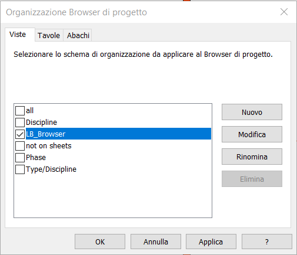

Quest’ultima tipologia potrà contenere tutte le indicazioni per una corretta esecuzione delle tavole, quali testi, quote, annotazioni, simboli, …, o potranno essere utilizzate come collegamenti per la creazione di tavoli su file esterni.

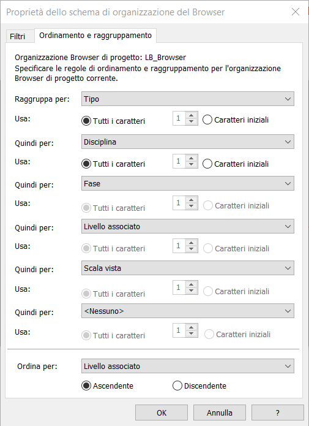

## 2.5 Impostazione del progetto e regole di modellazione

Un progetto è soggetto a costanti modifiche nel tempo ed è quindi necessario sviluppare delle strategie che consentano di poter gestire i cambiamenti e le modifiche nel minor tempo possibile. Si suggerisce quindi di procedere facendo attenzione ai seguenti aspetti che verranno riportati nei capitoli seguenti:

- impostazione del progetto e regole di modellazione;
- nomenclatura e sistemi di classificazione;
- standard grafici;
- template di riferimento.

### 2.5.1 Definizione dell'area di lavoro

Può essere utile soprattutto agli inizi della fase di modellazione e impostazione del progetto, definire un’area di lavoro tracciando 4 piani di riferimenti (piano di lavoro Nord, Sud, Est e Ovest) per definire i limiti dell’area di lavoro.

I livelli e le griglie dovranno essere estesi oltre a questi riferimenti in modo tale da garantire ad ogni vista (sezione o prospetto) di estendere oltre ai margini della vista i livelli e le griglie. Nell’immagine è riportato un esempio.

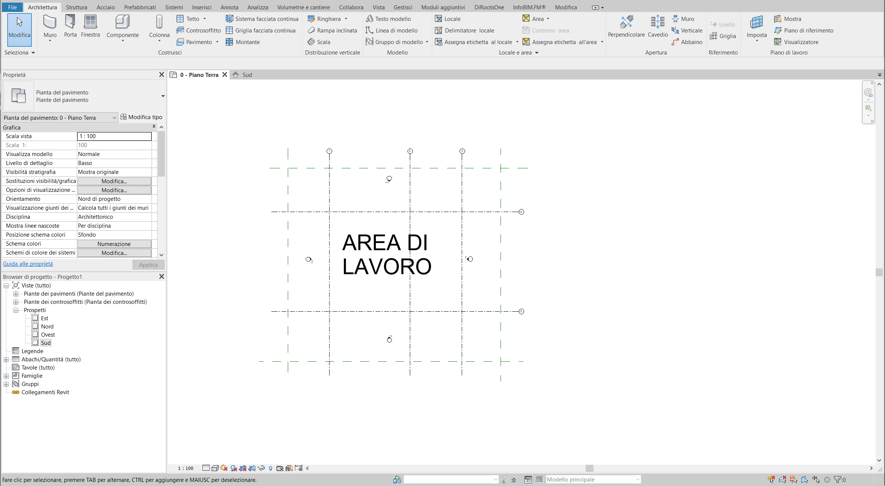

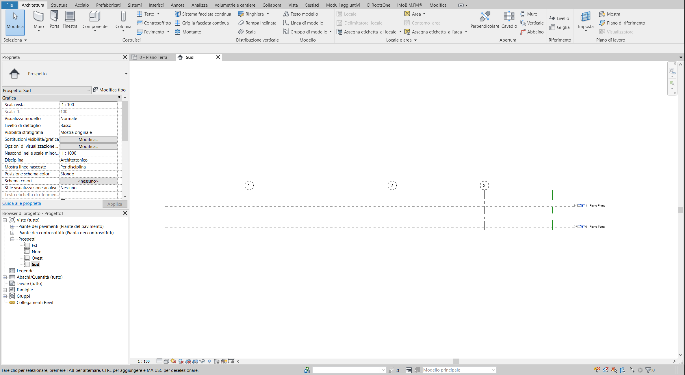

Si consiglia di estendere griglie e livelli oltre tali piani di riferimento per averli sempre visibili nelle varie viste.

### 2.5.2 Sistema di riferimento per l'impostazione del lavoro

Durante la fase di avvio del progetto, è necessario impostare un **sistema di riferimento** di lavoro costituito da:

- **Origine di progetto** comune e condivisa fra tutti i file (anche fra le diverse discipline). E’ necessario impostare un sistema di riferimento condiviso fra i vari modelli (stabilire un’origine comune fra i file, ad esempio un punto di ordine 0,0,0 oppure georeferenziare i file). Il sistema di riferimento deve essere comune a tutti i tipi di file, da quelli in formato proprietario a quelli in formato aperto;
- **Livelli**, che potranno subire cambiamenti. Dovranno essere definiti dei piani di lavoro (quota finito architettonico e quota impalcato strutturale) usando il comando “LIVELLI”. Se si reputa necessario utilizzare piani ausiliari di supporto alla modellazione (es. rivestimenti, davanzali, ecc.) è possibile utilizzarli stando però attenti ad evitarne l’esportazione in formato IFC o a collegarci elementi costruttivi;
- **Assi strutturali**, le "GRIGLIE" dovranno essere rinominate suddividendole tra griglie verticali (es. A01, A02, A03, ...) e griglie orizzontali (es. AA, AB, AC, ...);
- **Riferimenti architettonici**, si potrà creare un sistema griglie (o piani) rispetto a quelle strutturali (differenti per nome e per colore, creando un nuovo tipo) che descriveranno i fili esterni delle partizioni esterne (oppure in relazione del nucleo interno del muro che servirà come riferimento per estendere il pavimento fino a toccare il nucleo). Si possono usare anche piani di riferimenti compatibilmente con la chiarezza e lettura del disegno;
- **Vincoli urbanistici**, vincoli urbanistici saranno inseriti in Revit attraverso il comando “CONFINI CATASTALI”. Se necessario si potranno inserire altri riferimenti attraverso il comando “PIANO DI RIFERIMENTO”.

### 2.5.3 Georeferenziazione del modello

Prima di procedere alla modellazione degli elementi di sistema è buona prassi definire la corretta georeferenziazione del modello e l’inclinazione del nord reale rispetto al nord di progetto (utilizzato per lavorare con piani verticali ed orizzontali invece che obliqui).

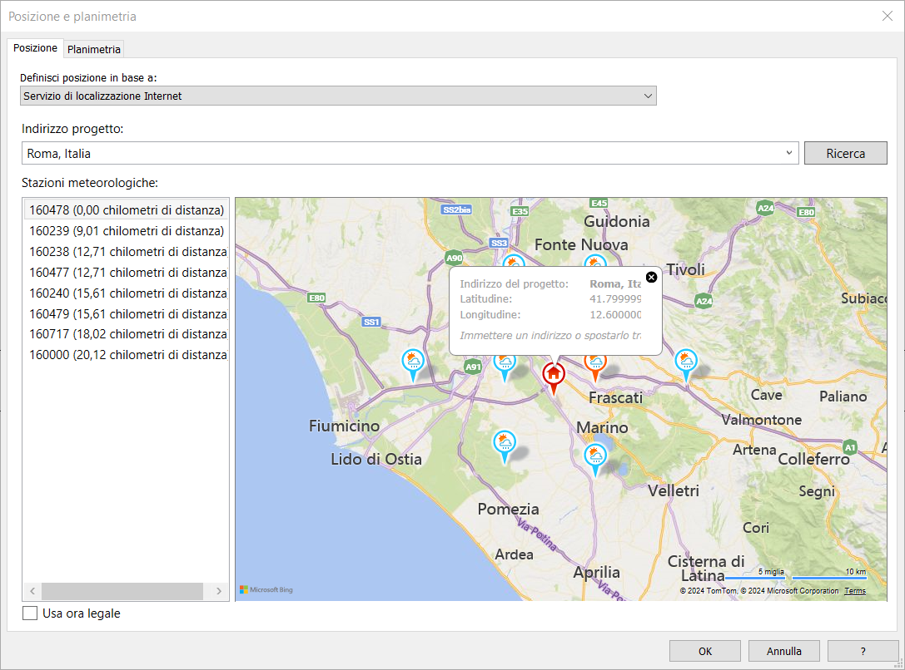

Le viste di pianta vengono aperte di default nella condizione di Nord di Progetto. Tale impostazione è possibile osservarla nel Pannello delle Proprietà di istanza della singola vista. Per definire un’inclinazione del Nord Reale differente da quella del Nord di Progetto è possibile modificare il parametro “ORIENTAMENTO” con “NORD REALE”, dopo di che utilizzare il comando “RUOTA NORD REALE” nella scheda Gestisci e definire l’angolo di inclinazione. Una volta ruotato l’intero modello rispetto al nord reale è possibile tornare a lavorare con i piani nella posizione più ottimale modificando nuovamente il parametro “ORIENTAMENTO” in “NORD DI PROGETTO”.

E' possibile effettuare anche l'operazione inversa, ovvero, a partire da un nord reale modificare il nord di progetto in modo da ottenere un posizionamento dell'oggetto migliore ai fini della modellazione.

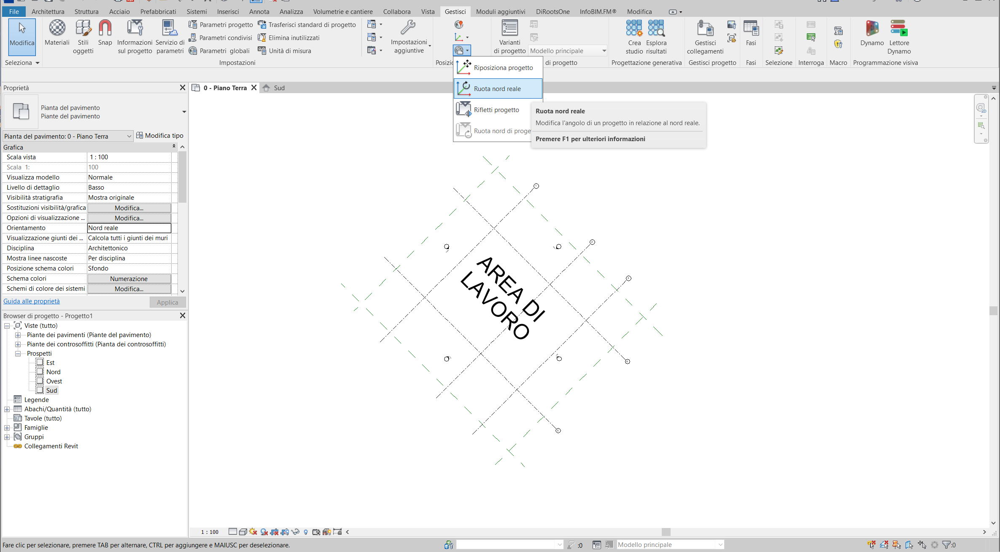

### 2.5.4 Coordinamento con un modello di riferimento (master)

Nel caso si abbia già un modello di coordinamento, collegato al nostro modello di progetto, in cui sono state inserite griglie e livelli è necessario ricorrere al comando “COPIA-CONTROLLA” per importare nel proprio modello questi elementi nelle medesime posizioni rispetto all’origine. Questo processo eviterà di modificare erroneamente la posizione di elementi condivisi in quanto il software restituirà un avviso nel quale indica che un oggetto ha perso il riferimento con il modello collegato.

### 2.5.5 Collegamenti di file CAD

Nel caso in cui il nostro modello abbia dei file CAD di riferimento è buona prassi collegarli all’interno del modello evitandone l’importazione. Al momento della creazione del collegamento è buona pratica verificare:

- che il file CAD sia ottimizzato (ripulito di tutte le informazioni non necessarie e posizionato con una origine congrua al "project base point" del file .rvt);
- che sia presente il flag in "SOLO VISTA CORRENTE" ("Current View Only");
- che sia assente il flag in "Current line that are slightly off axis";
- che il posizionamento sia "DA ORIGINE A ORIGINE";
- che l'unità di misura sia la stessa del progetto.

### 2.5.6 Suggerimenti per la realizzazione di una superficie topografica (terreno)

Il terreno può essere realizzato partendo da:

- inserimento di punti singoli nell'are di lavoro definendone le altezze;
- file ._dwg_ che contiene polilinee posizionate in quota oppure tramite punti 3D;
- Importazione dei punti da file ._txt_;

Una volta creata la topografia è possibile andare a definire delle sotto-regioni a cui associare attributi o materiali differenti a seconda delle necessità (es. render).

Rilevati, scarpate e strade possono essere modellate con il plug-in "Site Design" (**in progress**).

### 2.5.7 Creazione di modelli di vista

Quando si creano delle viste è buona prassi associare ad ognuna un modello di vista in funzione del tipo di vista che stiamo impostando.

### 2.5.8 Sistema di annotazione

### 2.5.9 Annotazioni per le revisioni

Le revisioni saranno indicate tramite il comando nuvola di revisione.

### 2.5.10 Spessori e tipi di linee

Le linee presenti nel template di riferimento differiscono anche a seconda delle scale di rappresentazione.

### 2.5.11 Stili di linee

Settare i tipi di linea in Revit può essere un processo molto lungo e noioso, soprattutto quando è necessario modificare localmente un disegno bidimensionale e aggiungere delle informazioni. Per aiutare in questo processo sono state inserire, invece della solita suddivisione standard fra Linee sottili, Linee medie, Linee pesanti, degli stili suddivisi sia per spessori, con identificativi numerici, che per tipologia.

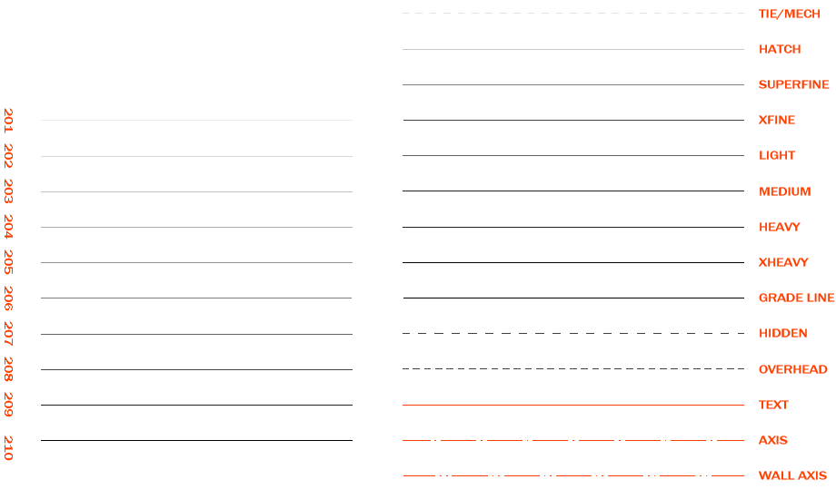

Inoltre, sono state aggiunte delle linee che potrebbero essere utili durante il disegno dei particolari esecutivi e dettagli.

### 2.5.12 Stili di quote

Le quote riportano la seguente convenzione grafica ed utilizzano lo
stile di carattere Arial Narrow 1.8 mm.

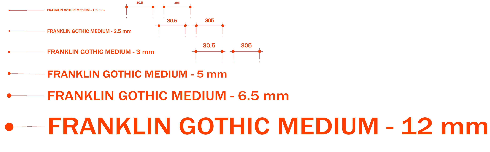

### 2.5.13 Tipi di testo

I testi riportano il tipo di carattere “Franklin Gothic Medium” riportato all’interno della descrizione del tipo in quanto potrebbe essere necessario utilizzare altri tipi di carattere, anche se è fortemente sconsigliato. I testi sono principalmente di colore arancio ma possono essere utilizzati anche altri colori in caso di necessità:

- Arancio, per tutte le annotazioni (testo di default) -- riporta il termine "Orange" alla fine del nome e la dimensione in mm (RGB: 255; 063; 000);
- Nero, in caso di impaginazione tavole per pratiche edilizie -- anche in questo caso sarà riportato il codice "Black" in fondo al testo (RGB: colore nero Revit)

Effetti corsivi, sottolineati e grassetti dovranno riportare in fondo al testo l'indicazione "I" (italic), "B" (bold) e "U" (underlined).

### 2.5.14 Tipi di campiture

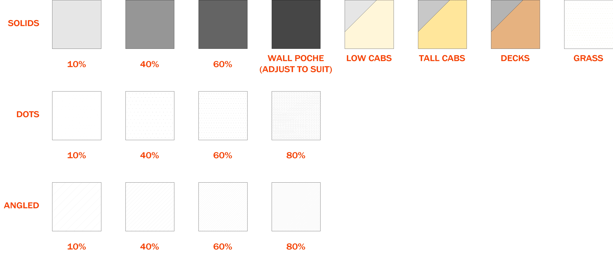

### 2.5.15 Tipi di contrassegno

I locali hanno 2 tipi di etichette in funzione della scala di rappresentazione (con area o senza area). Porte e finestre verranno indicate solo col codice prevalentemente rispetto al senso dell’apertura della porta (fai riferimento a standard grafici). Murature saranno indicati con il singolo del rombo.

Le famiglie nidificate avranno annotazioni per ciascun tipo di rivestimento (Attenzione: all’interno della famiglia quando si nidifica una famiglia, è necessario controllare che il parametro “condiviso” sia stato attivato, altrimenti nel progetto non è possibile leggere il contrassegno tipo della famiglia nidificata).

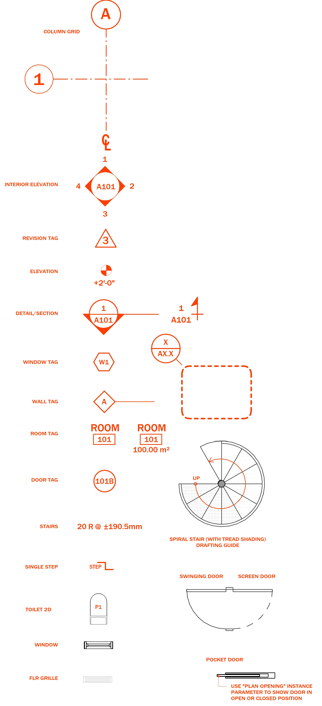

### 2.5.16 Simboli di vista

Il simbolo _Interior Elevation_ si utilizza per i prospetti. Il simbolo _Detail / Section_ si utilizzerà per le sezioni. Il simbolo _Elevation_ si utilizza per l'inserimento di quote altimetriche nelle viste di pianta o in elevazione.

### 2.5.17 Altri simboli

Oltre a quelli già presenti all’interno del template è possibile inserire altri simbolo di utilizzo comune da concordare con i responsabili.

## 2.6 Specifica per l'inserimento di oggetti

Di seguito sono specificate le modalità di inserimento e/o vincoli dei principali elementi tecnici rispetto ai principali sistemi di riferimento spaziali definiti nel modello stesso.

Si riportano di seguito alcune buone pratiche di modellazione per singole categorie di elementi:

- _modelli generici_, **nessun oggetto / parte del lavoro o dell'entità del modello deve essere inserito come oggetto generico**, ma deve sempre essere associato alla categoria logica a cui appartiene;
- _aree esterne_, potranno essere modellate come [IfcSlab](https://standards.buildingsmart.org/IFC/RELEASE/IFC4_3/HTML/lexical/IfcSlab.htm), differenziando, ove possibile, le diverse tipologie di pavimentazione;
- _elementi architettonici_:
  - _pareti_, tutte le pareti saranno associate inferiormente al livello su cui giacciono e limitate inferiormente e superiormente secondo le caratteristiche costruttive e tecnologiche. Nel caso di doppia altezza saranno associate al livello più basso. Tutte le pareti inoltre devono essere classificate rispetto alla "funzione", indicando se esterne o interne tramite il parametro [Pset_WallCommon.IsExternal](https://standards.buildingsmart.org/IFC/RELEASE/IFC4_3/HTML/lexical/Pset_WallCommon.htm). A seconda delle esigenze di progetto, che devono essere valutate caso per caso, è possibile generalizzare i processi di modellazioni secondo le seguenti regole:
    - _muri esterni_: in generale secondo la "LINEA DI UBICAZIONE" impostata come "SUPERFICIE DI FINITURA ESTERNA" per rispettare i vincoli urbanistici;
    - _muri interni_: secondo la "LINEA DI UBICAZIONE" impostata come "LINEA D'ASSE DEL NUCLEO";
    - in generale si consiglia di controllare i "GIUNTI DEI MURI" e attivare "GIUNTI D'ANGOLO" per garantire il giusto calcolo delle quantità.
  - _solai_, tutti i solai saranno associati al livello di riferimento in cui giacciono ed inseriti alla quota del proprio estradosso. I solai devono essere modellati attraverso il comando “SELEZIONA MURI” e spuntando la voce “PROLUNGA NEL MURO (NUCLEO)”;
  - _finiture_, molte volte è necessario separare la finitura architettonica dalla componente strutturale al fine di migliore sia la restituzione geometrica dell’oggetto che agevolare la fase di quantity takeoff. Nel caso delle pareti di default la finitura aggiuntiva si collocherà sopra le aperture, come porte e finestre. Tramite la funzione “UNISCI” della scheda Modifica è possibile unire lo strato di finitura con la parete sottostante ed ottenere quindi il vuoto corrispondente alle aperture anche per questo ultimo strato;
  - _volte_, i soffitti voltati andranno modellati per il solo strato strutturale (più intonaco se presente) inserendo separatamente il pacchetto architettonico soprastante e lasciando del vuoto tra i due elementi. A secondo della logica del singolo caso;
  - _coperture_, tutte le coperture saranno associate al livello di riferimento in cui giacciono ed inseriti alla quota del proprio estradosso;
  - _controsoffitti_, i controsoffitti saranno associati al livello a loro sottostante;
  - _facciate continue_, si suggerisce di spostare l’asse del muro facciata continua in modo tale che la linea di posizionamento coincida con la parte interna del profilo. In questo modo il delimitatore del locale si fermerà in corrispondenza del filo interno;
  - _scale_, se prevista una suddivisione per discipline dovranno essere separate in parti strutturali e architettoniche. Ognuno di questi elementi apparterrà al proprio modello disciplinare;
  - _pilastri_, tutti i pilastri saranno associati al livello su cui giacciono e limitate inferiormente e superiormente secondo le caratteristiche costruttive e tecnologiche. Nel caso di doppia altezza saranno associati al livello più basso;
  - _travi_, tutte le travi saranno associate al livello su cui giacciono ed inserite alla quota del loro estradosso;
  - _porte_, gli elementi base che dovrebbero essere sempre presenti all'interno di una famiglia porta sono il telaio (_frame_) ed il pannello (_panel_) ai quali si consiglia di aggiungere la maniglia (_handle_) e la simbologia dell'apertura tramite la nidificazione di famiglie come mostrato in fig. 11. Ogni estrusione o elementi nidificato dovrà essere assegnato alla relativa sottocategoria;
  - _arredi_, tutti gli arredi devono essere associati al livello architettonico su cui giacciono e collocati nell'adeguata categoria di elementi (per esempio vedere enumerativi [IfcFurniture](https://standards.buildingsmart.org/IFC/RELEASE/IFC4_3/HTML/lexical/IfcFurniture.htm));
- _componenti impiantistiche_, tutte le apparecchiature, terminali e relative distribuzioni impiantistiche, dovranno essere modellati in relazione alla quota di finito architettonico del piano di riferimento, indicando per il singolo elemento l’offset relativo:
  - _sistemi meccanici_, ove si intende come sistema meccanico, a titolo indicativo e non esaustivo, gli insiemi di apparecchiature meccaniche, impianti e terminali relativi a climatizzazione (compressore, condensatore, pompa di calore, fan coil), ventilazione, depurazione, refrigerazione. Si richiede la classificazione di ogni sistema, contenente tutte le sue parti rappresentate e le distribuzioni relative, tramite le corrette classe IFC (es. [IfcDistributionSystem](https://standards.buildingsmart.org/IFC/RELEASE/IFC4_3/HTML/lexical/IfcDistributionSystem.htm));
  - _sistema elettrico_, ove si intende con sistema elettrico, a titolo indicativo e non esaustivo, gli insiemi di apparecchiature elettriche, impianti e terminali relativi a illuminazione, forza motrice, linee no break/privilegiate, safety, security, sistemi dati, sistemi logici, alimentazione equipment, building automation. Si richiede la modellazione di elementi quali generatori, celle, trasformatori, quadri, canaline elettriche, corpi illuminanti e terminali afferenti alle categorie di impianti speciali e sistemi di sicurezza(tutto il resto si intende escluso dalla fase di modellazione);
  - _sistema antincendio_, gli impianti presenti negli spazi pubblici del progetto (naspi, idranti) saranno modellati e oggetto di coordinamento.

")

Come regola generale si suggerisce di creare sempre famiglie parametriche in Revit, evitando la modellazione locale o famiglie scaricate da internet, le quali hanno al loro interno modelli mesh importati da altri software. Questo perché ogni volta che si copia un modello locale, viene creata una nuova entità, invece di riferire le informazioni attraverso una famiglia, che invece invece deve essere intesa quasi come se fosse un “xref”, ovvero viene caricata una sola volta ed i MB caricati all’interno del file rimangono limitati anche se si copia numerose volte all’interno dello stesso progetto.

**Tip.** Nel caso si riscontrassero delle problematiche nell’esportazione del file IFC per quanto riguarda l’associazione di singoli elementi a livelli del progetto è possibile utilizzare il parametro di istanza IfcSpatialContainer” per definire manualmente manualmente l’associazione. I valori accettati dal parametro sono: IFCSITE, IFCBUILDING o qualsiasi nome di livello esistente all’interno del progetto.

**Osservazioni**
Non usare famiglie che:

- presentano al loro interno oggetti non dinamici, come ad esempio oggetti _.dwg_ o mesh 3D;
- hanno dimensioni superiori a 2 MB (se superiori valutare se indispensabile al progetto);
- possiedono un dettaglio sovrabbondante rispetto al livello di approfondimento progettuale di lavoro;
  Un altro aspetto da considera è che le famiglie richiedono meno risorse che i gruppi. I gruppi sono molto efficaci, ma l'aggiornamento di molti esemplari nel gruppo consuma una notevole quantità di risorse di elaborazione. Se possibile, limitare l'uso diffuso di vuoti per generare le geometrie della famiglia e limitare l'uso di matrici e formule. Utilizzare le linee dei simboli e delle regioni di mascheratura invece di geometria in viste di pianta.

Altre regole:

- usare piani di riferimento per vincolare i parametri e vincolare i solidi ai piani;
- modellare gli oggetti rispetto al baricentro (incrocio fra asse verticale e orizzontale);
- usare parametri che fanno riferimento allo schema IFC ove possibile o più semplificati possibile con nomi corti (es. D, d, rmax, rmin, ecc);
- usare le sotto-categorie standard o quelle codificate;
- per l'impostazione dei paramenti e dei vincoli si usa il comando "quota". In linea generale si deve selezionare prima l'asse che si muove e poi quello che rimane fisso.

## 2.7 Altri suggerimenti per l’ottimizzazione del processo

**Collegamenti** - un file collegato (.rvt o .dwg) se non servono devono essere scaricati e ricollegati soltanto in fase di utilizzo. Alla consegna di un modello in formato nativo è buona prassi rimuovere tutti i modelli collegati nei vari formati.

**File .dwg** -- ridurre al minimo il numero di file DWG collegati o importati. E’ preferibile che i file DWG siano collegati e non importati in quanto, in quest’ultimo caso, Revit scompone in file e carica al suo interno tutte le entità (linee, polilinee, tratteggi, ecc).

**Origine comune** -- i file devono essere collegati mantenendo l’origine uguale a tutti i file anche nei diversi formati. E’ essenziale effettuare delle prove di esportazione in formato IFC per verificare la corretta georeferenziazione tra i diversi modelli.

**Cancellare oggetti non utilizzati** -- evitare di mantenere oggetti inutili (scheda Gestisci, "ELIMINA INUTILIZZATI"). Cancellare anche schemi colore o schemi aree non utilizzati.

**Avvisi di errore**-- periodicamente esaminare gli avvisi ricevuti e risolverli. Alla consegna di un modello in formati nativo non dovrebbero essere presenti avvisi e/o errori. In caso di errori che non possono essere risolti si consiglia di produrre un report esplicativo delle motivazioni.

**Matrici**-- le matrici possono essere utilizzati per la copia in serie di oggetti. Le prestazioni possono migliorare se gli oggetti non vengono raggruppati (quindi successivamente si procede con l’esplosione). I Paramenti associati agli oggetti devono essere limitati al minimo. Questo può essere ottenuto, deselezionando l'opzione di creazione del gruppo prima di creare la matrice.

**Keymap** -- elaborare le mappe da utilizzare come navigatori attraverso il comando "LEGENDA".

**Immagini raster** -- eliminare le immagini inutilizzate. Le immagini raster sono associate a file di grandi dimensioni e riduzioni di performance. Le immagini monocromatiche raster sono più piccole di quelle immagini a colori. Salvare le immagini raster in bianco e nero, con una dimensione di 1 bit per pixel, invece di JPG o TIF. Le immagini da inserire (es. per i cartigli) devono essere delle dimensioni appropriate e non più grandi di quanto necessario (infatti bisogna evitare di ridurre l’immagine).

**Visualizzazioni** -- prima di chiudere un file, aprire una vista semplice (pianta o prospetto in wireframe) in modo tale che quando il programma viene riavviato l’apertura del file diviene più snella e veloce. In alternativa si può selezionare una vista di “Home Page”. Altre osservazioni sugli stili di visualizzazioni sono:

- minimizzare la profondità delle viste, ove possibile (prospetti e sezione);
- utilizzare riquadri di sezione per limitare le geometrie visibili in una vista 3D;
- minimizzare la quantità di vista per ridurre le dimensioni del modello;
- utilizzare stile di visualizzazione wireframe o ombreggiato in quanto sono le modalità più leggere di visualizzazione (l'ombreggiato è 3 volte più veloce della modalità linee nascoste o ombreggiatura con bordi);
- evitare di nascondere grandi quantità di elementi individuali nella vista;
- chiudere finestre inutili attraverso il comando "CHIUDE FINESTRE NASCOSTE";
- assegnare alle viste il livello di dettaglio appropriato;
- disattivare le ombre nelle viste non necessarie.

## 2.8 Principi generali di lavoro collaborativo

Esistono numerosi metodi che consentono la collaborazione in ambiente BIM, comprese le pratiche di lavoro e la gestione della squadra di progetto, nonché le soluzioni tecnologiche definite sinteticamente da questo documento.

Questa sezione tratta i principi di suddivisione e condivisione di un modello ai fini di garantire efficienza operativa per grandi progetti, garantire l’accesso contemporaneo multiutente sullo stesso progetto e di permettere una collaborazione interdisciplinare.

Nel caso specifico dell’Ufficio Tecnico la terminologia seguente farà riferimento alla condivisione del lavoro nella piattaforma Autodesk Revit (worksharing) attraverso due modalità principali: **FILE COLLEGATI** (linked file) e **WORKSETS**.

Il primo, (**file collegati**), consiste nel collegare all’interno di un file di lavoro Revit un altro modello in formato proprietario (.rvt) o in formato aperto (.ifc). Si potrà accedere a ciascun file singolarmente e non è permesso il lavoro simultaneo sullo stesso file. Con la stessa metodologia è possibile collegare all’interno di un modello anche file di altra natura come .dwg, .rcp/rcs (ReCap) o .nwc (Navisworks). Il secondo (**worksets**) permette invece di lavorare contemporaneamente sullo stesso file (si veda cap. xx), suddividendo con criterio tra gli utenti gli elementi o le viste di pertinenza.

Le proprietà degli oggetti parametrici che sono definite all’interno del template o di qualsiasi modello possono essere trasferite (attraverso il comando “TRASFERISCI STANDARD DI PROGETTO”) all’interno di un altro file di lavoro. In questo modo la fase di progettazione è separata dalla fase di gestione delle famiglie.

## 2.9 Standard grafici per la produzione degli elaborati

Al fine di mantenere i file leggeri e fruibili, è opportuno modellare scorporando il file di modellazione da quello utilizzato per la creazione delle tavole, secondo due tipologie:

- **Work Model**, destinato alla modellazione;
- **Sheet Model**, destinati all’estrazione dei dati e delle tavole di progetto. In tale file sarà possibile importare dei file CAD solo se utili alla rappresentazione in tavola di legende o dettagli costruttivi non rappresentabili nel modello.

Si riportano alcune accortezze da tenere a mente quando si producono elaborati grafici tramite il software Autodesk Revit.

**Griglie e livelli** - Attivando il comando “ESTENSIONE 2D” per livelli e griglie è possibile modificare solo la rappresentazione grafica 2D mantenendo inalterata l’informazione 3D presente nel modello. I livelli e le griglie non dovrebbero intersecare il disegno del prospetto: i livelli verranno portati su un lato (sinistro o destro) mentre le griglie si riporteranno in alto, interrompendo la linea (circa 1 metro o 1,5 metri) dall’elemento.

**Piante** - I muri saranno rappresentati a dettaglio basso (campitura a retino pieno) per la scala superiore a 1:100, mentre a dettaglio medio (con stratigrafia per scala 1:50 o minore). In caso di rappresentazione della stratigrafia, si consiglia di impostare la stampa in scala di grigi per le linee che indicano gli strati interni dei muri, e lasciare inalterato la linea di sezione.

**Schemi** - Può essere utile impaginare le tavole utilizzando una pianta per tavola, riportando in basso (o in alto) schemi per l’indicazione dei materiali e tabelle per il calcolo dei rapporti areo illuminanti. Altresì può essere utile riportare sopra al cartiglio, tabelle riassuntive per i codici degli elementi.

**Codifica** - Per porte e finestre l’etichetta dovrà essere orientata perpendicolarmente rispetto all’elemento e allineato rispetto ad una dei due montanti verticali. Per le altre etichette l’orientamento di lettura deve essere in funzione all’orientamento della tavola.

## 2.10 Integrazione con altri software

Revit permette di progettare in modo integrato, utilizzando una serie di software che permettono di apportare agevolare i processi di produzione di modelli e portare al progetto contributi in vari settori specialistici. Nel nostro caso si individuano alcuni percorsi di approfondimento sia per alcuni plug-in molto utilizzati che per l’integrazione di software terzi in ambiti specialistici come:

1. rendering;
2. analisi strutturale;
3. analisi energetica.

### 2.10.1 Droots One

Questo è un pacchetto unico che riunisce al suo interno più strumenti fondamentali per l'utilizzo professionale del software revit.

1\) **Sheet Link**, ermette di importare/esportare fogli di calcolo Excel o Google Sheet. E’ possibile sia impostare l’esportazione di un abaco creandolo sul base sulla base di una selezione di categorie di elementi e parametri associati, o esportare abachi già impostati all’interno del progetto (fig. 12).

Nella colonna di sinistra è possibile selezionare quale abachi esportare, mentre nella colonna di destra è possibile visualizzare i parametri presenti nell’abaco e la loro tipologia: istanza o tipo. Alcuni parametri evidenziati in rosso sono impostati in sola lettura, questo significa che non sarà possibile modificarli esternamente al software e poi re-importarli.

Una volta aperto il nuovo foglio di calcolo notiamo come questo sia organizzato tramite colori in cui i parametri di tipo si presentano con lo sfondo giallo e quelli di istanza con lo sfondo bianco. Sheet Link aggiunge sempre un parametro “ID Elemento” per mantenere l’associazione al momento in cui si voglia re-importare il file modificato. Quando effettuiamo delle modifiche è importante tenere a mente la distinzione tra parametri di tipo e di istanza, infatti se modifico un parametro così detto di tipo dovrò assicurarmi che questo sia identico per tutte le istanze della stessa tipologia di elemento.

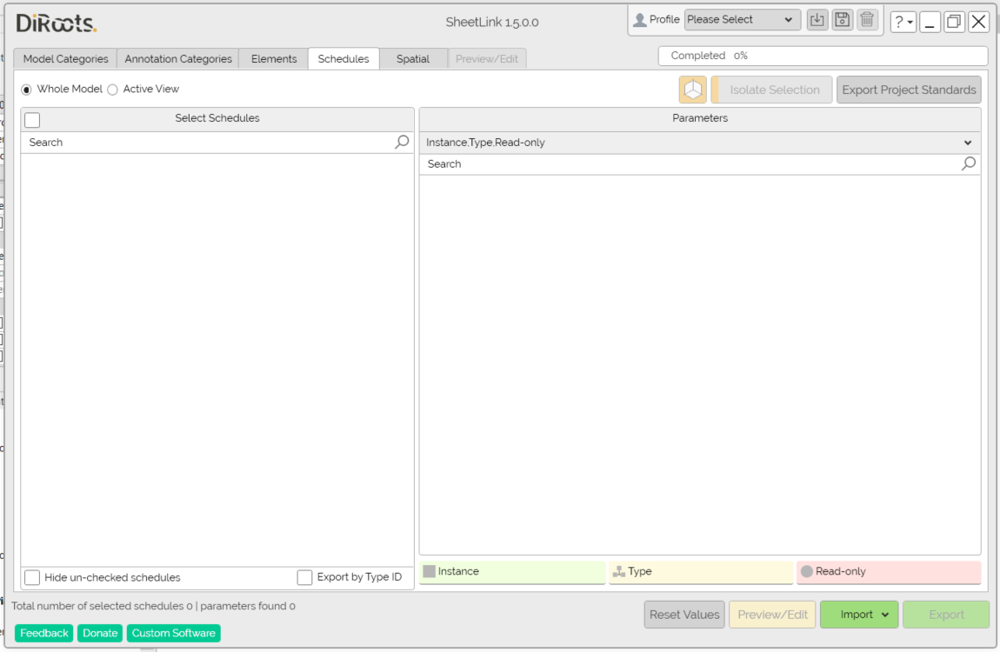

Una volta modificati i parametri è possibile importare il file in Revit tramite il comando “IMPORT” e si troveranno i parametri, sia in abaco che associati agli oggetti (sono la stessa cosa!), con i nuovi valori appena modificati.

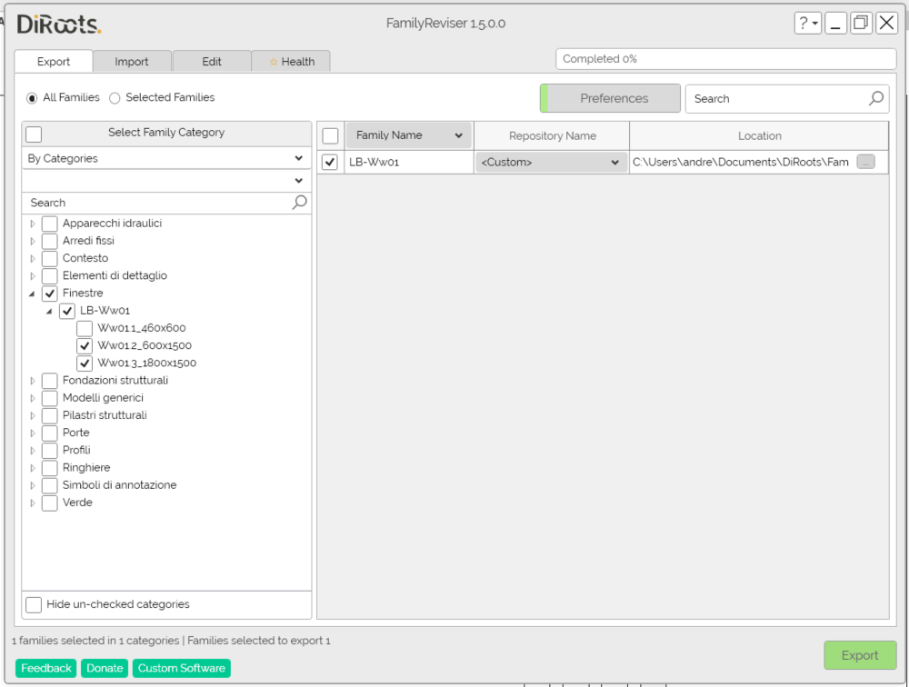

2\) **Family Reviser**, permette di gestire le famiglie e la loro naming convention. Il pannello presenta tre schede principali:

- Export (fig. 13), permette di esportare una o più (anche tutte) famiglie presenti all'interno di un progetto in singoli file in formato .rfa. E' possibile assegnare sia una cartella che una sotto-cartella per l'organizzazione di tali famiglie.
- Edit (fig. 14), permette di effettuare operazione come "TROVA / SOSTITUISCI" nella naming delle famiglia, o aggiungere prefissi/suffissi. Il tutto sia a livello di famiglia che di tipo;

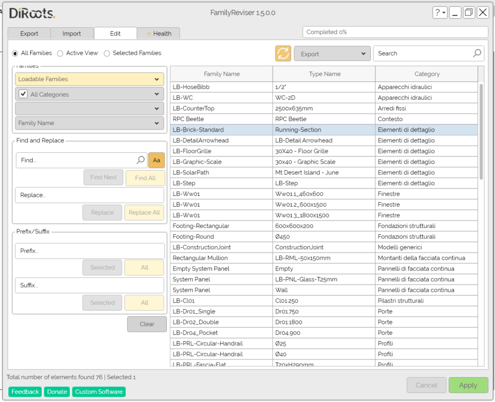

- Import, permette di importare una o più famiglia esterne al progetto in formato .rfa a partire da una cartella selezionata;
- Health, permette di verificare lo stato di salute delle famiglie interne al progetto, ovvero se presentano qualche errore per il quale possono sorgere degli errori di visualizzazione o inserimento nel modello.
  3\) **ParaManager**, permette di gestire i parametri di progetto agevolando l’importazione di parametri condivisi rispetto al comando tradizionale. E’ infatti possibile selezionare più di un parametro condiviso per volta ed assegnare ad ognuno la sua tipologia (tipo/istanza), il gruppo sotto cui deve essere raccolto e le categoria di riferimento.

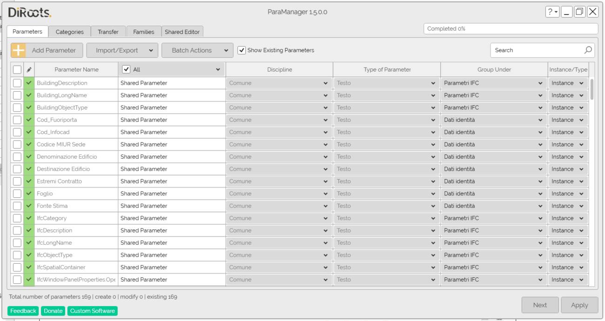

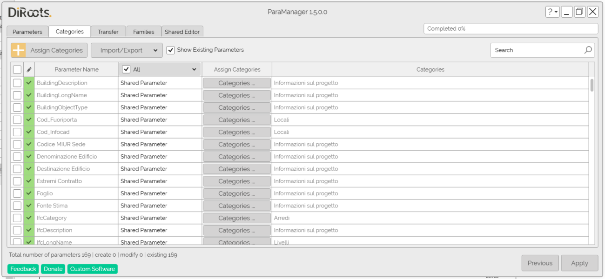

### 2.10.2 pyRevit (by Ehsan Iran-Nejad)

PyRevit è un plugin gratico che offre sia delle funzionalità di base ma che permette anche di creare i propri tools tramite linguaggio Python.

1. **Make Pattern**, permette di creare delle campiture personalizzate. Per iniziare, è necessario creare una Vista di disegno e disegnare il modello utilizzando delle linee di dettaglio assicurandosi che entri all'interno di un rettangolo (non è necessario disegnare un rettangolo vero e proprio). Selezionare poi le linee e utilizzare lo strumento “CREA MODELLO” nella scheda pyRevit. È possibile attivare anche alcune opzioni come il “ribaltamento orizzontale/verticale”, “scala”, “ruota” e “crea regione riempita”. Immettere il nome del modello e selezionare il tipo di campitura Dettaglio o Modello. Quando si è pronti, fare clic su Crea modello. Un’altra opzione è quella di poter esportare un _pattern_ esistente in formato _.pat_.

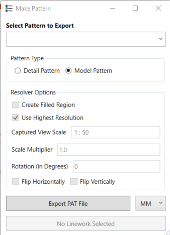

2. **Batch Sheet Maker**, permette di creare più tavole contemporaneamente. Una volta selezionato il comando che si trova nella scheda “Drawing Set”, icona Sheet, sarà sufficiente digitare i numeri ed i nomi delle tavole con la seguente formattazione:

> **sheet-number** TAB **sheet-name** (es. A311 SHEET NAME)

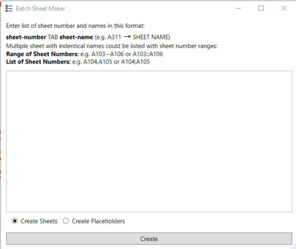

Se sono presenti più tavole con lo stesso nome può essere dato un range della numerazione tramite la formattazione A103—A106 o A103::A106

Definiti nomi e numeri dovrà essere selezionato un cartiglio e le tavole appariranno le browser di progetto.

3. **Set Revision on Sheet**, permette di attivare l'impostazione di revisione su più tavole in quanto normalmente queste deve essere attivate singolarmente per ogni tavola o tramite l'aggiunta di nuvole di revisione.

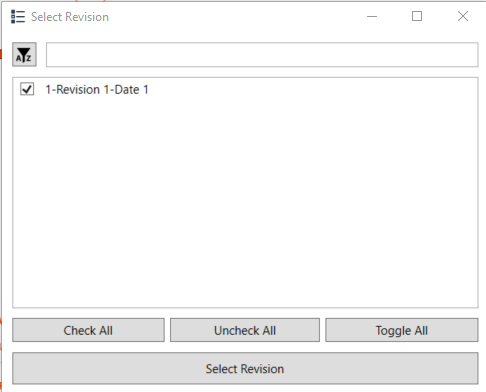

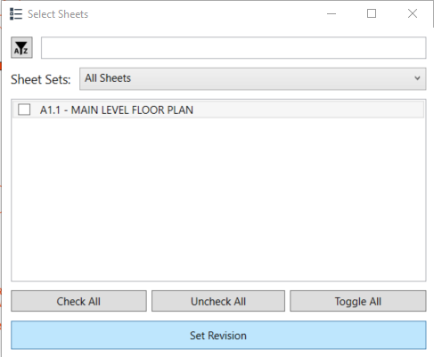

Tramite questo comando si va quindi a selezionare prima la revisione da dover aggiungere (fig. 14) e successivamente le tavole in cui si vuole aggiungere quella specifica revisione (fig. 15). Una volta aggiunta la revisione questa sarà visibile nell’ABACO DELLE REVISIONI.

4. **Match**, permette di trasferire le impostazioni grafiche da un elemento di origine a uno o più elementi di destinazione.

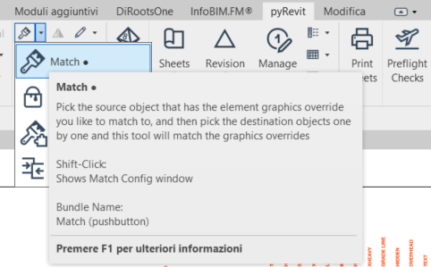

5. **Copy Legends to Other Documents**, permette di copiare una legenda all'interno di un altro documento.

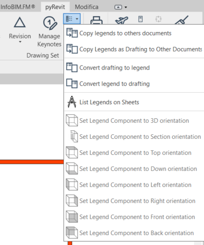

6. **Sync Views**, permette di impostare tutte le viste nella stessa area, in modo da poter continuare a lavorare sullo stesso settore senza dover eseguire zoom in/out.

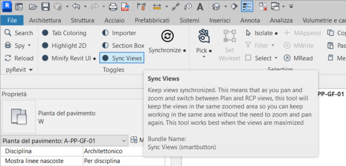

7. **Who did that?**, permette di visualizzare l'ultimo utente che ha effettuato una modifica su un determinato elemento.

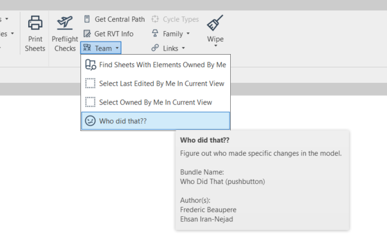

8. **Wipe**, permette di eliminare gli elementi non utilizzati con maggior accuratezza rispetto al comando standard di Revit. E’ possibile visualizzare tutte le categorie di elementi che è possibile ripulire, inoltre l’opzione “WIPE MODEL COMPONENTS” consente di eliminare contemporaneamente elementi come viste, tavole, muri, …, il che potrebbe tornare utile prima di inviare un modello all’esterno dell’organizzazione.

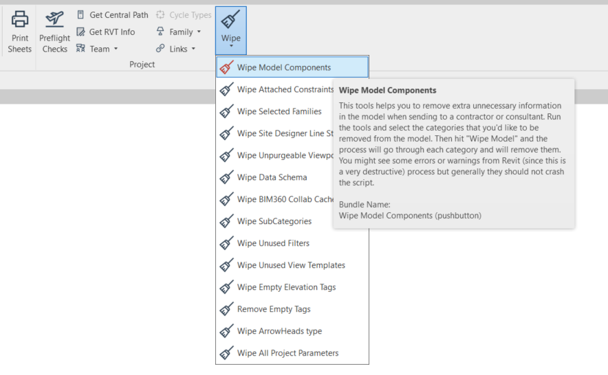

9. **Pick**, permette di selezionare una specifica categoria prima di effettuare una selezione di elementi. I comandi “Pick Detail Elements” e “Pick Model Elements” permettono rispettivamente di selezionare solo elementi di dettaglio o solo elementi di modello. Tramite questo comando la selezione della categoria di elementi viene effettuata prima di tracciare il riquadro di selezione al contrario del classico filtro di Revit che viene applicato successivamente.

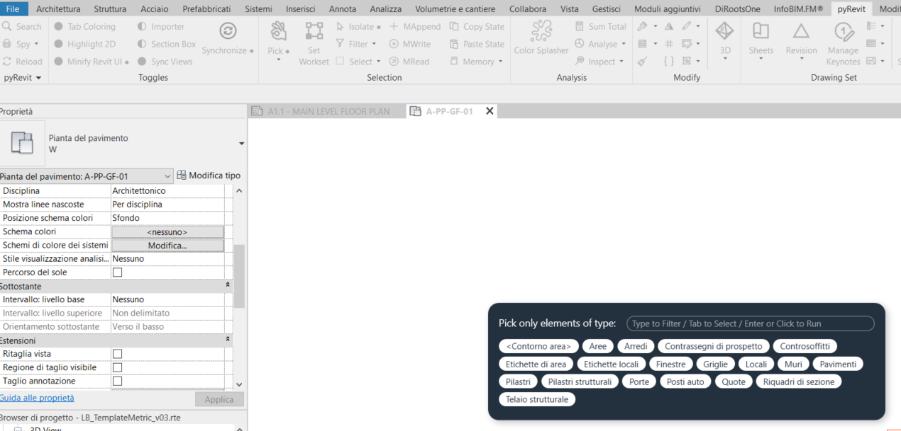

10. **Place Origin Marker**, permette di posizionare un marker nell'origine (0, 0, 0) del modello. \*Dalla versione 2022 l'origine interna ha già un suo marker, il che rende inutile tale strumento.

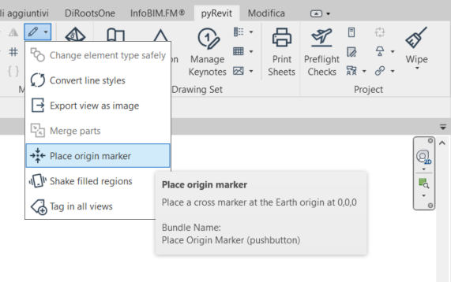

11. **Print Ordered Sheet Index**, consente di stampare tavole da un elenco specifico e non solo dai filtri delle revisioni come avviene con il comando base di Revit. Questo torna utile per rendersi conto se stiamo stampando le tavole corrette a partire da una lista/revisione specifica.

### 2.10.3 Isolate Warnings (by Archisoft)

Permette di visualizzare gli elementi interessati da avvisi all’interno di una vista. Dal pannello di gestione degli avvisi è necessario esportare la lista in formato .html. Adesso è possibile utilizzare il comando del plug-in il quale richiederà di selezionare un file in formato .html per riconoscere gli elementi interessati da avvisi.

In automatico verranno generate due viste 3D:

- IsolateWarningElements, in cui gli elementi interessati da avviso appariranno isolati con il resto degli elementi del modello nascosti;
- OverrideWarningElement, in cui gli elementi interessati da avviso appariranno colorati in verde e con le linee di colore rosso.

Selezionando uno di questi elementi si renderà disponibile il comando "SHOW RELATED WARNINGS" il quale ci fornirà la descrizione degli errori associati a quel singolo elemento.

### 2.10.4 Color Splasher (by BIM One)

Permette di colorare le viste basandosi sui valori dei parametri degli elementi. Permette di creare degli schemi colori che riflettono i parametri di una determinata categoria di elementi. La procedura standard di Revit prevede di identificare inizialmente una specifica categoria di elementi, aggiungere un filtro alla vista (se è già stato creato) e poi impostare una sostituzione grafica.

Questo plug-in permette di fare tutto questo in un unico pannello. La prima cosa da fare è selezionare una o più categorie di elementi (il menù permette di visualizzare solo le categorie visibili nella vista). Dopo di che è possibile selezionare uno dei parametri disponibili per quella categoria (o in comune a più categorie se abbiamo effettuato una selezione multipla), in automatico lo strumento restituisce uno schema colori sulla base dei valori contenuti in quel parametro. Se si volessero cambiare i colori possiamo utilizzare i comandi “RAIMBOW” o “REFRESH”. E’ possibile modificare i colori anche manualmente cliccando sulla singola riga dello schema. Una volta che lo schema è pronto si può utilizzare il comando “APPLY COLOR SET” per applicare il filtro alla vista.

Per evitare di perdere le impostazione appena create è bene salvare lo schema tramite il comando “SAVE SCHEMA”.

Lo schema colori appena impostato può essere visualizzato anche da colore che non hanno il plug-in installato ma solo tramite quest’ultimo sarà possibile modificarlo.

**N.B.** Al momento della stesura di questo documento c’è una problematica sulla sostituzione grafica effettuata dal plug-in in quanto questa va ad interessare non solo le linee di taglio ma anche quelle in proiezione.

### 2.10.5 BIM Interoperability Tool

Da completare

### 2.10.6 Site Design

Da completare

# Sezione gestionale

Questa sezione stabilisce i requisiti gestionali minimi per le attività di modellazione e di gestione informativa.

## 3.1 Obiettivi e Usi del Modello in Relazione alle Fasi del Processo

Di seguito si descrivono gli obbiettivi relativamente ai BIM uses del modello in un contesto generico. In particolare si può fare riferimento ai [BIM Uses](https://bim.psu.edu/uses/) definiti dalla Penn State University.

Tabella 14. Obiettivi e Usi del Modello in Relazione alle Fasi del Processo

|                        Fase                        | Obiettivi di Fase                                                                                                                                                                                                                                                                                                                                                                                                                                                                                                                                                                                                                                                                                                        | Modelli                                                                                                                                                                                    | Usi del Modello                                  |
| :------------------------------------------------: | ------------------------------------------------------------------------------------------------------------------------------------------------------------------------------------------------------------------------------------------------------------------------------------------------------------------------------------------------------------------------------------------------------------------------------------------------------------------------------------------------------------------------------------------------------------------------------------------------------------------------------------------------------------------------------------------------------------------------ | ------------------------------------------------------------------------------------------------------------------------------------------------------------------------------------------ | ------------------------------------------------ |
|       Conoscitiva / Restituzione del Modello       | Per una corretta valutazione e storicizzazione degli interventi da realizzare si ritiene importante realizzare un modello dello stato di fatto ottenuto dal rilievo già prerestituito.                                                                                                                                                                                                                                                                                                                                                                                                                                                                                                                                   | Architettonico, opere esterne, edifici del contesto esistente e paesaggi                                                                                                                   | Site Modelling                                   |
|      Autorizzativa / Progettazione Definitiva      | Fornire modello coordinato multidisciplinare e aggiornabile, definendo ogni elemento del progetto definitivo tale che sia identificato informa, tipologia, qualità e dimensione. Valutazione ed analisi delle soluzioni progettuali. Ottenimento di autorizzazioni e pareri di enti terzi. Programmazione dei lavori e controllo sui costi. Generazione di elaborati grafici, render e foto inserimenti.                                                                                                                                                                                                                                                                                                                 | Coordinamento, architettonico, opere esterne, edifici del contesto esistente e paesaggio, strutture, impianti                                                                              | Design Review, Coordinamento 3D                  |
|       Tecnologica / Progettazione esecutiva        | Valutazione ed analisi delle soluzioni progettuali. Fornire modello coordinato multidisciplinare e aggiornabile, definendo ogni elemento del progetto esecutivo tale che sia identificato in forma, tipologia, qualità e dimensione. Definizione di dettaglio delle tecnologie, ingegnerizzazione degli elementi e delle attività necessari al successivo stadio di produzione, recepimento dei vincoli e delle prescrizioni dettate nei titoli abilitativi. Generazione di elaborati grafici, render e foto inserimenti. Generazione della documentazione di progetto. Interazione con elaborati di computo metrico (quantity take-off), cronoprogrammi ed elaborati inerenti la sicurezza (PSC) e la cantierizzazione. | Architettonico, opere esterne, edifici del contesto esistente e paesaggio \| Coordinamento, architettonico, opere esterne, edifici del contesto esistente e paesaggio, strutture, impianti | Design Review, Coordinamento 3D                  |
| Realizzativa / Costruttiva / Gestione del cantiere | Supporto all’ingegnerizzazione di tutti gli interventi previsti nelle precedenti fasi di progettazione o di varianti dovute al manifestarsi di condizioni impreviste.                                                                                                                                                                                                                                                                                                                                                                                                                                                                                                                                                    | Coordinamento, architettonico, opere esterne, edifici del contesto esistente e paesaggio, strutture, impianti                                                                              | Design Review, Progettazione sistemi costruttivi |
|                                                    | Coordinamento interdisciplinare delle interferenze.                                                                                                                                                                                                                                                                                                                                                                                                                                                                                                                                                                                                                                                                      | Coordinamento, architettonico, opere esterne, edifici del contesto esistente e paesaggio, strutture, impianti                                                                              | Coordinamento 3D                                 |
|                                                    | Monitoraggio delle fasi di lavoro e della relativa cantierizzazione con particolare riguardo per le attività di coordinamento della sicurezza in fase di esecuzione.                                                                                                                                                                                                                                                                                                                                                                                                                                                                                                                                                     | Coordinamento, architettonico, opere esterne, edifici del contesto esistente e paesaggio, strutture, impianti                                                                              | Coordinamento 4D                                 |
|                                                    | Monitoraggio e verifica materiali, quantità e costi.                                                                                                                                                                                                                                                                                                                                                                                                                                                                                                                                                                                                                                                                     | Coordinamento, architettonico, opere esterne, edifici del contesto esistente e paesaggio, strutture, impianti                                                                              | Quantity Take-off Analysis 5D                    |
|                                                    | Restituzione modello aggiornato degli interventi realizzati.                                                                                                                                                                                                                                                                                                                                                                                                                                                                                                                                                                                                                                                             | Coordinamento, architettonico, opere esterne, edifici del contesto esistente e paesaggio, strutture, impianti                                                                              | Record Modeling                                  |
|                                                    | Redazione dei Piani manutenzione dell'opera integrati con il modello.                                                                                                                                                                                                                                                                                                                                                                                                                                                                                                                                                                                                                                                    | Impianti, antincendio                                                                                                                                                                      | Programmazione della gestione e manutenzione     |
|          Gestionale / Collaudo e consegna          | Fornirsi di modello coordinato multidisciplinare e aggiornabile in fase di gestione dell’opera.                                                                                                                                                                                                                                                                                                                                                                                                                                                                                                                                                                                                                          | Coordinamento, architettonico, opere esterne, edifici del contesto esistente e paesaggio, strutture, impianti                                                                              | Programmazione della gestione e manutenzione     |

## 3.2 Definizione degli elaborati informativi richiesti

In relazione alla generazione degli elaborati informativi grafici progettuali si prenda a riferimento le origini ed i collegamenti come illustrato nella seguente tabella.

Tabella 15. Definizione degli elaborati informativi richiesti

|                                     Elaborati                                      |       Disciplina        | Origine                              | Note                                                                                                                                                              |
| :--------------------------------------------------------------------------------: | :---------------------: | ------------------------------------ | ----------------------------------------------------------------------------------------------------------------------------------------------------------------- |
| Inquadramento Territoriale, Struttura del Progetto, Planimetria Aree di Intervento |        Generali         | Da modello o integrate nel modello   | La planimetria potrà avere integrazioni basate su disegno 2D                                                                                                      |
|                   Piante, Sezioni, Prospetti rilievo geometrico                    |         Rilievo         | Da modello                           |                                                                                                                                                                   |
|                   Planimetrie, Piante, Layout funzionali, Arredi                   | Progetto architettonico | Da modello                           |                                                                                                                                                                   |
|                                Sezioni e Prospetti                                 | Progetto architettonico | Da modello                           | Da modello o integrate nel modello                                                                                                                                |
|                       Planimetrie, Piante, Sezioni Prospetti                       |   Tavole comparative    | Da modello o integrate nel modello   |                                                                                                                                                                   |
|                                Dettagli Costruttivi                                |  Tuttte le discipline   | Da modello                           | L’estrazione della base del disegno avverrà da modello, mentre lo sviluppo del particolare avverrà tramite disegno 2D da modello o su software di disegno esterni |
|             Piante e sezioni interventi strutturali nuova costruzione              |  Progetto strutturale   | Da modello o integrate nel modello   |                                                                                                                                                                   |
|  Documentazione Impianti: distribuzione generale, idrico di irrigazione e arredo   |   Impianti meccanici    | Da modello o integrate nel modello   |                                                                                                                                                                   |
|   Documentazione Impianti: distribuzione e FM, impianti speciali, illuminazione    |   Impianti elettrici    | Da modello o integrate nel modello   |                                                                                                                                                                   |
|                               Piani della Sicurezza                                | Coordinamento sicurezza | Da modello o integrate nel modello   |                                                                                                                                                                   |
|                            Piante, Sezioni Antincendio                             |   Prevenzione incendi   | Da modello o integrate nel modello   |                                                                                                                                                                   |
|                             Computi Metrici Estimativi                             | Generali amministrativi | Tradizionale o integrate nel modello | Da collegare al modello                                                                                                                                           |
|                                Specifiche Tecniche                                 |        Generali         | Esterne                              | Da collegare al modello tramite codici o url in fase di consegna dei lavori                                                                                       |

In relazione alla generazione degli elaborati informativi si faccia riferimento alle origini ed ai collegamenti illustrati nella seguente tabella, indipendentemente dalla disciplina specifica.

Tabella 16. Definizione dell'origine degli elaborati informativi richiesti

|       Elaborati        |      Origine       | Elaborati             | Origine                   |
| :--------------------: | :----------------: | --------------------- | ------------------------- |
|         Piante         |     Modello 3D     | Cronoprogramma        | Modello 4D o tradizionale |
|       Prospetti        |     Modello 3D     | Atti contabili        | Modello 5D o tradizionale |
|        Sezioni         |     Modello 3D     | Libretto delle misure | Modello 5D o tradizionale |
| Rappr. Tridimensionali |     Modello 3D     | Registro contabile    | Modello 5D o tradizionale |
|         Abachi         |     Modello 3D     | SAL                   | Modello 5D o tradizionale |
|  Dettagli costruttivi  | Elaborato grafico  | Conto finale lavori   | Modello 5D o tradizionale |
|  Giornale dei lavori   | Scheda informativa | Carbon Footprint      | Scheda informativa        |
|   Ordini di servizio   | Scheda informativa | Fascicolo dell'opera  | Scheda informativa        |
|       Relazioni        | Scheda informativa | Piano di manutenzione | Scheda informativa        |
|    Altri documenti     | Scheda informativa | Manuale d'uso         | Scheda informativa        |

Nel caso di modello eseguito esternamente dall’Ufficio Tecnico questi dovranno essere consegnati principalmente tramite formato interoperabile IFC, e si potrà valutare la richiesta di trasmissione anche del formato nativo.

## 3.3 Livello di sviluppo degli oggetti e delle schede informative

II livello di sviluppo degli oggetti che compongono i modelli grafici (LOD) definisce quantità e qualità del loro contenuto informativo ed è funzionale al raggiungimento degli obiettivi delle fasi a cui il modello si riferisce. Il livello di sviluppo di un oggetto va considerato come risultante della sommatoria delle informazioni di tipo geometrico e non-geometrico, (normativo, economico ecc.) che possono essere rappresentate in forma grafica 2D e 3D, in forma alfanumerica (4D tempo, 5D costi, ecc.) e tramite documentazione allegata.

Al fine di superare il concetto statico di LOD proposto dalla UNI 11337-4, nelle presenti linee guida si propone la definizione del _Level Of Information Need_ per le varie categorie edilizie. Si precisa quindi che gli oggetti avranno un livello di dettaglio per garantire la corretta rappresentazione richiesta dai livelli progettuali secondo criteri di legge (scala 1:100 per il progetto definitivo e 1:50 per il progetto esecutivo). Inoltre, per quanto riguarda il contenuto informativo, ciascun oggetto dovrà disporre dei parametri necessari alla sua manutenzione e che verranno elencati nei capitoli successivi facendo sempre riferimento, ove possibile, ai parametri propri dello schema IFC.

## 3.4 Politiche per la tutela e sicurezza del contenuto informativo

La tutela e la sicurezza del contenuto informativo digitale sarà conforme al quadro normativo come definito dalla norma UNI 11337-6:2017 al punto 5.4.6.1.

In aggiunta ai criteri generali identificati tramite gli strumenti normativi, dovranno essere adottate azioni specifiche necessarie al fine di garantire il rispetto dei principi espressi dalle suddette norme:

- salvataggio con backup dei dati per l'archiviazione su supporto fisso esterno con cadenza prefissata;
- garanzia di salvataggio di numero di copie sufficienti;
- definizione dei processi di salvataggio dei modelli grafici informativi in relazione al loro riutilizzo, modifica, visualizzazione;
- redazione di una scheda informativa digitale identificativa da allegare al modello grafico informativo al momento del caricamento nell’archivio di condivisione dei dati (ACDat), da parte dell’affidatario, all’interno della quale dovrebbero essere riportati gli scopi, l’identità del modellatore delle informazioni e una breve descrizione del modello stesso. Tale scheda è redatta al fine di poter sempre stabilire le responsabilità delle figure professionali associate ai modelli pubblicati.

## 3.5 Modalità di condivisione dei dati, dei modelli, dei documenti e degli elaborati

L’ACDat, così come previsto dalla UNI 11337:2017 – parti 1 e 5, sarà la piattaforma informatica a supporto del corretto flusso di informazioni tra i diversi soggetti partecipanti alla realizzazione dell’opera. In particolare, in aderenza a tale Norma, dovranno essere garantiti gli obiettivi minimi da essa richiamati (accessibilità, sicurezza, tracciabilità).

Sarà utilizzata una struttura dell’ACDat che rispetti le 4 aree canoniche ISO 19650 (Lavorazione– Condivisione – Pubblicazione – Archiviazione).

**Come si imposta questo ACDat? Cosa si dichiara di utilizzare? Servono delle immagini per la descrizione delle diverse fasi.**

## 3.6 Procedure di verifica, validazione di modelli, oggetti e/o elaborati

Dovranno essere programmate delle verifiche di coordinamento il cui scopo è quello di evidenziare tutte le interferenze (intra ed interdisciplinari) emerse attraverso le attività di model checking e clash detection. Potranno essere utilizzati strumenti differenti per il monitoraggio delle stesse a seconda dell’ambito di analisi. Successivamente ai modelli dovrà essere quindi allegata una scheda descrittiva delle principali attività svolte e delle problematiche eventualmente riscontrate.

Una volta individuate tutte le interferenze/incoerenze si dovrà provvedere alla loro risoluzione lavorando direttamente nell’ambiente di model authoring. Nei prossimi paragrafi si riportano le modalità con le quali si richiede venga organizzata l’attività di coordinamento.

### 3.6.1 Procedure di coordinamento e verifica dei modelli

Le procedure di verifica dei modelli, degli oggetti e degli elaborati, saranno svolte in ottemperanza a quanto prescritto dalla norma UNI 11337-5.

#### Coordinamento modelli

I livelli di coordinamento previsti dalla UNI 11337-5 e che devono essere eseguiti sono i seguenti:

- coordinamento di primo livello (LC1);
- coordinamento di secondo livello (LC2);
- coordinamento di terzo livello (LC3).

Nel **coordinamento di primo livello** (**LC1**) si dovrà lavorare su dati e le informazioni contenute all’interno del singolo modello informativo. I BIM Coordinator responsabili dei singoli modelli disciplinari (architettura, impianti, struttura e contesto) dovranno accertarsi nel corso della modellazione che le informazioni inserite all’interno siano conformi alle specifiche richieste in questo documento.

In particolare, i BIM Coordinator dovranno controllare:

- nomenclatura file, oggetti ed elementi;
- dimensione del modello e delle famiglie;
- controllo work set degli elementi;
- controllo delle fasi di modellazione;

Questo controllo verrà effettuato ogni qualvolta il modello verrà caricato nell'Ambiente di Condivisione Dati.

Nel **coordinamento di secondo livello** (**LC2**) verranno coordinati dati e informazioni tra più modelli disciplinari, attraverso la loro aggregazione simultanea in un unico modello, definito per l’appunto “Modello federato”. In questa fase, il BIM Coordinator, sotto la supervisione del BIM Manager, si occuperà del controllo di tutti i modelli disciplinari, in modo tale da poter evidenziare eventuali problematiche (interferenze o incoerenze informative) e individuare la migliore soluzione possibile in collaborazione con gli altri partecipanti al progetto.

Con il **coordinamento di terzo livello** (**LC3**), verrà effettuato il controllo tra dati/informazioni/contenuti informativi generati da modelli BIM e dati/informazioni/contenuti informativi non generati da modelli BIM. Le figure che dovranno effettuare questo tipo di controllo sono il BIM Coordinator e i Progettisti Senior responsabili delle diverse discipline.

#### Verifica e validazione dei modelli

I livelli di verifica previsti dalla UNI 11337-5 e che devono essere eseguiti sono i seguenti:

- verifica di primo livello (LV1);
- verifica di secondo livello (LV2);
- verifica di terzo livello (LV3).

Nella **verifica di primo livello** (**LV1**) i modelli informativi prodotti dovranno essere sottoposti ad una prima verifica interna e formale, relativa ai dati, alle informazioni e al contenuto informativo, in relazione alla correttezza delle modalità di produzione, consegna e gestione. Tale livello di verifica sarà effettuato dal BIM Manager in collaborazione con il BIM Coordinator di ogni singola disciplina mediante l’utilizzo di una Quality Check List.

Nella **verifica di secondo livello** (**LV2**) modelli informativi dovranno essere sottoposti ad una seconda verifica interna, ma di tipo sostanziale, volta ad accertare la leggibilità, tracciabilità e coerenza delle informazioni contenute nei vari modelli disciplinari. Consiste, quindi, in una verifica dei processi di controllo e coordinamento effettuati, in particolare:

- verifica delle procedure di determinazione e risoluzione delle interferenze e delle incoerenze;
- verifica del rispetto degli standard informativi;
- verifica di coerenza informativa rispetto l'estrazione di dati;
- verifica del raggiungimento dell'evoluzione informativa dei modelli, degli elaborati e livello di sviluppo degli oggetti e della loro rappresentazione grafica in conformita' a quanto previsto dal
  presente documento.

La **verifica di terzo livello** (**LV3**), da effettuarsi a carico della SA, si tratta di una verifica di tipo sia formale che sostanziale che viene svolta su quanto depositato nell'ACDat (Ambiente di
Condivisione Dati).

#### Verifiche delle interferenze geometriche

Dovrà essere eseguito il controllo delle interferenze geometriche sia all'interno della stessa disciplina che fra differenti discipline attraverso particolari procedure che potranno prevedere livelli di approfondimento e tolleranze differenti a secondo della fase del progetto in cui ci si trova (ad esempio per un progetto definitivo potranno essere effettuate solo verifiche relative a macro-categorie di elementi edilizi, mentre per un progetto esecutivo le verifiche delle interferenze dovranno essere più approfondite).

Si riportano di seguito alcuni valori di riferimento per le tolleranze geometriche da utilizzare nelle fasi di creazione e verifica dei modelli.

Tabella 17: Tolleranze ammesse per modelli As Is

| Modelli |   A    |   S    |    M    |    E    |    P    |   F    |
| :-----: | :----: | :----: | :-----: | :-----: | :-----: | :----: |
|    A    | 5-20mm | 5-20mm | 20-35mm | 20-35mm | 20-35mm | 5-10mm |
|    S    |        | 5-20mm | 5-20mm  | 5-20mm  | 5-20mm  | 5-10mm |
|    M    |        |        | 5-20mm  | 20-35mm | 5-20mm  | 5-10mm |
|    E    |        |        |         | 20-35mm | 20-35mm | 5-10mm |
|    P    |        |        |         |         | 5-20mm  | 5-10mm |
|    F    |        |        |         |         |         | 0-10mm |

Tabella 18: Tolleranze ammesse per modelli PFTE

| Modelli | A       |    S    |    M    | E       |    P    |    F    |
| :-----: | ------- | :-----: | :-----: | ------- | :-----: | :-----: |
|    A    | 15-30mm | 15-30mm | 20-40mm | 20-40mm | 20-40mm | 20-25mm |
|    S    |         | 15-30mm | 20-40mm | 20-40mm | 20-40mm | 20-25mm |
|    M    |         |         | 15-30mm | 20-40mm | 20-40mm | 10-20mm |
|    E    |         |         |         | 20-40mm | 20-40mm | 10-20mm |
|    P    |         |         |         |         | 20-40mm | 10-20mm |
|    F    |         |         |         |         |         | 10-25mm |

Tabella 19: Tolleranze ammesse per modelli esecutivi

| Modelli |   A    |   S    |    M    |    E    |    P    |   F    |
| :-----: | :----: | :----: | :-----: | :-----: | :-----: | :----: |
|    A    | 5-15mm | 5-15mm | 10-20mm | 10-20mm | 10-20mm | 5-10mm |
|    S    |        | 5-15mm | 5-15mm  | 5-15mm  | 5-15mm  | 5-10mm |
|    M    |        |        | 5-15mm  | 10-20mm | 5-15mm  | 5-10mm |
|    E    |        |        |         | 10-20mm | 10-20mm | 5-10mm |
|    P    |        |        |         |         | 5-15mm  | 5-10mm |
|    F    |        |        |         |         |         | 5-10mm |

Tabella 20: Tolleranze ammesse per modelli As Built

| Modelli |   A    |   S    |    M    |   E    |    P    |   F    |
| :-----: | :----: | :----: | :-----: | :----: | :-----: | :----: |
|    A    | 0-10mm | 0-10mm | 10-15mm | 5-10mm | 10-15mm | 5-10mm |
|    S    |        | 0-10mm | 5-10mm  | 5-10mm | 5-10mm  | 5-10mm |
|    M    |        |        | 5-10mm  | 5-10mm | 5-10mm  | 5-10mm |
|    E    |        |        |         | 0-10mm | 5-10mm  | 5-10mm |
|    P    |        |        |         |        | 5-10mm  | 5-10mm |
|    F    |        |        |         |        |         | 0-10mm |

### 3.6.2 Processo di analisi e risoluzione delle interferenze e delle incoerenze informative

Qualora l'analisi dei risultati in seguito ad un controllo **All vs All** (analisi contemporanea di tutti i modelli) risultasse di difficile gestione, il BIM Coordinator può suddividere i test di interferenza
(**one vs one**) al fine di:

- rendere più agevole l'identificazione di tutti i clash rilevati;
- assegnare tolleranze più o meno restrittive a seconda delle tipologie di elementi;
- evitare i falsi positivi tramite esclusioni di elementi dai set di selezione;
- stabilire le strategie di azione più idonee alla risoluzione delle criticità.

La priorità deve essere gestita all'interno dei software di controllotramite commenti, tag, priorità ed eventualmente esportate e condivise verso gli altri software di BIM Authoring o piattaforma di
collaborazione tramite il formato **BCF** (**BIM Collaboration Format**). Sarà compito dell'Affidatario predisporre una matrice delle interferenze (**clash matrix**) in cui si metta in evidenza i
raggruppamenti utilizzati per tale verifica e le priorità assegnate.

E’ buona prassi predisporre un documento riassuntivo (attività di reporting) per l’attività di risoluzione delle incoerenze e interferenze. Si riportano di seguito esempi di informazioni richieste:

- risoluzione avvenuta delle incoerenze e/o interferenze rilevate all'interno dei modelli o degli oggetti, o degli elaborati informativi;
- assegnazione della risoluzione di ogni singola interferenza degli oggetti o dei modelli ai modellatori responsabili delle informazioni;
- eventuale determinazione di nuova riunione, nel momento in cui le interferenze/incoerenze siano relative a più discipline, quindi coinvolgano più modellatori delle informazioni all'interno della stessa fase processuale.

## 3.7 Modalità di gestione informativa della programmazione (4D)

Nella presente sezione si richiede di gestire i dati di programmazione, la schedulazione delle risorse e altro dell’intervento tramite l’utilizzo di strumenti che possano essere collegati ai modelli grafici.

Al fine di pianificare e controllare le attività per la realizzazione del servizio, sarà necessario predisporre un pset di parametri proprietari basato su WBS (Work Breakdown Structure) come già indicato. Il modello informativo dovrà essere quindi sviluppato prevedendo la suddivisione delle opere in tratti elementari omogenei per tipologia, in maniera da consentire aggregazioni e/o disaggregazioni secondo la suddivisione per WBS. Ad ogni oggetto del modello informativo grafico sono associati parametri di tipo testo coerenti con la WBS completa di schedulazione in modo da garantirne una univoca correlazione temporale delle lavorazioni.

## 3.8 Modalità di gestione informativa economica (5D)

Nella presente sezione si richiede la gestione dei dati di costo dell’intervento tramite l’utilizzo di strumenti che possano essere collegati ai modelli grafici.
Il modello informativo dovrà essere sviluppato prevedendo la suddivisione delle opere, in maniera da consentire aggregazioni e/o disaggregazioni secondo la suddivisione per WBS, e dovrà essere sviluppato ad un livello di definizione tale che ogni elemento sia identificato in forma, tipologia, qualità, dimensione e prezzo.

Ad ogni oggetto del modello informativo saranno quindi associati parametri coerenti sia con la struttura data dalla WBS, completa delle voci di lavorazioni in modo da garantirne una sicura correlazione, e dai parametri di QTO ereditati dallo schema IFC.

## 3.9 Modalità di gestione informativa delle fasi di esercizio dell'opera (6D)

La gestione e manutenzione dell’opera finita è parte integrante della metodologia BIM. I modelli grafici dovranno quindi contenere tutte quelle informazioni di tipo statico necessarie alla manutenzione e gestione degli asset contenuti all'interno del bene. Un set minimo di parametri, che verrà specificato in allegato, può essere ricavato dallao standard COBie (Construction Operations Building Information Exchange) v3 . Tale standard, da cui è stata ricavata anche una Model View Definition, è stato preso come input per la predisposizione dei parametri inclusi all’interno del template, i quali potranno essere modificati ed ampliati a seconda delle esigenze dell’Area Tecnica.

## 3.10 Modalità di archiviazione e consegna finale di modelli

Una volta superata la verifica di congruenza, tutti i dati, le informazioni e i contenuti informativi verranno archiviati nella directory "Archiviazione" garantendone l’accessibilità nel tempo.

Nell’ambito della modellazione tali modelli informativi potranno essere realizzati con piattaforme software BIM commerciali compatibili con formati di interscambio open, come l’Industry Foundation Classes (IFC) secondo gli standard definiti da Building SMART International e come disposto dal vigente D.lgs. 50/2016.
